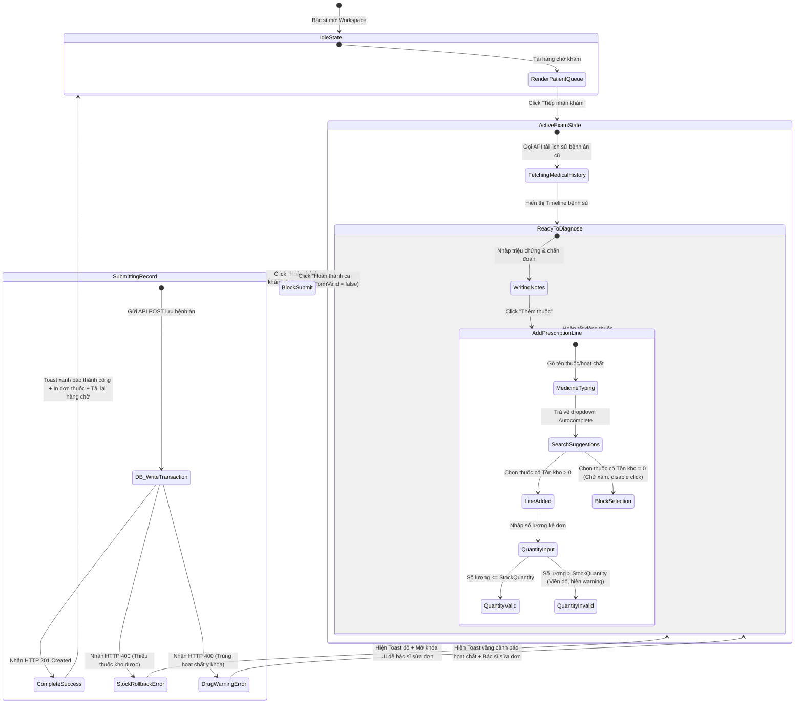

# 🎭 Behavioral Specification - Clinical Diagnosis & Treatment

## 1. Máy trạng thái Không gian khám bệnh (Finite State Machine - FSM)

Giao diện phòng khám lâm sàng điều phối các hoạt động nghiệp vụ y khoa phức tạp, kiểm soát chặt chẽ dữ liệu kê đơn trước khi thực hiện ghi vào DB:

---

## 2. Diễn giải các chuyển dịch trạng thái tương tác (State Transitions)

### A. Ràng buộc Tự động điền & Lọc danh mục thuốc (Autocomplete Guard Logic)
* **Medicine Autocomplete:** Bác sĩ gõ tối thiểu 2 ký tự vào ô tìm kiếm thuốc để kích hoạt API `/medicines/autocomplete`. 
* **Stock Check on Selection:**
  * Nếu thuốc có `stockQuantity == 0`, dòng thuốc đó hiển thị mờ đục (`opacity: 0.5`), nhãn `[Hết hàng]` màu đỏ và thuộc tính `pointer-events: none` được áp dụng để ngăn bác sĩ nhấp chọn.
  * Nếu thuốc có `stockQuantity > 0`, cho phép click chọn. Khi được chọn, hệ thống tự động chèn thông tin thuốc vào bảng kê đơn, mặc định gán số lượng là `1`.

### B. Khóa tương tác và Chống mất dữ liệu (Submit Lockout & Draft Recovery)
* **Submit Locking:** Khi bấm "Hoàn thành ca khám", trạng thái `submitting = true` được bật:
  * Toàn bộ form chẩn đoán, hướng điều trị và bảng kê đơn chuyển sang trạng thái read-only.
  * Nút "Hoàn thành" đổi thành biểu tượng spinner quay.
  * Chặn đóng tab trình duyệt bằng sự kiện `beforeunload` để đảm bảo transaction hoàn tất ghi nhận dưới DB.
* **Auto-save Draft Check:** Mỗi khi có thay đổi trên ô nhập liệu triệu chứng, chẩn đoán, hoặc dòng thuốc, store tự động lưu bản nháp vào LocalStorage. Khi bác sĩ mở lại ca khám đó, store kiểm tra nếu tồn tại bản nháp thì hiển thị thông báo: *"Hệ thống tìm thấy bản nháp khám chưa hoàn thành của bé. Bạn có muốn phục hồi dữ liệu?"* kèm nút bấm "Phục hồi".

---

## 3. Phân tích các Edge Cases và Giải pháp xử lý (Edge Cases & Error Handling)

| Tình huống Edge Case | Kịch bản / Hành vi của Hệ thống | Giải pháp Giao diện & Trải nghiệm (UI/UX) |
| :--- | :--- | :--- |
| **Hai ca khám kê đơn cùng một loại thuốc ở giây cuối** | Phòng khám A và B cùng kê liều thuốc cuối cùng trong kho. Phòng A lưu trước. Khi phòng B bấm lưu, API trả về lỗi 400 (Hết hàng). | Hệ thống rollback transaction của phòng B. Giao diện phòng B hiển thị Toast đỏ: *"Lưu bệnh án thất bại: Thuốc X vừa hết hàng tại kho dược."*, dòng thuốc đó lập tức nhấp nháy đỏ và cập nhật số lượng tồn kho khả dụng mới bằng 0. Bác sĩ B đổi sang thuốc khác. |
| **Kê nhiều dòng thuốc chứa hoạt chất trùng nhau** | Bác sĩ kê cả biệt dược Amoxicillin dạng viên và Amoxicillin dạng siro cho cùng một đơn. | Hệ thống Backend chạy `PrescriptionSafetyChecker` phát hiện trùng hoạt chất, chặn lưu và trả về lỗi. Frontend hiển thị cảnh báo y tế hộp thoại vàng nổi bật: *"Đơn thuốc vi phạm: Hoạt chất Amoxicillin bị trùng lặp."*, yêu cầu bác sĩ rà soát loại bỏ bớt. |
| **Mất kết nối mạng khi đang thực hiện khám** | Mạng phòng khám bị ngắt khi bác sĩ đang viết chẩn đoán dài. | Nhờ cơ chế Auto-save Draft vào LocalStorage, toàn bộ triệu chứng và chẩn đoán của bác sĩ được bảo vệ an toàn. Khi mạng hoạt động trở lại, bác sĩ có thể gửi đơn bình thường mà không bị mất dữ liệu đã gõ. |
| **Kê số lượng thuốc là số âm hoặc chữ** | Bác sĩ cố tình gõ hoặc copy ký tự không phải số nguyên dương vào ô số lượng. | Trường nhập số lượng giới hạn `min="1"` và tự động ép kiểu về số nguyên dương (`Math.floor(value)`). Nếu bỏ trống, hệ thống tự động gán về mặc định `1`. |
