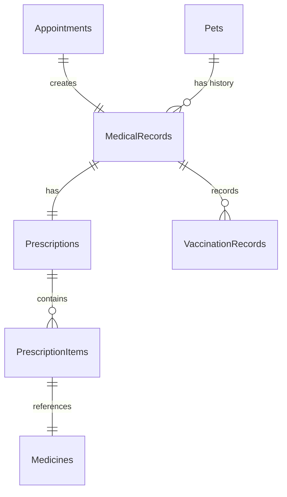
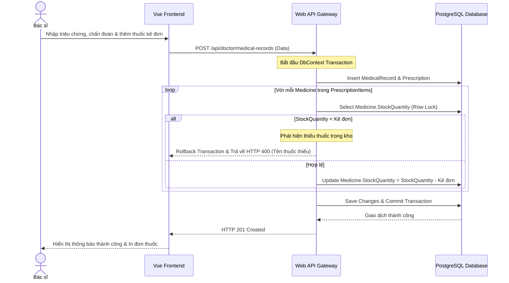

# 🛠️ Technical Specification - Clinical Diagnosis & Treatment

## 🔗 Skills Liên Quan
- **BE-F02 (SOLID - SRP):** Tách biệt logic quản lý bệnh án (`MedicalRecordService`) và logic xử lý trừ kho thuốc (`InventoryStockService`).
- **BE-A02 (Unit of Work / Transaction):** Áp dụng Transaction Scope đảm bảo đơn thuốc và cập nhật kho thuốc là Atomic.
- **BE-C02 (EF Core):** Sử dụng các truy vấn tải trước (Eager Loading) `.Include()` để tối ưu hóa việc đọc lịch sử bệnh án phức tạp.

---

## 1. Bản vẽ Thiết kế Database quan hệ (Data Model)

---

## 2. Sequence Diagram: Kê đơn & Trừ kho thuốc Atomic

