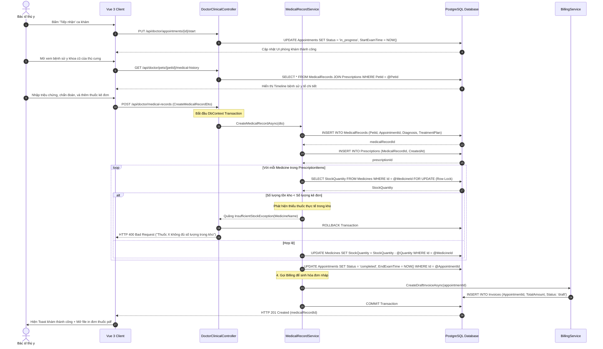
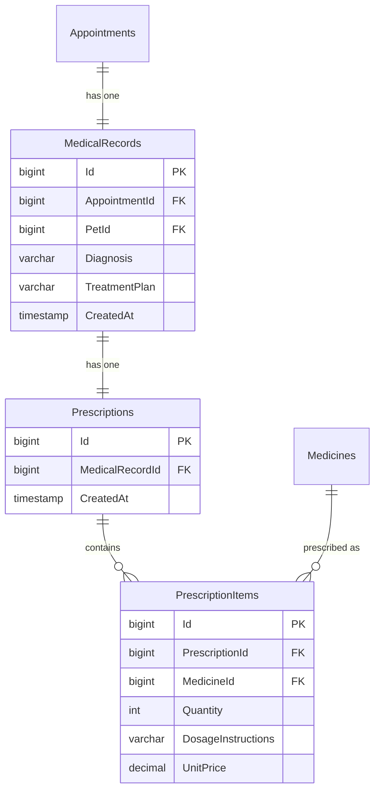

# 🛠️ Technical Specification - Clinical Diagnosis & Treatment

## 1. Luồng xử lý Kỹ thuật (Sequence Diagram)

Quy trình khám bệnh lâm sàng, kê đơn thuốc và tích hợp trừ kho dược thời gian thực diễn ra theo trình tự bảo đảm tính toàn vẹn dữ liệu:



---

## 2. Đặc tả Mô hình Cơ sở dữ liệu Bệnh án & Đơn thuốc (Database Schemas)

Sơ đồ ERD chi tiết thể hiện quan hệ giữa Lịch hẹn, Bệnh án, Đơn thuốc, Chi tiết đơn thuốc và Dược phẩm:



### Script khởi tạo CSDL:
```sql
CREATE TABLE "MedicalRecords" (
    "Id" bigint GENERATED BY DEFAULT AS IDENTITY PRIMARY KEY,
    "AppointmentId" bigint NOT NULL REFERENCES "Appointments"("Id") ON DELETE CASCADE,
    "PetId" bigint NOT NULL REFERENCES "Pets"("Id") ON DELETE CASCADE,
    "Diagnosis" text NOT NULL,
    "TreatmentPlan" text NOT NULL,
    "CreatedAt" timestamp DEFAULT CURRENT_TIMESTAMP
);

CREATE TABLE "Prescriptions" (
    "Id" bigint GENERATED BY DEFAULT AS IDENTITY PRIMARY KEY,
    "MedicalRecordId" bigint NOT NULL REFERENCES "MedicalRecords"("Id") ON DELETE CASCADE,
    "CreatedAt" timestamp DEFAULT CURRENT_TIMESTAMP
);

CREATE TABLE "PrescriptionItems" (
    "Id" bigint GENERATED BY DEFAULT AS IDENTITY PRIMARY KEY,
    "PrescriptionId" bigint NOT NULL REFERENCES "Prescriptions"("Id") ON DELETE CASCADE,
    "MedicineId" bigint NOT NULL REFERENCES "Medicines"("Id") ON DELETE RESTRICT,
    "Quantity" int NOT NULL CHECK ("Quantity" > 0),
    "DosageInstructions" varchar(500) NOT NULL, -- Ví dụ: Uống ngày 2 lần, mỗi lần 1 viên sau ăn
    "UnitPrice" decimal(18,2) NOT NULL
);
```

---

## 3. Đặc tả DTOs & Validation Rules

### A. CreateMedicalRecordDto (Ghi nhận bệnh án từ Bác sĩ)
```csharp
using System;
using System.Collections.Generic;

namespace MyPetClinic.Application.DTOs
{
    public class CreateMedicalRecordDto
    {
        public long AppointmentId { get; set; }
        public long PetId { get; set; }
        public string Diagnosis { get; set; } = string.Empty;
        public string TreatmentPlan { get; set; } = string.Empty;
        public List<PrescriptionItemDto> PrescriptionItems { get; set; } = new();
    }

    public class PrescriptionItemDto
    {
        public long MedicineId { get; set; }
        public int Quantity { get; set; }
        public string DosageInstructions { get; set; } = string.Empty;
    }
}
```

### B. FluentValidation C# Rules
```csharp
using FluentValidation;
using MyPetClinic.Application.DTOs;

namespace MyPetClinic.Application.Validators
{
    public class CreateMedicalRecordDtoValidator : AbstractValidator<CreateMedicalRecordDto>
    {
        public CreateMedicalRecordDtoValidator()
        {
            RuleFor(x => x.AppointmentId)
                .NotEmpty().WithMessage("Lịch hẹn chỉ định khám không được để trống.");

            RuleFor(x => x.PetId)
                .NotEmpty().WithMessage("Vui lòng chọn đúng thú cưng điều trị.");

            RuleFor(x => x.Diagnosis)
                .NotEmpty().WithMessage("Chẩn đoán lâm sàng của bác sĩ không được để trống.")
                .MinimumLength(10).WithMessage("Chẩn đoán lâm sàng phải chứa tối thiểu 10 ký tự.");

            RuleFor(x => x.TreatmentPlan)
                .NotEmpty().WithMessage("Hướng điều trị / Lời khuyên không được để trống.");

            RuleForEach(x => x.PrescriptionItems).SetValidator(new PrescriptionItemDtoValidator());
        }
    }

    public class PrescriptionItemDtoValidator : AbstractValidator<PrescriptionItemDto>
    {
        public PrescriptionItemDtoValidator()
        {
            RuleFor(x => x.MedicineId)
                .NotEmpty().WithMessage("Vui lòng chọn thuốc kê đơn.");

            RuleFor(x => x.Quantity)
                .GreaterThan(0).WithMessage("Số lượng thuốc kê đơn phải lớn hơn 0.");

            RuleFor(x => x.DosageInstructions)
                .NotEmpty().WithMessage("Hướng dẫn sử dụng thuốc không được để trống.")
                .MaximumLength(300).WithMessage("Hướng dẫn sử dụng không được vượt quá 300 ký tự.");
        }
    }
}
```
