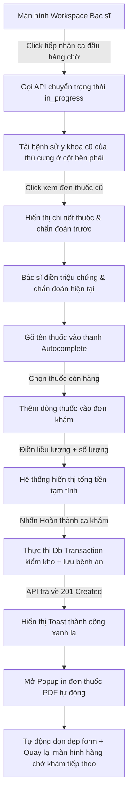

# 📐 UX Flow & State Transitions - Clinical Diagnosis & Treatment

Tài liệu này đặc tả chi tiết luồng trải nghiệm người dùng (User Experience Flow) và tương tác của bác sĩ thú y trên màn hình phòng khám lâm sàng tại **MyPetClinic**.

---

## 1. Dòng Trải nghiệm Người dùng từng bước (UX Walkthrough Flow)

---

## 2. Đặc tả các Điểm chạm Giao diện (UI Touchpoints Details)

### A. Trải nghiệm Autocomplete thuốc siêu tốc (Autocomplete Touchpoint)
* Khi bác sĩ nhấp chuột vào ô tìm kiếm thuốc kê đơn, một hộp tìm kiếm mờ kính (Glassmorphic Dropdown) mở ra phía dưới.
* Gợi ý hiển thị ngay lập tức khi bác sĩ gõ phím. Cấu trúc gợi ý trình bày song song:
  * Tên thuốc thương mại (Ví dụ: `Augmentin 250mg`).
  * Tên hoạt chất y sinh trong ngoặc đơn (Ví dụ: `Amoxicillin/Clavulanate`).
  * Chỉ số tồn kho kèm mã màu: Màu xanh `Tồn: 150` nếu >20 liều, màu vàng cam `Tồn: 8 [Sắp hết]` nếu <=10 liều, và màu đỏ xám `Tồn: 0 [Hết hàng]` nếu bằng 0.

### B. Bệnh sử y khoa dạng Timeline (Medical History Timeline UX)
* Timeline bệnh sử y tế được thiết kế chạy dọc mép phải màn hình.
* Các mốc thời gian hiển thị rõ nét dạng bong bóng thời gian (Time Bubbles) mờ kính.
* Bác sĩ có thể dùng bộ lọc nhanh y bạ: `[ Xem tất cả ] | [ Chỉ xem đơn thuốc ] | [ Chỉ xem tiêm phòng ]` để lọc nhanh thông tin y tế cần thiết mà không phải cuộn trang tìm kiếm mất thời gian.

### C. Đơn thuốc động và Cảnh báo kho (Prescription Grid UX)
* Bảng kê đơn thuốc hỗ trợ xóa nhanh bằng nút biểu tượng thùng rác màu đỏ nhạt ở cuối mỗi dòng. Khi hover chuột, nút thùng rác đổi màu đỏ đậm rực rỡ.
* **Hộp thoại cảnh báo tồn kho y tế (Low Stock Warning Overlay):**
  * Nếu bác sĩ nhập số lượng kê vượt quá số lượng thực tế trong kho, dòng thuốc đó sẽ bị phủ một lớp màu đỏ mờ HSL `hsl(0, 100%, 96%)`.
  * Nút "Hoàn thành ca khám" phía dưới sẽ tự động bị khóa và chuyển sang trạng thái disabled, đồng thời hiển thị tooltip màu đen mờ: *"Vui lòng điều chỉnh số lượng thuốc kê đơn không vượt quá tồn kho khả dụng để hoàn thành khám."*

### D. Trải nghiệm In đơn thuốc PDF tự động
* Ngay sau khi bấm hoàn thành và API ghi nhận thành công, một cửa sổ popup PDF in ấn (Print Preview) của trình duyệt sẽ tự động kích hoạt.
* Đơn thuốc được xuất bản theo form mẫu chuẩn y khoa của phòng khám (chứa logo, tên bác sĩ khám, chẩn đoán bệnh, đơn thuốc chi tiết và chữ ký bác sĩ), sẵn sàng kết nối trực tiếp với máy in văn phòng.

---

## 3. So sánh Điểm chạm UX giữa các vai trò (Receptionist vs Doctor)

| Điểm chạm giao diện | Lễ tân (Receptionist Queue) | Bác sĩ khám (Clinical Diagnosis) |
| :--- | :--- | :--- |
| **Mục tiêu chính trên UI** | Tiếp đón nhanh, duyệt lịch, và phân bổ phòng khám trống. | Chẩn đoán lâm sàng, nghiên cứu bệnh sử, và kê đơn thuốc an toàn. |
| **Kiểm kho y tế** | Kiểm tra tồn kho ảo của vắc-xin khi đặt lịch tiêm. | Kiểm kho thực tế thời gian thực và thực hiện trừ kho thuốc khi hoàn tất khám. |
| **Thao tác đơn thuốc** | Không thao tác. | Tìm kiếm autocomplete, kê số lượng, ghi hướng dẫn sử dụng chi tiết. |
| **Dữ liệu phát sinh** | Sinh Số thứ tự khám (`QueueNumber`) và QR check-in. | Sinh Bệnh án (`MedicalRecord`), Đơn thuốc (`Prescription`) và Hóa đơn nháp (`Invoice`). |
