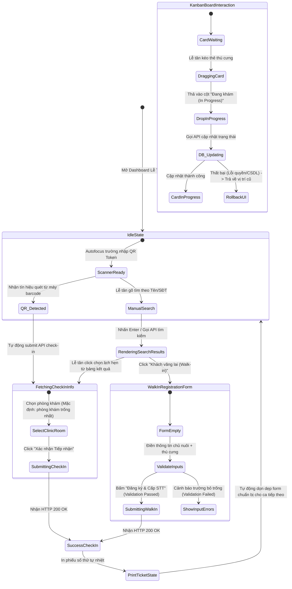

# 🎭 Behavioral Specification - Receptionist Portal & Queue Management

## 1. Máy trạng thái Hàng đợi khám & Check-in (Finite State Machine - FSM)

Quy trình tiếp nhận tại quầy lễ tân điều phối 3 luồng trạng thái song song để đồng bộ hóa dữ liệu y tế của thú cưng:

---

## 2. Diễn giải các chuyển dịch trạng thái tương tác (State Transitions)

### A. Ràng buộc Điều kiện chuyển cột Kanban (Kanban Columns Guard Logic)
Bảng Kanban thực thi các quy tắc nghiệp vụ y khoa chặt chẽ khi di chuyển trạng thái ca khám:
* **Hạn chế kéo thả ngược (Forward-only constraint):** 
  * Cho phép kéo thẻ từ `Waiting` ➡️ `In Progress`.
  * Cho phép kéo thẻ từ `In Progress` ➡️ `Completed`.
  * **Chặn kéo ngược:** Tuyệt đối không cho phép kéo thẻ từ `Completed` ngược lại `In Progress` hay `Waiting` để bảo toàn lịch sử chẩn đoán lâm sàng của bác sĩ. Nếu lễ tân thực hiện kéo ngược, UI lập tức kích hoạt trạng thái `RollbackUI` đưa card về vị trí cũ và hiện thông báo lỗi.
* **Gán Phòng khám bắt buộc (Assigned Room Guard):**
  * Khi kéo thả thẻ từ cột `Waiting` sang `In Progress`, hệ thống tự động mở một popover nhỏ yêu cầu lễ tân xác nhận phòng khám chỉ định (`ClinicRoom`). Nút xác nhận chỉ hoạt động khi có phòng khám được chọn.

### B. Khóa tương tác trong lúc tiếp nhận (Submit Lockout)
* Trong quá trình API `POST /api/receptionist/check-in` hoặc `/api/receptionist/walk-in` xử lý:
  * Cờ `submitting = true` được bật trong store.
  * Toàn bộ trường nhập liệu và nút bấm trên Modal Đăng ký Walk-in bị vô hiệu hóa.
  * Chặn click đóng modal để tránh việc người dùng nhấp đúp sinh trùng bản ghi thú cưng trong DB.

---

## 3. Phân tích các Edge Cases và Giải pháp xử lý (Edge Cases & Error Handling)

| Tình huống Edge Case | Kịch bản / Hành vi của Hệ thống | Giải pháp Giao diện & Trải nghiệm (UI/UX) |
| :--- | :--- | :--- |
| **Quét mã QR Token đã check-in trước đó** | Khách hàng vô tình đưa mã QR cũ hoặc nhấn quét 2 lần. | API trả về lỗi 400. Frontend hiển thị Toast cảnh báo: *"Mã QR này đã được tiếp nhận trước đó vào lúc HH:mm."*, không sinh lại số thứ tự. |
| **Bác sĩ đã kết thúc khám trước khi Lễ tân cập nhật Kanban** | Bác sĩ hoàn thành khám trên màn hình chẩn đoán (chuyển sang `completed`), nhưng Lễ tân chưa kịp kéo thẻ. Lễ tân cố tình kéo thẻ đó sang cột khám xong. | Hệ thống sử dụng kết nối SignalR tự động cập nhật trạng thái thẻ sang cột Completed từ trước. Nếu lễ tân vẫn cố tình thao tác kéo đè lên, API trả về lỗi 409 Conflict. Frontend báo lỗi: *"Ca khám này đã được bác sĩ hoàn thành và khóa."* |
| **Mất kết nối mạng khi đang kéo thả Card** | Lễ tân đang kéo thẻ thì kết nối mạng bị ngắt. | Hệ thống không thể gửi request PUT. Giao diện Kanban thực hiện Rollback thẻ về cột ban đầu, đồng thời hiển thị Toast đỏ cảnh báo mất kết nối mạng. |
| **Khách hàng vãng lai trùng số điện thoại** | Lễ tân nhập SĐT khách vãng lai đã có tài khoản trong hệ thống trước đó. | Modal Walk-in tự động nhận diện SĐT, hiện thông báo: *"Số điện thoại này đã liên kết với chủ nuôi [Tên chủ]. Bạn có muốn tự động điền thông tin?"* kèm nút "Đồng ý" để điền nhanh dữ liệu. |
