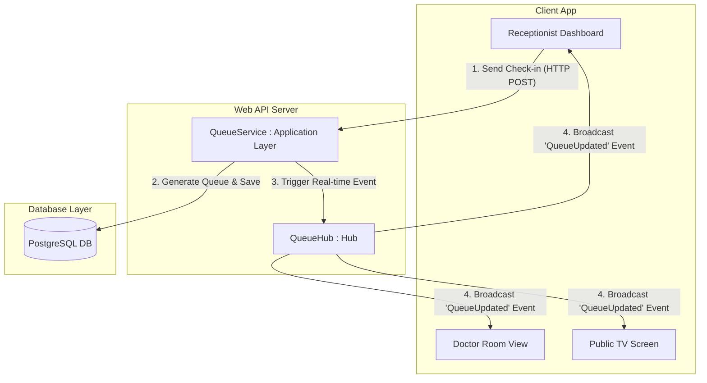
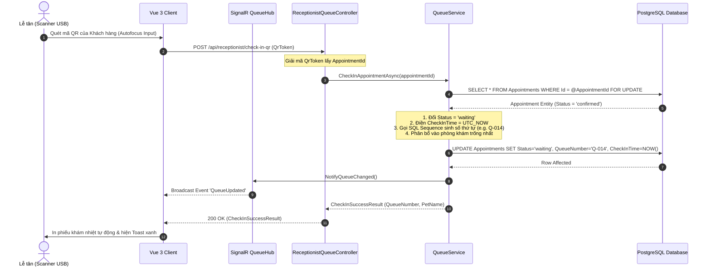
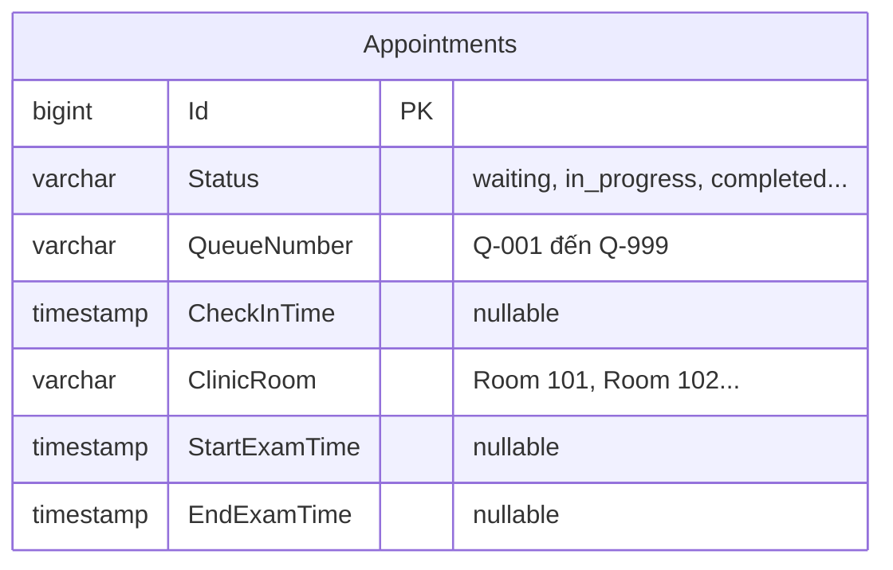

# 🛠️ Technical Specification - Receptionist Portal & Queue Management

## 1. Kiến trúc Đồng bộ Hàng đợi Thời gian thực (Real-time SignalR Hub)

Để đảm bảo các màn hình tivi công cộng tại sảnh chờ (Public Queue Board) và màn hình điều hành của Lễ tân, Bác sĩ được cập nhật đồng bộ tức thời dưới 500ms mà không cần tải lại trang, hệ thống sử dụng kiến trúc WebSockets thông qua **ASP.NET Core SignalR**:



---

## 2. Luồng xử lý Kỹ thuật chi tiết (Sequence Diagrams)

### A. Luồng Quét QR Check-in & Cấp Số Thứ Tự Tự Động
Quy trình lễ tân quét mã QR tiếp đón nhanh và phân phòng khám:



---

## 3. Đặc tả Mô hình Cơ sở dữ liệu Mở rộng (Database Schemas)

Để quản lý số thứ tự và phân bổ phòng khám, bảng `Appointments` được mở rộng thêm các cột quản trị hàng đợi:



### Script tạo Postgres Sequence tự động reset mỗi ngày:
Để đảm bảo số thứ tự khám tự động quay về `1` vào lúc 00:00 đêm:
```sql
-- Tạo Sequence cho số thứ tự khám
CREATE SEQUENCE IF NOT EXISTS queue_number_seq
    START WITH 1
    INCREMENT BY 1
    MINVALUE 1
    MAXVALUE 999
    CYCLE;

-- Tạo Function tự động reset Sequence hàng ngày thông qua pg_cron hoặc Scheduler
CREATE OR REPLACE FUNCTION reset_queue_sequence()
RETURNS void AS $$
BEGIN
    ALTER SEQUENCE queue_number_seq RESTART WITH 1;
END;
$$ LANGUAGE plpgsql;
```

---

## 4. Đặc tả DTOs & Validation Rules

### A. QuickWalkInRequestDto (Đăng ký nhanh khách vãng lai)
```csharp
namespace MyPetClinic.Application.DTOs
{
    public class QuickWalkInRequestDto
    {
        // Thông tin Chủ nuôi
        public string CustomerName { get; set; } = string.Empty;
        public string CustomerPhone { get; set; } = string.Empty;
        
        // Thông tin Thú cưng
        public string PetName { get; set; } = string.Empty;
        public string Species { get; set; } = string.Empty; // Dog, Cat
        public string Breed { get; set; } = string.Empty; // Giống
        
        // Chỉ định Khám
        public long ServiceId { get; set; }
        public Guid? AssignedDoctorId { get; set; }
        public string ClinicRoom { get; set; } = string.Empty;
        public string Symptom { get; set; } = string.Empty;
    }
}
```

### B. FluentValidation C# Rules
```csharp
using FluentValidation;
using MyPetClinic.Application.DTOs;

namespace MyPetClinic.Application.Validators
{
    public class QuickWalkInRequestDtoValidator : AbstractValidator<QuickWalkInRequestDto>
    {
        public QuickWalkInRequestDtoValidator()
        {
            RuleFor(x => x.CustomerName)
                .NotEmpty().WithMessage("Tên chủ nuôi không được bỏ trống.")
                .MaximumLength(100).WithMessage("Tên không được vượt quá 100 ký tự.");

            RuleFor(x => x.CustomerPhone)
                .NotEmpty().WithMessage("Số điện thoại không được bỏ trống.")
                .Matches(@"^(0[3|5|7|8|9])+([0-9]{8})$").WithMessage("Số điện thoại không đúng định dạng Việt Nam.");

            RuleFor(x => x.PetName)
                .NotEmpty().WithMessage("Tên thú cưng không được bỏ trống.");

            RuleFor(x => x.Species)
                .NotEmpty().WithMessage("Vui lòng chọn loài thú cưng (Dog/Cat).")
                .Must(s => s == "Dog" || s == "Cat").WithMessage("Loài thú cưng phải là Dog hoặc Cat.");

            RuleFor(x => x.ServiceId)
                .NotEmpty().WithMessage("Vui lòng chọn dịch vụ chỉ định khám.");
        }
    }
}
```
