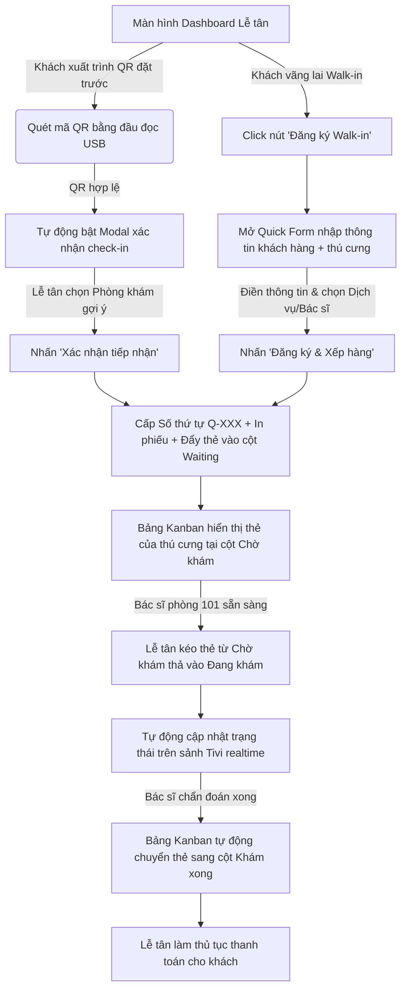

# 📐 UX Flow & State Transitions - Receptionist Portal & Queue Management

Tài liệu này đặc tả chi tiết luồng trải nghiệm người dùng (User Experience Flow) và tương tác của nhân viên lễ tân cùng chủ nuôi trên các giao diện quản lý hàng đợi tại **MyPetClinic**.

---

## 1. Dòng Trải nghiệm Người dùng từng bước (UX Walkthrough Flow)

---

## 2. Đặc tả các Điểm chạm Giao diện (UI Touchpoints Details)

### A. Trải nghiệm tiếp tiếp tiếp nhận "Không chạm" (QR Check-In Touchpoint)
* Lễ tân không cần nhấp chuột vào bất kỳ ô nhập liệu nào.
* Trường tìm kiếm QR luôn ở trạng thái **Autofocus** ngầm. Khi khách hàng đưa điện thoại chứa QR Token, lễ tân chỉ việc hướng máy quét barcode vào màn hình.
* Còi máy quét phát tiếng bíp 🔊 báo quét thành công, giao diện lập tức hiện Modal tiếp đón chứa đầy đủ ảnh thú cưng, tên chủ nuôi, loại vắc-xin/dịch vụ đặt trước để lễ tân đối chiếu trực quan.

### B. Màn hình Kanban Board trực quan (Kanban Dashboard UX)
* **Cấu trúc 3 Cột rộng rãi:**
  * Thẻ thú cưng (Kanban Cards) hiển thị mờ kính tinh tế.
  * Trình bày rõ nét các thông tin quan trọng giúp điều phối nhanh: Số thứ tự, Tên bé, Bác sĩ chỉ định, và bộ đếm thời gian chờ thời gian thực (Ví dụ: `Đang chờ: 15 phút`).
* **Định danh nhanh loài thú cưng (Visual Species Tags):**
  * Thẻ thú cưng tự động đổi màu viền nhẹ dựa trên loài để lễ tân phân biệt trong sảnh chờ: viền xanh ngọc nhạt cho Chó (`Dog`), viền hồng phấn nhạt cho Mèo (`Cat`).
  * Giúp lễ tân sắp xếp các bé chó/mèo xa nhau nếu có bé cún tỏ ra hung dữ hoặc mèo sợ hãi.

### C. Màn hình TV sảnh chờ Công cộng (Public TV Queue Experience)
* Giao diện tối giản thiết kế riêng cho Tivi sảnh chờ ở độ phân giải Full HD / 4K.
* **Quy tắc chuyển trượt mượt mà (Smooth Slide Transition):**
  * Khi trạng thái hàng đợi thay đổi (Ví dụ: Số thứ tự `Q-012` được gọi vào phòng khám), dòng thông tin của `Q-012` trên Tivi sẽ chuyển sang hiệu ứng chớp sáng viền xanh neon và trượt mượt mà lên khu vực đầu bảng "Đang khám", đồng thời phát âm thanh nhẹ "ting tong" 🔔 để nhắc nhở chủ nuôi chuẩn bị di chuyển.
  * Các số thứ tự đang khám hiển thị font chữ lớn, đậm để nhìn rõ từ xa.

---

## 3. So sánh Điểm chạm UX giữa các vai trò (Receptionist vs Doctor vs Public TV)

| Điểm chạm | Cổng Lễ Tân (Receptionist Portal) | Cổng Bác Sĩ (Doctor Portal) | Tivi Sảnh Chờ (Public TV Screen) |
| :--- | :--- | :--- | :--- |
| **Quyền hạn tương tác** | Đọc/Ghi (Check-in, kéo thả Kanban thay đổi trạng thái, sửa phòng khám). | Đọc/Ghi (Bấm gọi khám, kết thúc khám và kê đơn thuốc). | Chỉ đọc (Read-only, hiển thị thụ động danh sách hàng đợi). |
| **Cơ chế cập nhật** | Real-time (SignalR) + Fallback nút refresh tay. | Real-time (SignalR) đồng bộ với phòng khám. | Real-time (SignalR) tự động hoàn toàn, không có tương tác chuột/phím. |
| **Độ chi tiết thông tin** | Chi tiết nhất (Tên chủ, SĐT, loại thú cưng, lịch sử tiêm, ghi chú y tế dị ứng). | Chi tiết bệnh án (Bệnh sử, triệu chứng lâm sàng, chẩn đoán cũ, đơn thuốc cũ). | Tối giản (Số thứ tự, Tên thú cưng, Loài, Phòng khám, Trạng thái). |
