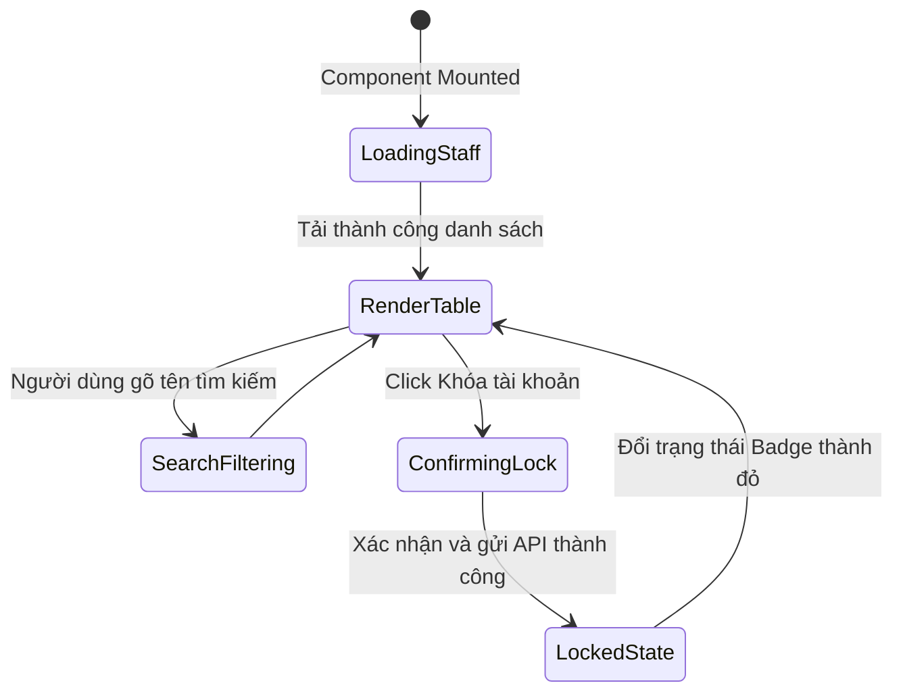

# 🎭 Behavioral Specification - Admin Staff Management

## 1. Biểu đồ Trạng thái Vue Component User Table

---

## 2. Ràng buộc Hành vi & Quy tắc Giao diện
- **Delete Prevention for Admin:** Nút "Xóa" hoặc "Khóa" phải bị ẩn/disabled hoàn toàn đối với chính tài khoản của Admin đang đăng nhập hiện tại để tránh việc tự khóa mình ra ngoài.
- **Form Validation:** Form thêm nhân viên bắt buộc kiểm tra định dạng Email chuẩn và Số điện thoại chỉ chứa chữ số (từ 10 đến 11 số).
