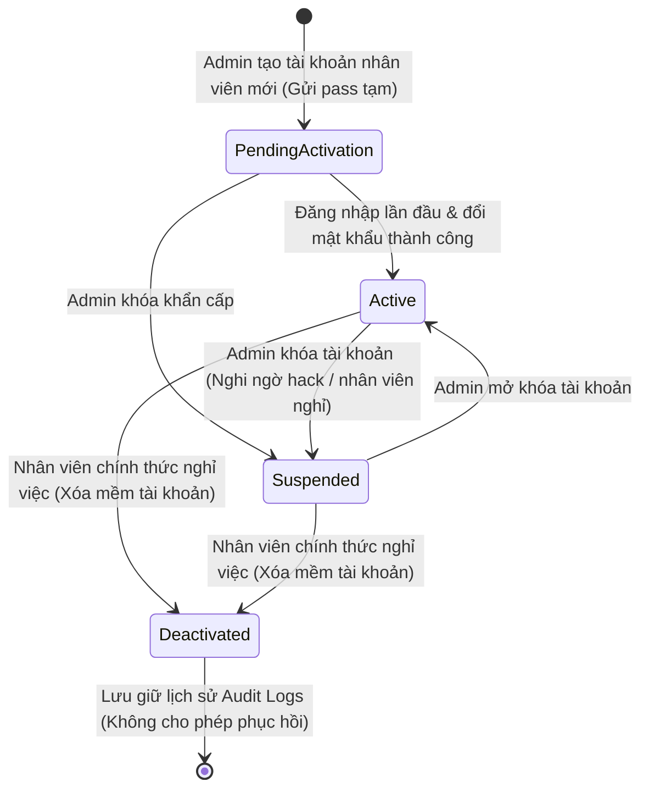

# 📊 Behavioral Specification - Admin Staff Management

Tài liệu đặc tả hành vi hệ thống, mô hình máy trạng thái hữu hạn (FSM) và các điều kiện ràng buộc chuyển đổi trạng thái của tài khoản nhân viên.

---

## 1. Biểu đồ Máy Trạng thái Tài khoản Nhân viên (User FSM)

Trạng thái hoạt động và bảo mật của một tài khoản nhân viên (`User.Status`) trong hệ thống MyPetClinic được quản trị chặt chẽ theo sơ đồ Mermaid dưới đây:

---

## 2. Diễn giải chi tiết các chuyển dịch trạng thái (Transitions)

### 1. Khởi tạo (`PendingActivation`) sang Hoạt động (`Active`)
- **Tác nhân:** Nhân viên sở hữu tài khoản.
- **Điều kiện kích hoạt:** Đăng nhập thành công bằng email và mật khẩu mặc định tạm thời, sau đó thực hiện đổi mật khẩu mới thông qua API `POST /api/auth/reset-first-password`.
- **Hành vi hệ thống:**
  - Hệ thống kiểm tra mật khẩu cũ trùng khớp.
  - Lưu mật khẩu mới đã băm bằng BCrypt.
  - Đổi flag `RequirePasswordChange = false` và cập nhật `Status = 'Active'`.
  - Cấp token JWT phiên làm việc chính thức đầy đủ quyền hạn.

### 2. Hoạt động (`Active`) sang Đang khóa (`Suspended`)
- **Tác nhân:** Quản trị viên (Admin).
- **Điều kiện kích hoạt:** Admin nhấn nút "Khóa tài khoản" trên màn hình quản trị nhân sự.
- **Hành vi hệ thống:**
  - Thực hiện cập nhật `Status = 'Suspended'`.
  - Tự động ghi nhận Audit Log.
  - Vô hiệu hóa tất cả token JWT hiện hành của nhân viên bị khóa ngay lập tức (Thời gian thu hồi đặc quyền < 1 giây).

### 3. Đang khóa (`Suspended`) sang Hoạt động (`Active`)
- **Tác nhân:** Quản trị viên (Admin).
- **Điều kiện kích hoạt:** Admin nhấn nút "Mở khóa tài khoản".
- **Hành vi hệ thống:**
  - Thực hiện cập nhật `Status = 'Active'`.
  - Ghi nhận Audit Log. Nhân viên có thể đăng nhập bình thường bằng mật khẩu cũ của họ.

---

## 3. Các quy tắc ràng buộc bảo mật và nghiệp vụ (Business Rules Constraints)

- **Quy tắc An toàn Quản trị Tối cao (Self-Action Protection):**
  - Chặn đứng hoàn toàn mọi yêu cầu thay đổi trạng thái của chính Admin đang thao tác. Trả về lỗi `403 Forbidden` kèm thông báo *"Admin không được phép tự khóa tài khoản của chính mình"*.
- **Quy tắc Duy nhất Tài khoản Admin Gốc:**
  - Nếu hệ thống chỉ còn duy nhất một tài khoản có vai trò `admin`, hệ thống sẽ chặn không cho phép đổi vai trò của tài khoản này sang vai trò khác nhằm tránh rủi ro mất quyền kiểm soát phòng khám.
- **Chính sách Thu hồi JWT tức thì (Token Invalidation Policy):**
  - Khi trạng thái tài khoản chuyển sang `Suspended` hoặc `Deactivated`, Backend Middleware sẽ phát hiện sự thay đổi trạng thái trong Database (hoặc qua Cache Redis phân tán) khi người dùng gửi request tiếp theo. Hệ thống lập tức hủy yêu cầu và trả về lỗi `401 Unauthorized` buộc đăng xuất ngay.
