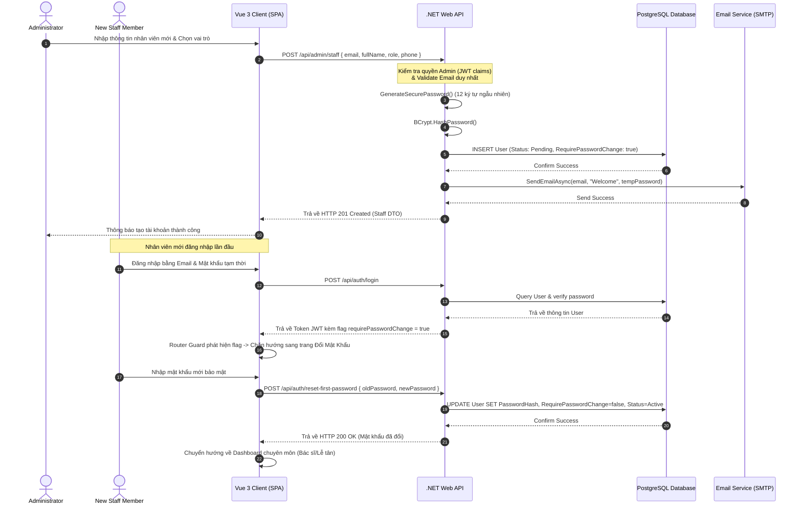

# 🛠️ Technical Specification - Admin Staff & Role Authorization

Tài liệu thiết kế kỹ thuật chi tiết cho tính năng Quản lý Nhân sự & Phân quyền hệ thống MyPetClinic.

---

## 1. Kiến trúc Tổng quát & Sơ đồ Tuần tự (Sequence Diagram)

Sơ đồ dưới đây mô tả luồng dữ liệu khi Admin tạo tài khoản nhân viên mới, hệ thống sinh mật khẩu ngẫu nhiên tạm thời, mã hóa lưu vào Database và nhân viên đăng nhập lần đầu tiên bắt buộc phải đổi mật khẩu.



---

## 2. Đặc tả Cơ sở Dữ liệu (Database Schema)

### Thực thể `Users` (Mở rộng các trường quản trị nhân sự)
Bảng lưu trữ thông tin tài khoản người dùng hệ thống.

| Tên cột | Kiểu dữ liệu | Ràng buộc | Mô tả |
| :--- | :--- | :--- | :--- |
| **Id** | UUID / uniqueidentifier | Primary Key | Khóa chính |
| **Email** | VARCHAR(150) | Not Null, Unique | Email đăng nhập chính |
| **PasswordHash** | VARCHAR(255) | Not Null | Chuỗi băm mật khẩu bảo mật (BCrypt) |
| **FullName** | VARCHAR(100) | Not Null | Họ và tên |
| **PhoneNumber** | VARCHAR(20) | Nullable | Số điện thoại |
| **Role** | VARCHAR(30) | Not Null | Vai trò: `customer`, `doctor`, `receptionist`, `cashier`, `admin` |
| **Status** | VARCHAR(20) | Not Null | Trạng thái: `PendingActivation`, `Active`, `Suspended` |
| **RequirePasswordChange**| BOOLEAN | Not Null, Default TRUE | Bắt buộc đổi mật khẩu ở lần đầu đăng nhập |
| **CreatedAt** | TIMESTAMP WITH TIME ZONE | Not Null | Thời gian tạo tài khoản |

### Thực thể `AuditLogs` (Nhật ký thay đổi quyền)
Bảng ghi chép lại lịch sử thao tác của các Admin trên hệ thống phục vụ công tác thanh tra bảo mật.

| Tên cột | Kiểu dữ liệu | Ràng buộc | Mô tả |
| :--- | :--- | :--- | :--- |
| **Id** | UUID / uniqueidentifier | Primary Key | Khóa chính nhật ký |
| **ActorId** | UUID / uniqueidentifier | Foreign Key | ID của Admin thực hiện thao tác |
| **ActionName** | VARCHAR(100) | Not Null | Tên hành động: `CREATE_STAFF`, `CHANGE_ROLE`, `SUSPEND_USER` |
| **TargetUserId** | UUID / uniqueidentifier | Foreign Key | ID của nhân viên chịu tác động |
| **Description** | TEXT | Not Null | Chi tiết nội dung: *"Đổi vai trò từ doctor sang admin"* |
| **Timestamp** | TIMESTAMP WITH TIME ZONE | Not Null | Thời gian thực thi hệ thống |
| **IpAddress** | VARCHAR(50) | Nullable | Địa chỉ IP của máy khách gửi yêu cầu |

### Script SQL Khởi Tạo Cập Nhật PostgreSQL
```sql
-- Cập nhật bảng Users
ALTER TABLE Users ADD COLUMN IF NOT EXISTS Role VARCHAR(30) NOT NULL DEFAULT 'customer';
ALTER TABLE Users ADD COLUMN IF NOT EXISTS Status VARCHAR(20) NOT NULL DEFAULT 'Active';
ALTER TABLE Users ADD COLUMN IF NOT EXISTS RequirePasswordChange BOOLEAN NOT NULL DEFAULT FALSE;

-- Tạo bảng AuditLogs
CREATE TABLE AuditLogs (
    Id UUID PRIMARY KEY DEFAULT gen_random_uuid(),
    ActorId UUID NOT NULL,
    ActionName VARCHAR(100) NOT NULL,
    TargetUserId UUID NOT NULL,
    Description TEXT NOT NULL,
    Timestamp TIMESTAMP WITH TIME ZONE NOT NULL DEFAULT CURRENT_TIMESTAMP,
    IpAddress VARCHAR(50) NULL,
    CONSTRAINT fk_audit_actor FOREIGN KEY (ActorId) REFERENCES Users(Id) ON DELETE RESTRICT,
    CONSTRAINT fk_audit_target FOREIGN KEY (TargetUserId) REFERENCES Users(Id) ON DELETE CASCADE
);

-- Tạo Index tối ưu
CREATE INDEX idx_users_role_status ON Users(Role, Status);
CREATE INDEX idx_audit_logs_timestamp ON AuditLogs(Timestamp DESC);
CREATE INDEX idx_audit_logs_actor ON AuditLogs(ActorId);
```

---

## 3. Đặc tả C# DTOs & Validation

### CreateStaffRequest.cs
```csharp
using System.ComponentModel.DataAnnotations;

namespace MyPetClinic.Application.DTOs.Admin
{
    public class CreateStaffRequest
    {
        [Required(ErrorMessage = "Họ và tên bắt buộc nhập")]
        [StringLength(100, ErrorMessage = "Họ tên không được vượt quá 100 ký tự")]
        public string FullName { get; set; } = null!;

        [Required(ErrorMessage = "Email bắt buộc nhập")]
        [EmailAddress(ErrorMessage = "Địa chỉ Email không đúng định dạng")]
        [StringLength(150, ErrorMessage = "Email không được vượt quá 150 ký tự")]
        public string Email { get; set; } = null!;

        [Required(ErrorMessage = "Số điện thoại bắt buộc nhập")]
        [Phone(ErrorMessage = "Số điện thoại không hợp lệ")]
        public string PhoneNumber { get; set; } = null!;

        [Required(ErrorMessage = "Vai trò nhân sự bắt buộc chọn")]
        [RegularExpression("^(admin|doctor|receptionist|cashier)$", ErrorMessage = "Vai trò phải là admin, doctor, receptionist, hoặc cashier")]
        public string Role { get; set; } = null!;
    }
}
```

### ChangeRoleRequest.cs
```csharp
using System.ComponentModel.DataAnnotations;

namespace MyPetClinic.Application.DTOs.Admin
{
    public class ChangeRoleRequest
    {
        [Required(ErrorMessage = "Vai trò nhân sự mới bắt buộc chọn")]
        [RegularExpression("^(admin|doctor|receptionist|cashier)$", ErrorMessage = "Vai trò phải là admin, doctor, receptionist, hoặc cashier")]
        public string NewRole { get; set; } = null!;
    }
}
```

### StaffDto.cs
```csharp
namespace MyPetClinic.Application.DTOs.Admin
{
    public class StaffDto
    {
        public Guid Id { get; set; }
        public string FullName { get; set; } = null!;
        public string Email { get; set; } = null!;
        public string PhoneNumber { get; set; } = null!;
        public string Role { get; set; } = null!;
        public string Status { get; set; } = null!;
        public bool RequirePasswordChange { get; set; }
        public DateTime CreatedAt { get; set; }
    }
}
```
