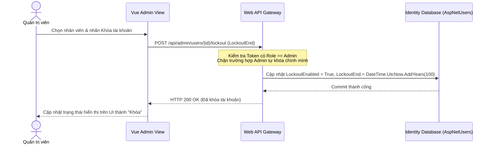

# 🛠️ Technical Specification - Admin Staff Management

## 🔗 Skills Liên Quan
- **BE-F02 (SOLID - SRP):** Tách biệt logic quản lý tài khoản (`IdentityUserService`) ra khỏi logic quản lý phân quyền nhân sự (`UserRoleManager`).
- **BE-A03 (RBAC):** Sử dụng các thẻ `[Authorize(Roles = "admin")]` bảo vệ nghiêm ngặt toàn bộ API Endpoint.

---

## 1. Sequence Diagram: Phân quyền & Khóa tài khoản nhân viên



---

## 2. API Schema & DTOs

```csharp
public class CreateStaffRequestDto
{
    public string Email { get; set; }
    public string FullName { get; set; }
    public string PhoneNumber { get; set; }
    public string Role { get; set; } // doctor, receptionist, cashier, admin
    public string Specialty { get; set; } // Dành riêng cho Bác sĩ
}

public class UserDetailDto
{
    public Guid Id { get; set; }
    public string Email { get; set; }
    public string FullName { get; set; }
    public string Role { get; set; }
    public bool IsLockedOut { get; set; }
    public DateTimeOffset? LockoutEnd { get; set; }
}
```
