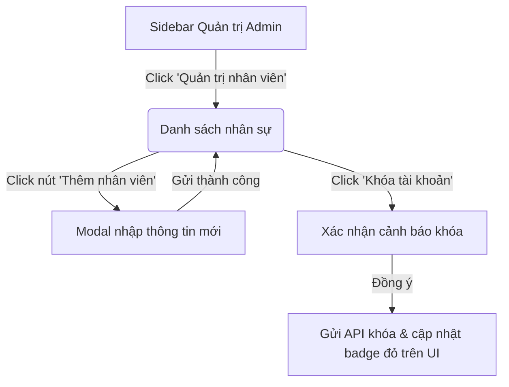
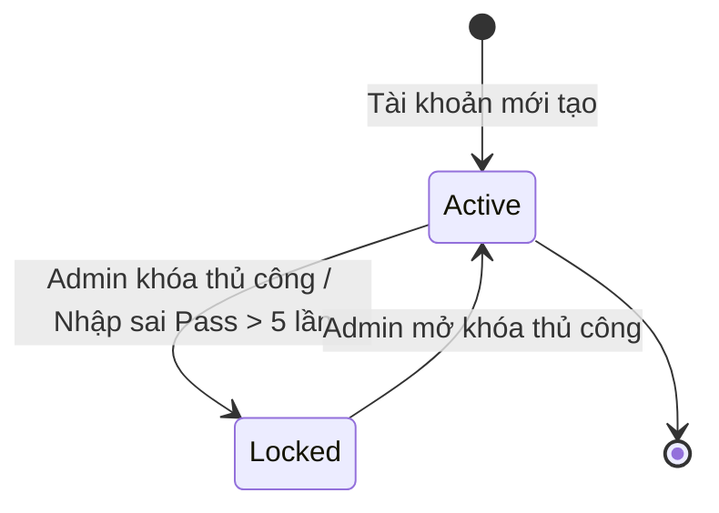

# 📐 UX Flow & State Transitions - Admin Staff Management

## 1. Luồng Giao diện Quản trị Nhân sự (UX Flow)

```mermaid
graph TD
    A[Sidebar Quản trị Admin] -->|Click 'Quản trị nhân viên'| B(Danh sách nhân sự)
    B -->|Click nút 'Thêm nhân viên'| C[Modal nhập thông tin mới]
    C -->|Gửi thành công| B
    B -->|Click 'Khóa tài khoản'| D[Xác nhận cảnh báo khóa]
    D -->|Đồng ý| E[Gửi API khóa & cập nhật badge đỏ trên UI]
```

---

## 2. Bản đồ Chuyển dịch Trạng thái tài khoản (Account Lock Status)

```mermaid
stateDiagram-v2
    [*] --> Active : Tài khoản mới tạo
    Active --> Locked : Admin khóa thủ công / Nhập sai Pass > 5 lần
    Locked --> Active : Admin mở khóa thủ công
    Active --> [*]
```
