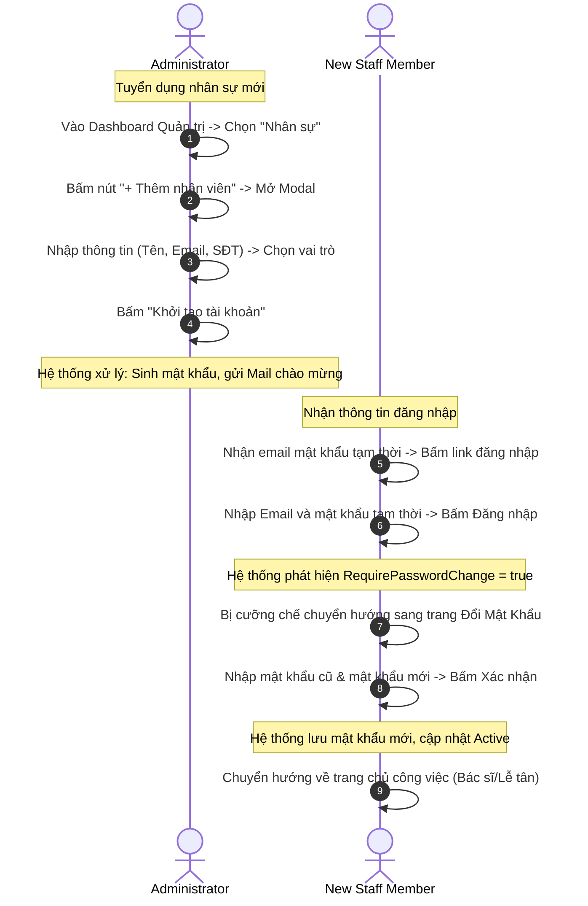

# 🗺️ UX Flow & Interactions - Admin Staff Management

Tài liệu đặc tả luồng trải nghiệm người dùng (UX Journey Map), các điểm chạm tương tác và hiệu ứng chuyển động giao diện dành cho Quản trị viên và Nhân viên mới.

---

## 1. Bản đồ Hành trình Trải nghiệm của Admin & Nhân viên (User Journey Map)



---

## 2. Chi tiết các Bước Tương tác & Điểm chạm (Touchpoints)

### Bước 1: Thêm mới nhân viên tại màn hình Admin
- **Tương tác:** Admin click nút "+ Thêm nhân viên" màu xanh dương phát sáng neon.
- **Hiệu ứng:** Cửa sổ Modal popup xuất hiện bằng hiệu ứng phóng to nhẹ (Scale-up) từ giữa màn hình trong 200ms cùng với lớp phủ mờ phía sau (Backdrop Blur: 12px) để tập trung cao độ.
- **Trạng thái Loading:** Khi Admin bấm "Khởi tạo tài khoản", nút bấm hiển thị trạng thái xoay tròn (Spinner Loading) và chữ *"Đang khởi tạo tài khoản và gửi mail..."* để báo hiệu hệ thống đang xử lý mã hóa mật khẩu và gọi SMTP Mailer bên ngoài.

### Bước 2: Nhân viên đăng nhập lần đầu và Đổi mật khẩu bắt buộc
- **Hiện tượng UI:** Sau khi đăng nhập thành công bằng mật khẩu tạm thời, trình duyệt sẽ kiểm tra cờ `requirePasswordChange` trả về từ API.
- **Hành vi:** Hệ thống chặn đứng việc truy cập vào bất kỳ trang Dashboard chuyên môn nào (Router Guard block) và chuyển hướng nhân viên sang trang `/auth/change-password-force`.
- **Giao diện đổi mật khẩu:** Hiển thị form tối giản, có thanh đo độ mạnh yếu của mật khẩu mới theo thời gian thực (Password Strength Meter) đổi màu sinh động (Đỏ: Yếu -> Cam: Trung bình -> Xanh lá: Mạnh). Nút "Xác nhận mật khẩu" chỉ sáng lên và cho phép click khi mật khẩu mới đạt độ mạnh tối thiểu và khớp với ô nhập lại mật khẩu.

### Bước 3: Khóa tài khoản khẩn cấp
- **Tương tác:** Admin click nút "Khóa" màu đỏ tại dòng nhân viên nghỉ việc trong bảng danh sách.
- **Popup xác nhận:** Một hộp thoại cảnh báo nguy hiểm (Danger Confirmation Dialog) xuất hiện với nội dung: *"Hành động này sẽ ngắt kết nối và khóa tài khoản nhân viên ngay lập tức. Bạn có chắc chắn muốn tiếp tục?"*.
- **Phản hồi UI:** Sau khi Admin xác nhận, trạng thái tài khoản chuyển sang màu đỏ `Suspended` kèm hiệu ứng chuyển màu mượt mà trong 300ms.

---

## 3. Đặc tả Hiệu ứng Chuyển động CSS (Micro-animations)

Các hiệu ứng CSS tinh tế cho giao diện quản trị nhân sự:

```css
/* Hiệu ứng gợn sóng khi Admin bấm nút tạo tài khoản */
.btn-ripple {
  position: relative;
  overflow: hidden;
}

.btn-ripple::after {
  content: '';
  position: absolute;
  top: 50%;
  left: 50%;
  width: 0;
  height: 0;
  background: rgba(255, 255, 255, 0.2);
  border-radius: 50%;
  transform: translate(-50%, -50%);
  transition: width 0.3s ease-out, height 0.3s ease-out;
}

.btn-ripple:active::after {
  width: 200%;
  height: 200%;
}

/* Hiệu ứng chuyển màu thanh đo độ mạnh mật khẩu */
.strength-bar {
  height: 4px;
  border-radius: 2px;
  transition: width 0.3s ease, background-color 0.3s ease;
}

.strength-weak {
  width: 33%;
  background-color: hsl(355, 75%, 50%); /* Đỏ */
}

.strength-medium {
  width: 66%;
  background-color: hsl(35, 95%, 55%);  /* Cam */
}

.strength-strong {
  width: 100%;
  background-color: hsl(145, 65%, 45%); /* Xanh lá */
}
```
