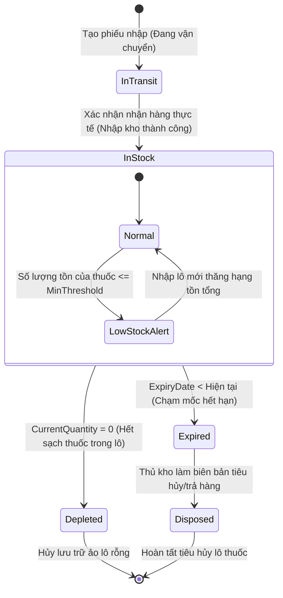

# 📊 Behavioral Specification - Admin Drug Inventory

Tài liệu đặc tả hành vi hệ thống, mô hình máy trạng thái hữu hạn (FSM) và các điều kiện ràng buộc chuyển đổi trạng thái của lô hàng trong kho.

---

## 1. Biểu đồ Máy Trạng thái Lô thuốc (Inventory Batch FSM)

Vòng đời của một lô thuốc (`InventoryBatch`) được quản trị nghiêm ngặt theo mô hình máy trạng thái dưới đây:

---

## 2. Diễn giải chi tiết các chuyển dịch trạng thái (Transitions)

### 1. Đang vận chuyển (`InTransit`) sang Trong kho (`InStock`)
- **Tác nhân:** Thủ kho / Admin.
- **Điều kiện kích hoạt:** Hàng về tới phòng khám, thực hiện kiểm đếm thực tế và bấm xác nhận nhập kho trên phần mềm.
- **Hành vi hệ thống:**
  - Chuyển `Batch.Status = 'InStock'`.
  - Cộng số lượng lô vào tồn khả dụng tổng của thuốc (`Medicine.CurrentStock`).
  - Ghi nhận Audit Log giao dịch nhập kho `IMPORT`.

### 2. Trong kho (`InStock`) sang Hết hạn (`Expired`)
- **Tác nhân:** Hệ thống (Tự động quét hàng ngày).
- **Điều kiện kích hoạt:** Ngày hết hạn của lô thuốc nhỏ hơn ngày hiện tại (`ExpiryDate < DateTime.UtcNow.Date`).
- **Hành vi hệ thống:**
  - Chuyển `Batch.Status = 'Expired'`.
  - Khóa vĩnh viễn lô hàng này, không cho phép trừ kho kê đơn y bạ đối với các biệt dược thuộc lô này.
  - Khấu trừ tồn khả dụng tổng của thuốc một lượng tương ứng với số lượng còn tồn trong lô hết hạn.

### 3. Trong kho (`InStock`) sang Hết hàng (`Depleted`)
- **Tác nhân:** Bác sĩ thú y (Kê đơn trừ kho tự động).
- **Điều kiện kích hoạt:** Số lượng còn lại của lô hàng giảm về 0 (`CurrentQuantity = 0`).
- **Hành vi hệ thống:**
  - Chuyển `Batch.Status = 'Depleted'`.
  - Ẩn lô hàng khỏi danh sách lựa chọn xuất kho để tối ưu hóa truy vấn tìm kiếm FEFO.

---

## 3. Các quy tắc ràng buộc bảo mật và nghiệp vụ (Business Rules Constraints)

- **Quy tắc Chống Nhập Hàng Hết Hạn:**
  - Hệ thống từ chối mọi yêu cầu tạo lô hàng mới nếu trường `ExpiryDate` nhỏ hơn hoặc bằng ngày hiện tại. Trả về mã lỗi `400 Bad Request` ngay tại tầng DTO Validation.
- **Tính Bất Biến của Nhật Ký Giao Dịch Kho (Immutability of Transactions):**
  - Bảng ghi lịch sử giao dịch `InventoryTransactions` chỉ hỗ trợ hành động **Ghi thêm** (`Insert`), không bao giờ hỗ trợ các API cập nhật (`Update`) hoặc xóa (`Delete`) dữ liệu lịch sử, kể cả đối với vai trò Admin, để đảm bảo tính minh bạch kiểm toán tài chính.
- **Ràng buộc Khóa Số Dư Không Âm:**
  - Các trường `CurrentQuantity` trong bảng `InventoryBatches` và `CurrentStock` trong bảng `Medicines` luôn được bảo vệ bằng ràng buộc CSDL PostgreSQL `CHECK (Quantity >= 0)`. Hệ thống sẽ lập tức rollback giao dịch nếu có bất kỳ luồng xử lý nào tính toán sai dẫn đến số lượng bán âm kho.
