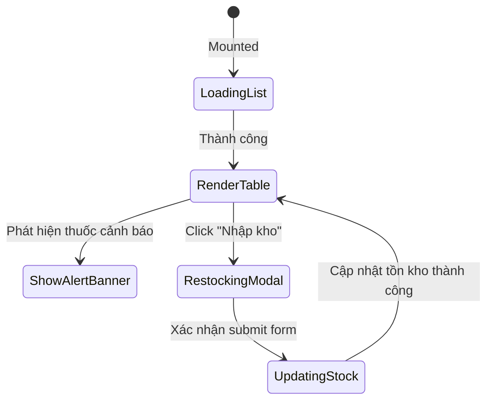

# 🎭 Behavioral Specification - Admin Drug Inventory

## 1. Biểu đồ Trạng thái Component Kho thuốc

---

## 2. Ràng buộc Nghiệp vụ (Business Rules)
- **Stock Minimum Check:** Nếu số lượng tồn kho sau khi bác sĩ kê đơn giảm xuống dưới `MinStockLimit`, hệ thống tự động đánh dấu badge đỏ trên trang kho thuốc mà không cần reload lại trang (nhờ computed property Pinia).
- **Expiry Sort Priority:** Bảng kho thuốc mặc định sắp xếp ưu tiên hiển thị các thuốc có cảnh báo lên đầu danh sách để Admin xử lý nhanh hơn.
