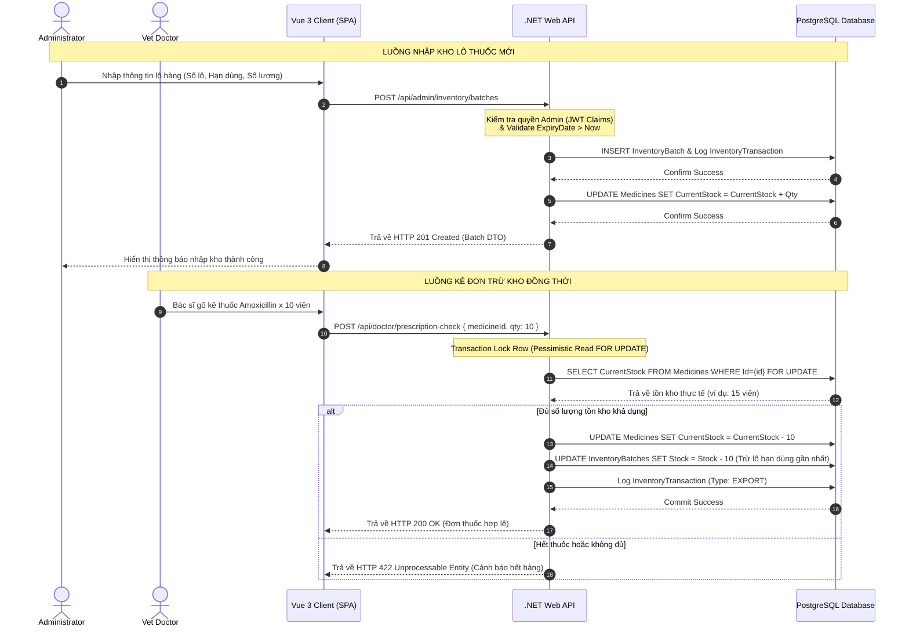

# 🛠️ Technical Specification - Admin Drug Inventory

Tài liệu thiết kế kỹ thuật chi tiết cho tính năng Quản lý Kho thuốc & Vật tư Admin phòng khám MyPetClinic.

---

## 1. Kiến trúc Tổng quát & Sơ đồ Tuần tự (Sequence Diagram)

Sơ đồ dưới đây mô tả luồng nhập kho lô thuốc mới của Admin và luồng kiểm kho đồng bộ trừ kho khi bác sĩ thực hiện kê đơn thuốc cho thú cưng.



---

## 2. Đặc tả Cơ sở Dữ liệu (Database Schema)

### Thực thể `Medicines` (Cập nhật cột quản trị tồn kho)
Bảng danh mục thuốc của phòng khám.

| Tên cột | Kiểu dữ liệu | Ràng buộc | Mô tả |
| :--- | :--- | :--- | :--- |
| **Id** | UUID / uniqueidentifier | Primary Key | Khóa chính |
| **Name** | VARCHAR(150) | Not Null, Unique | Tên biệt dược thương mại |
| **ActiveIngredient**| VARCHAR(200) | Not Null | Hoạt chất hóa học y bạ |
| **Price** | DECIMAL(18, 2) | Not Null | Đơn giá bán lẻ cho khách hàng |
| **MinStockThreshold**| INT | Not Null, Default 10 | Định mức tồn kho tối thiểu |
| **CurrentStock** | INT | Not Null, Default 0 | Số lượng tồn thực tế trong kho |

### Thực thể `InventoryBatches` (Lô hàng nhập kho)
Bảng lưu trữ thông tin tồn kho chi tiết theo từng lô hàng có hạn sử dụng cụ thể.

| Tên cột | Kiểu dữ liệu | Ràng buộc | Mô tả |
| :--- | :--- | :--- | :--- |
| **Id** | UUID / uniqueidentifier | Primary Key | Khóa chính lô hàng |
| **MedicineId** | UUID / uniqueidentifier | Foreign Key | Tham chiếu đến bảng `Medicines` |
| **BatchNumber** | VARCHAR(50) | Not Null | Số lô sản xuất từ nhà cung cấp |
| **InitialQuantity** | INT | Not Null | Số lượng nhập vào ban đầu |
| **CurrentQuantity** | INT | Not Null | Số lượng còn lại hiện tại của lô |
| **ManufacturingDate**| DATE | Nullable | Ngày sản xuất |
| **ExpiryDate** | DATE | Not Null | Hạn sử dụng của lô hàng |
| **Status** | VARCHAR(20) | Not Null | Trạng thái lô: `InStock`, `Expired`, `Depleted` |

### Thực thể `InventoryTransactions` (Nhật ký giao dịch kho)
Lưu trữ toàn bộ lịch sử biến động kho thuốc để phục vụ đối soát tài chính và kiểm toán.

| Tên cột | Kiểu dữ liệu | Ràng buộc | Mô tả |
| :--- | :--- | :--- | :--- |
| **Id** | UUID / uniqueidentifier | Primary Key | Khóa chính giao dịch |
| **MedicineId** | UUID / uniqueidentifier | Foreign Key | Loại thuốc biến động |
| **BatchId** | UUID / uniqueidentifier | Foreign Key, Nullable | Tham chiếu lô hàng cụ thể |
| **TransactionType** | VARCHAR(20) | Not Null | Loại giao dịch: `IMPORT` (Nhập), `EXPORT` (Xuất) |
| **Quantity** | INT | Not Null | Số lượng biến động (luôn dương) |
| **ActorId** | UUID / uniqueidentifier | Foreign Key | Admin hoặc Bác sĩ thực hiện giao dịch |
| **Timestamp** | TIMESTAMP WITH TIME ZONE | Not Null | Thời gian giao dịch diễn ra |

### Script SQL Khởi Tạo Cập Nhật PostgreSQL
```sql
-- Tạo bảng InventoryBatches
CREATE TABLE InventoryBatches (
    Id UUID PRIMARY KEY DEFAULT gen_random_uuid(),
    MedicineId UUID NOT NULL,
    BatchNumber VARCHAR(50) NOT NULL,
    InitialQuantity INT NOT NULL CHECK (InitialQuantity > 0),
    CurrentQuantity INT NOT NULL CHECK (CurrentQuantity >= 0),
    ManufacturingDate DATE NULL,
    ExpiryDate DATE NOT NULL,
    Status VARCHAR(20) NOT NULL DEFAULT 'InStock',
    CONSTRAINT fk_batch_medicine FOREIGN KEY (MedicineId) REFERENCES Medicines(Id) ON DELETE CASCADE
);

-- Tạo bảng InventoryTransactions
CREATE TABLE InventoryTransactions (
    Id UUID PRIMARY KEY DEFAULT gen_random_uuid(),
    MedicineId UUID NOT NULL,
    BatchId UUID NULL,
    TransactionType VARCHAR(20) NOT NULL CHECK (TransactionType IN ('IMPORT', 'EXPORT')),
    Quantity INT NOT NULL CHECK (Quantity > 0),
    ActorId UUID NOT NULL,
    Timestamp TIMESTAMP WITH TIME ZONE NOT NULL DEFAULT CURRENT_TIMESTAMP,
    CONSTRAINT fk_tx_medicine FOREIGN KEY (MedicineId) REFERENCES Medicines(Id) ON DELETE CASCADE,
    CONSTRAINT fk_tx_batch FOREIGN KEY (BatchId) REFERENCES InventoryBatches(Id) ON DELETE SET NULL,
    CONSTRAINT fk_tx_actor FOREIGN KEY (ActorId) REFERENCES Users(Id) ON DELETE RESTRICT
);

-- Tạo Index tối ưu
CREATE INDEX idx_batches_expiry ON InventoryBatches(ExpiryDate);
CREATE INDEX idx_batches_medicine_status ON InventoryBatches(MedicineId, Status);
CREATE INDEX idx_tx_timestamp ON InventoryTransactions(Timestamp DESC);
```

---

## 3. Đặc tả C# DTOs & Validation

### ImportBatchRequest.cs
```csharp
using System;
using System.ComponentModel.DataAnnotations;

namespace MyPetClinic.Application.DTOs.Inventory
{
    public class ImportBatchRequest
    {
        [Required(ErrorMessage = "Bắt buộc chọn loại thuốc cần nhập kho")]
        public Guid MedicineId { get; set; }

        [Required(ErrorMessage = "Số lô sản xuất không được để trống")]
        [StringLength(50, ErrorMessage = "Số lô không được vượt quá 50 ký tự")]
        public string BatchNumber { get; set; } = null!;

        [Range(1, 100000, ErrorMessage = "Số lượng nhập kho phải lớn hơn 0")]
        public int Quantity { get; set; }

        public DateTime? ManufacturingDate { get; set; }

        [Required(ErrorMessage = "Hạn sử dụng bắt buộc nhập")]
        [DataType(DataType.Date)]
        public DateTime ExpiryDate { get; set; }
    }
}
```

### MedicineInventoryDto.cs
```csharp
namespace MyPetClinic.Application.DTOs.Inventory
{
    public class MedicineInventoryDto
    {
        public Guid Id { get; set; }
        public string Name { get; set; } = null!;
        public string ActiveIngredient { get; set; } = null!;
        public decimal Price { get; set; }
        public int MinStockThreshold { get; set; }
        public int CurrentStock { get; set; }
        public string StockStatus { get; set; } = null!; // LowStock, InStock, Depleted
        public List<BatchDto> Batches { get; set; } = new();
    }

    public class BatchDto
    {
        public Guid Id { get; set; }
        public string BatchNumber { get; set; } = null!;
        public int CurrentQuantity { get; set; }
        public DateTime ExpiryDate { get; set; }
        public string BatchStatus { get; set; } = null!; // Active, Expired, ExpiringSoon
    }
}
```
