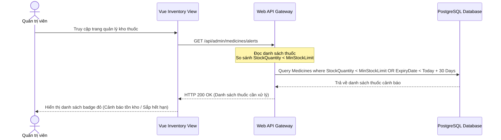

# 🛠️ Technical Specification - Admin Drug Inventory

## 🔗 Skills Liên Quan
- **BE-F02 (SOLID - SRP):** Tách biệt nghiệp vụ CRUD thuốc (`MedicineService`) và nghiệp vụ kiểm kho cảnh báo (`InventoryAlertService`).
- **BE-A03 (RBAC):** Gán tag `[Authorize(Roles = "admin")]` bảo vệ tài nguyên kho.

---

## 1. Sequence Diagram: Kiểm tra cảnh báo tồn kho tự động (Inventory Alert Flow)



---

## 2. API Schema & DTOs

```csharp
public class MedicineDto
{
    public Guid Id { get; set; }
    public string Name { get; set; }
    public string Unit { get; set; }
    public int StockQuantity { get; set; }
    public int MinStockLimit { get; set; }
    public decimal ImportPrice { get; set; }
    public decimal Price { get; set; }
    public DateTime? ExpiryDate { get; set; }
}

public class UpdateStockRequestDto
{
    public int AdjustQuantity { get; set; } // Số lượng cộng dồn thêm (nhập kho)
    public string Notes { get; set; }
}
```
