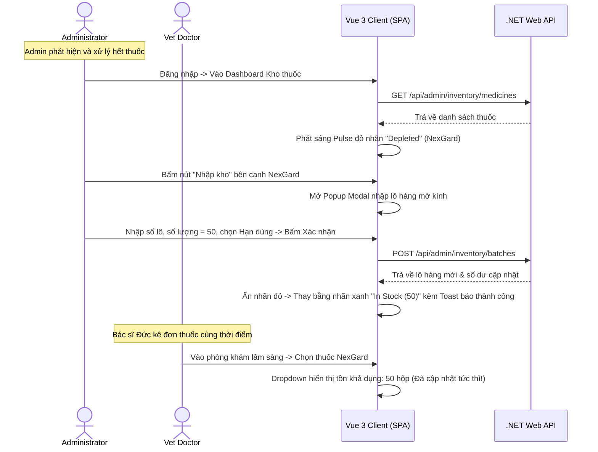

# 🗺️ UX Flow & Interactions - Admin Drug Inventory

Tài liệu đặc tả luồng trải nghiệm người dùng (UX Journey Map), các điểm chạm tương tác và hiệu ứng chuyển động giao diện dành cho Quản trị viên và Bác sĩ.

---

## 1. Bản đồ Hành trình Trải nghiệm của Admin & Bác sĩ (User Journey Map)



---

## 2. Chi tiết các Bước Tương tác & Điểm chạm (Touchpoints)

### Bước 1: Hệ thống hiển thị cảnh báo tồn kho
- **Hiện tượng UI:** Khi Admin truy cập vào Dashboard Quản lý kho, các dòng thuốc bị cạn kiệt (`CurrentStock = 0`) sẽ có nhãn `Depleted` nhấp nháy phát sáng đỏ (Pulse Animation). Các dòng thuốc sắp hết hàng (`CurrentStock <= MinThreshold`) sẽ có nhãn `Low Stock` nhấp nháy vàng.
- **Hành vi:** Hệ thống cung cấp bộ lọc nhanh ở đầu trang để Admin có thể lọc riêng các loại thuốc có cảnh báo nhằm xử lý nhanh chóng.

### Bước 2: Tạo phiếu nhập kho qua Popup mờ kính
- **Tương tác:** Admin click chọn nút "Nhập kho" tại dòng biệt dược cần bổ sung.
- **Hiệu ứng:** Cửa sổ Modal nhập kho trượt nhẹ từ trên xuống (Slide-down) trong 200ms cùng hiệu ứng mờ kính tối (Glassmorphism card) phủ mờ toàn bộ nội dung phía sau (Backdrop Blur: 10px).
- **Phản hồi thời gian thực:** Ô chọn Hạn sử dụng (`ExpiryDate`) được tích hợp lịch chọn thông minh. Nếu Admin chọn ngày ở quá khứ, viền ô nhập lập tức chuyển sang màu đỏ phát sáng nhẹ (Red shadow) kèm dòng chữ cảnh báo lỗi *"Hạn sử dụng không được là ngày quá khứ"*.

### Bước 3: Hoàn tất nhập kho và đồng bộ hóa giao diện Bác sĩ
- **Tương tác:** Admin bấm nút "Xác nhận nhập kho" màu xanh lá.
- **Hiệu ứng:**
  - Nút bấm hiển thị trạng thái Loading và hiệu ứng gợn sóng (Ripple).
  - Toast thông báo màu xanh lá xuất hiện góc trên màn hình: *"Đã nhập kho thành công 50 hộp NexGard, Lô LOT-202606-02"* trong 3 giây.
  - Số lượng tồn trên bảng danh sách của Admin và ô chọn kê đơn thuốc trên màn hình khám lâm sàng của Bác sĩ được tự động cập nhật số dư mới tức thời dưới 150ms mà không cần tải lại trang.

---

## 3. Đặc tả Các hiệu ứng Chuyển động CSS (Micro-animations)

Các hiệu ứng CSS tinh tế cho giao diện quản trị kho:

```css
/* Hiệu ứng trượt nhẹ Popup nhập kho từ trên xuống */
.modal-slide-down {
  transform: translateY(-50px);
  opacity: 0;
  animation: slideDown 0.25s cubic-bezier(0.16, 1, 0.3, 1) forwards;
}

@keyframes slideDown {
  to {
    transform: translateY(0);
    opacity: 1;
  }
}

/* Hiệu ứng viền đỏ phát sáng cho ô nhập lỗi */
.input-error-glow {
  border-color: hsl(355, 75%, 50%) !important;
  box-shadow: 0 0 0 3px rgba(239, 68, 68, 0.25);
  animation: shake 0.2s ease-in-out 2 times;
}

@keyframes shake {
  0%, 100% { transform: translateX(0); }
  25% { transform: translateX(-4px); }
  75% { transform: translateX(4px); }
}
```
