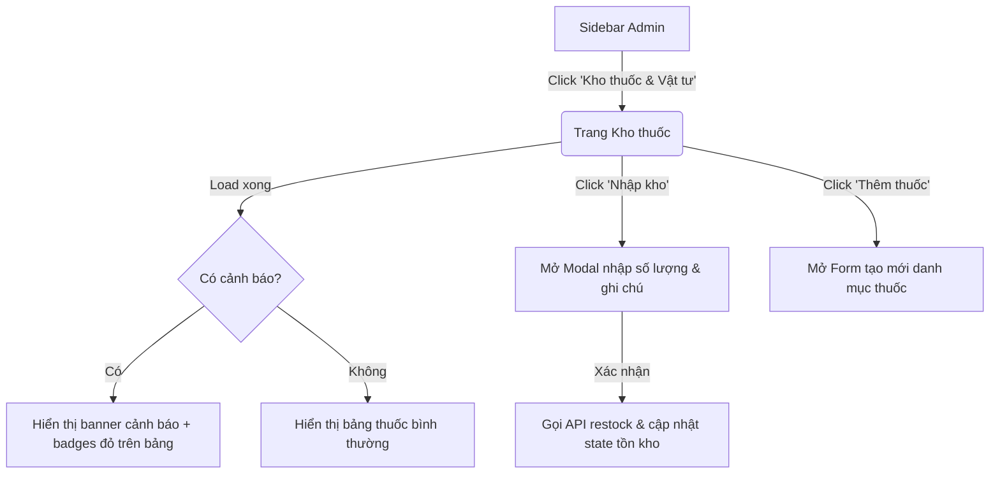

# 📐 UX Flow - Admin Drug Inventory

## 1. Luồng Giao diện Kho thuốc (UX Flow)

```mermaid
graph TD
    A[Sidebar Admin] -->|Click 'Kho thuốc & Vật tư'| B(Trang Kho thuốc)
    B -->|Load xong| C{Có cảnh báo?}
    C -->|Có| D[Hiển thị banner cảnh báo + badges đỏ trên bảng]
    C -->|Không| E[Hiển thị bảng thuốc bình thường]
    B -->|Click 'Nhập kho'| F[Mở Modal nhập số lượng & ghi chú]
    F -->|Xác nhận| G[Gọi API restock & cập nhật state tồn kho]
    B -->|Click 'Thêm thuốc'| H[Mở Form tạo mới danh mục thuốc]
```
