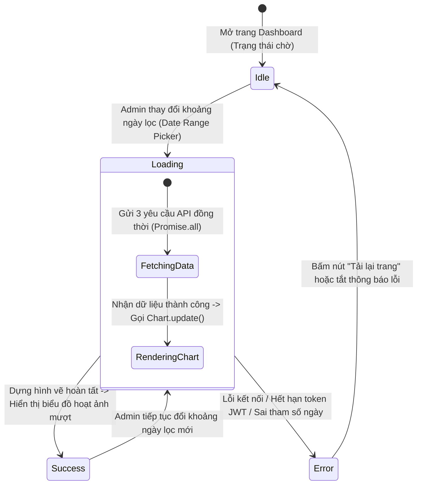

# 📊 Behavioral Specification - Admin Revenue Reports

Tài liệu đặc tả hành vi hệ thống, mô hình máy trạng thái hữu hạn (FSM) quản lý tiến trình tải và dựng biểu đồ doanh thu Chart.js ở phía Client.

---

## 1. Biểu đồ Máy Trạng thái Tải & Dựng Biểu đồ (Chart Lifecycle FSM)

Vòng đời hiển thị và dựng hình vẽ của hệ thống biểu đồ trên giao diện Vue 3 được điều phối chặt chẽ theo sơ đồ Mermaid dưới đây:

---

## 2. Diễn giải chi tiết các chuyển dịch trạng thái (Transitions)

### 1. Trạng thái Chờ (`Idle`) sang Đang tải (`Loading`)
- **Tác nhân:** Quản trị viên thay đổi ngày lọc trên lịch chọn ngày (Date Range Picker).
- **Hành vi hệ thống:**
  - Kích hoạt cờ `isLoading = true` trong Pinia store.
  - Trên giao diện hiển thị hiệu ứng khung xương tải giả lập (Skeleton Shimmer Effect) tại các vị trí thẻ KPI và biểu đồ.
  - Gọi đồng thời 3 API thông qua `Promise.all` để tối ưu thời gian tải.

### 2. Đang tải (`Loading`) sang Thành công (`Success`)
- **Tác nhân:** Hệ thống nhận đầy đủ dữ liệu từ Backend.
- **Hành vi hệ thống:**
  - Giải nén dữ liệu JSON gán vào Store State.
  - Gọi hàm `chart.destroy()` và khởi tạo lại đối tượng `new Chart()` để tránh rò rỉ bộ nhớ (Memory Leak) khi vẽ đè canvas cũ.
  - Dựng hoạt ảnh vẽ Line/Donut Chart chuyển động mềm mại trong 400ms (Chart.js Animation Duration).
  - Tắt cờ `isLoading = false` hiển thị biểu đồ chính thức.

### 3. Đang tải (`Loading`) sang Lỗi (`Error`)
- **Tác nhân:** Lỗi kết nối mạng, token JWT hết hạn giữa chừng (401) hoặc truy cập vượt quyền (403).
- **Hành vi hệ thống:**
  - Ẩn khung xương loading, tắt cờ `isLoading = false`.
  - Hiển thị Toast thông báo lỗi chi tiết: *"Không thể kết nối đến máy chủ. Vui lòng kiểm tra lại đường truyền."*.
  - Giữ nguyên biểu đồ cũ (nếu có) hoặc hiển thị nhãn rỗng (Empty State) để giao diện không bị vỡ bố cục.

---

## 3. Các quy tắc ràng buộc bảo mật và nghiệp vụ (Business Rules Constraints)

- **Ràng buộc Khoảng Ngày Lọc Tối Đa (Date Range Boundary):**
  - Chặn không cho phép Admin chọn ngày kết thúc nhỏ hơn ngày bắt đầu. Date Picker tự động disable các ngày trước ngày bắt đầu.
  - Giới hạn khoảng ngày tối đa là **1095 ngày (3 năm)** để tránh làm tràn bộ nhớ máy chủ khi thực hiện các phép Sum GroupBy quá dài.
- **Chính sách Giải phóng Bộ nhớ Canvas (Canvas Cleanup Policy):**
  - Trong Vue 3 Lifecycle Hook `onBeforeUnmount`, component bắt buộc phải gọi hàm `chart.destroy()` để thu hồi RAM đồ họa của trình duyệt, ngăn chặn hiện tượng treo đơ trình duyệt khi Admin chuyển qua lại giữa các tab nhiều lần.
- **Tránh gửi yêu cầu lặp thừa (Debounce Date Picking):**
  - Khi Admin chọn ngày trên lịch, hệ thống sẽ thực hiện trì hoãn (Debounce) **300ms** trước khi thực sự kích hoạt gọi API, phòng trường hợp Admin bấm nhấp nháy lịch nhiều lần liên tục làm spam server.
