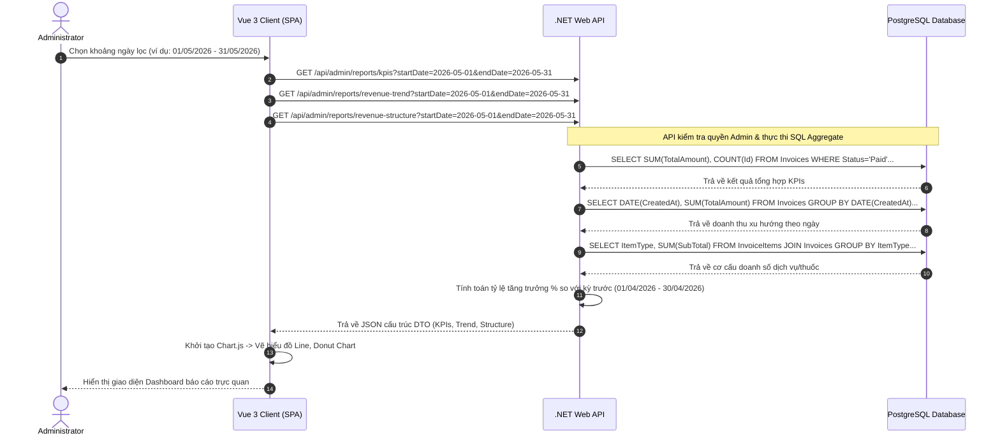

# 🛠️ Technical Specification - Admin Revenue Reports

Tài liệu thiết kế kỹ thuật chi tiết cho tính năng Báo cáo doanh thu & Hiệu suất Admin phòng khám MyPetClinic.

---

## 1. Kiến trúc Tổng quát & Sơ đồ Tuần tự (Sequence Diagram)

Sơ đồ dưới đây mô tả luồng truy xuất dữ liệu từ client Vue 3, qua .NET Web API, thực thi các truy vấn SQL tổng hợp trên CSDL PostgreSQL và trả về cấu trúc DTO phục vụ cho Chart.js.



---

## 2. Đặc tả Tối ưu hóa Truy vấn Cơ sở Dữ liệu (SQL Query Tuning)

Để tính toán doanh thu xu hướng theo ngày trong tháng nhanh chóng không gây nghẽn RAM máy chủ, ta viết các câu lệnh SQL sử dụng cơ chế gom nhóm của Postgres.

### SQL Tính toán Doanh thu Xu hướng theo Ngày:
```sql
SELECT 
    DATE(i.PaidAt) AS DateLabel,
    SUM(i.TotalAmount) AS DailyRevenue,
    COUNT(i.Id) AS InvoiceCount
FROM Invoices i
WHERE i.Status = 'Paid' 
  AND i.PaidAt >= :startDate 
  AND i.PaidAt <= :endDate
GROUP BY DATE(i.PaidAt)
ORDER BY DateLabel ASC;
```

### SQL Phân tích Cơ cấu Doanh thu (Phí khám vs Thuốc vs Vắc-xin):
```sql
SELECT 
    ii.ItemType AS Category,
    SUM(ii.SubTotal) AS CategoryTotal
FROM InvoiceItems ii
JOIN Invoices i ON ii.InvoiceId = i.Id
WHERE i.Status = 'Paid'
  AND i.PaidAt >= :startDate 
  AND i.PaidAt <= :endDate
GROUP BY ii.ItemType;
```

### Tối ưu hóa Database Index:
Chúng ta cần tạo chỉ mục phức hợp để tăng tốc độ quét theo khoảng ngày thanh toán và trạng thái hóa đơn:
```sql
CREATE INDEX idx_invoices_report_covering ON Invoices (Status, PaidAt) INCLUDE (TotalAmount);
```
*Index này cho phép PostgreSQL thực hiện quét Index-Only Scan vô cùng hiệu quả để lấy dữ liệu tính toán tổng tiền mà không cần quét toàn bộ bảng.*

---

## 3. Đặc tả C# DTOs & Cấu trúc JSON trả về cho Chart.js

### KpiReportDto.cs
```csharp
namespace MyPetClinic.Application.DTOs.Report
{
    public class KpiReportDto
    {
        public decimal TotalRevenue { get; set; }
        public double GrowthRate { get; set; } // Ví dụ: +12.5% hoặc -3.2%
        public int TotalAppointments { get; set; }
        public int ActiveCustomersCount { get; set; }
        public decimal AverageOrderValue { get; set; }
    }
}
```

### RevenueTrendDto.cs
```csharp
using System.Collections.Generic;

namespace MyPetClinic.Application.DTOs.Report
{
    public class RevenueTrendDto
    {
        public List<string> Labels { get; set; } = new(); // ["2026-06-01", "2026-06-02"...]
        public List<decimal> DataPoints { get; set; } = new(); // [12000000, 15500000...]
        public List<int> InvoiceCounts { get; set; } = new(); // [12, 15...]
    }
}
```

### RevenueStructureDto.cs
```csharp
namespace MyPetClinic.Application.DTOs.Report
{
    public class RevenueStructureDto
    {
        public decimal ServiceRevenue { get; set; }
        public decimal MedicineRevenue { get; set; }
        public decimal VaccineRevenue { get; set; }
    }
}
```
Cấu trúc JSON phản hồi tương ứng cho biểu đồ Donut:
```json
{
  "serviceRevenue": 150000000.00,
  "medicineRevenue": 85000000.00,
  "vaccineRevenue": 40000000.00
}
```
