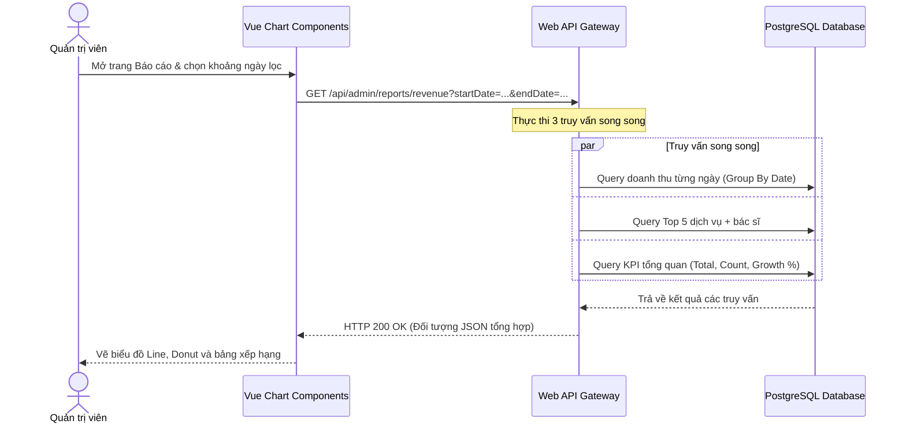

# 🛠️ Technical Specification - Admin Revenue Reports

## 🔗 Skills Liên Quan
- **BE-F03 (Async/Await):** Truy vấn song song các chỉ số thống kê bằng `Task.WhenAll` để tối ưu hóa tốc độ phản hồi API.
- **BE-C02 (EF Core):** Áp dụng Index trên cột `CreatedAt` và `Status` bảng `Invoices` để cải thiện hiệu năng truy vấn GROUP BY.

---

## 1. Sequence Diagram: Tải Dashboard Báo cáo Doanh thu



---

## 2. DTOs

```csharp
public class RevenueDashboardDto
{
    public decimal TotalRevenue { get; set; }
    public decimal GrowthRate { get; set; } // % so với kỳ trước
    public int TotalAppointments { get; set; }
    public decimal ServiceRevenue { get; set; }
    public decimal MedicineRevenue { get; set; }
    public List<DailyRevenueDto> DailyChart { get; set; }
    public List<TopItemDto> TopServices { get; set; }
    public List<TopItemDto> TopDoctors { get; set; }
}
```
