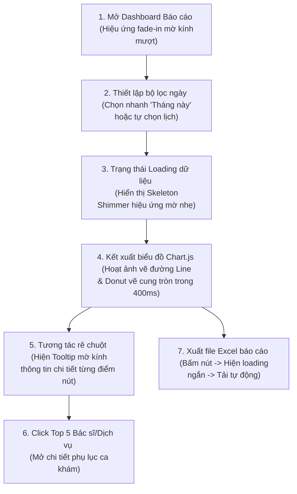

# 🗺️ UX Flow & Interactions - Admin Revenue Reports

Tài liệu đặc tả luồng trải nghiệm người dùng (UX Journey Map), các điểm chạm tương tác và hiệu ứng chuyển động đồ họa biểu đồ dành cho Quản trị viên khi phân tích dữ liệu phòng khám.

---

## 1. Bản đồ Hành trình Trải nghiệm của Admin (User Journey Map)



---

## 2. Chi tiết các Bước Tương tác & Điểm chạm (Touchpoints)

### Bước 1: Trạng thái Loading và Hoạt ảnh Dựng biểu đồ
- **Hiện tượng UI:** Khi vừa mở trang hoặc thay đổi bộ lọc ngày, toàn bộ các vùng hiển thị số liệu và biểu đồ sẽ chuyển sang hiệu ứng khung xương (Skeleton Loading Shimmer).
- **Hoạt ảnh dựng hình:** Sau khi nhận dữ liệu thành công từ API, các biểu đồ sẽ không xuất hiện đột ngột mà thực hiện hoạt ảnh vẽ:
  - **Line Chart (Xu hướng):** Đường doanh thu tự động vẽ từ điểm ngày đầu tiên trượt mượt mà đến ngày cuối cùng theo trục hoành.
  - **Donut Chart (Cơ cấu):** Các lát cắt phân chia cơ cấu dịch vụ tự động xoay và vẽ các cung tròn khép kín từ 0 đến 360 độ.

### Bước 2: Tương tác Tooltip và Rê chuột (Hover Interactions)
- **Tương tác:** Admin di chuột (Hover) qua các ngày trên biểu đồ Line Chart.
- **Phản hồi giao diện:**
  - Điểm nút dữ liệu của ngày đó tự động phình to (Radius hover increase) từ 4px lên 7px và phát sáng nhẹ.
  - Custom Tooltip mờ kính trượt nhẹ theo tọa độ chuột và hiển thị thông tin: Ngày lọc, Số lượng hóa đơn thu tiền, và tổng doanh thu VND được định dạng rõ ràng (ví dụ: *15.500.000 đ*).

### Bước 3: Xuất báo cáo Excel
- **Tương tác:** Admin click vào nút "Xuất báo cáo" màu xanh lục ở góc phải.
- **Phản hồi UI:** Nút bấm hiển thị spinner loading xoay tròn và chữ *"Đang tạo file..."*. Khi file Excel được tải xuống máy tính thành công, một Toast Notification xanh lá xuất hiện báo hiệu: *"Báo cáo Excel đã được tải xuống máy của bạn."*.

---

## 3. Đặc tả Các hiệu ứng Chuyển động CSS (Micro-animations)

Các hiệu ứng CSS tinh tế cho giao diện biểu đồ:

```css
/* Hiệu ứng Skeleton Loading Shimmer bóng mờ chạy qua card */
@keyframes shimmer {
  0% {
    background-position: -200% 0;
  }
  100% {
    background-position: 200% 0;
  }
}

.skeleton-shimmer {
  background: linear-gradient(90deg, rgba(255, 255, 255, 0.03) 25%, rgba(255, 255, 255, 0.08) 50%, rgba(255, 255, 255, 0.03) 75%);
  background-size: 200% 100%;
  animation: shimmer 1.5s infinite;
  border-radius: 8px;
}

/* Hiệu ứng fade-in mượt cho container biểu đồ khi tải xong */
.chart-fade-in {
  opacity: 0;
  animation: fadeIn 0.4s ease-out forwards;
}

@keyframes fadeIn {
  to {
    opacity: 1;
  }
}
```
