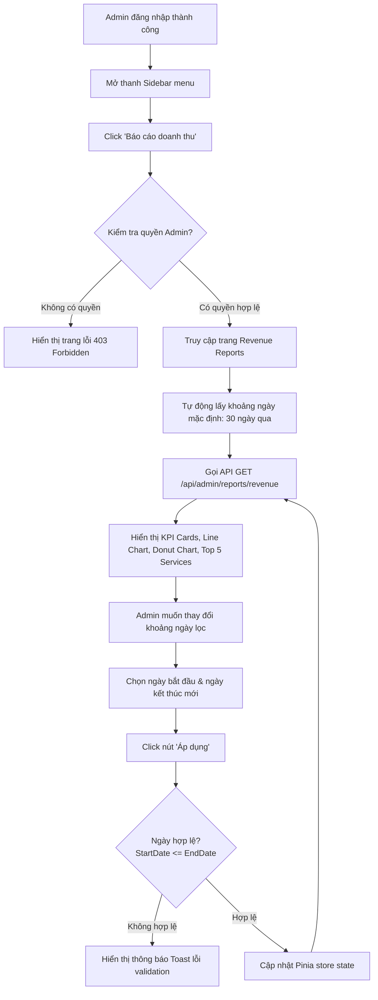

# 🔁 UX Flow - Admin Revenue Reports

## 🔗 Skills Liên Quan
- **FE-F01 (Navigation Flow):** Quản lý điều hướng người dùng giữa bảng điều khiển quản trị (Admin Dashboard) và trang chi tiết báo cáo.

---

## 1. Biểu đồ luồng trải nghiệm người dùng (UX Diagram)

Dưới đây là sơ đồ Mermaid thể hiện cách một Admin tương tác với trang báo cáo doanh thu:

