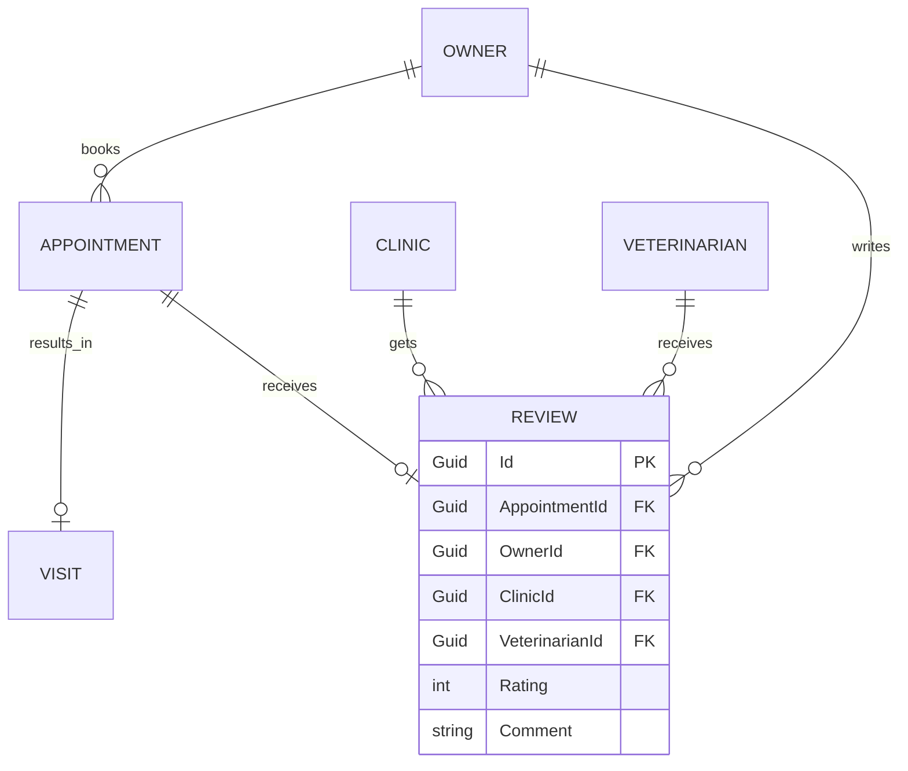

# Kế hoạch Triển khai: Chức năng Quản lý Đánh giá (Review Management)

Tài liệu này cung cấp phân tích và thiết kế chi tiết cho chức năng Quản lý Đánh giá (Review Management) dành cho hệ thống MyPetClinic, tuân thủ các nguyên tắc AI-First & Clean Architecture.

> [!IMPORTANT]
> **User Review Required:** Vui lòng xem xét các quy tắc nghiệp vụ (Business Rules) và cấu trúc Database đề xuất. Đặc biệt là quyết định Review sẽ gắn cứng với `Appointment` theo quan hệ 1-1.

## 1. Phân tích nghiệp vụ (Business Analysis)

*   **Mục đích:** Thu thập phản hồi thực tế từ khách hàng (Owner) để cải thiện chất lượng dịch vụ, đánh giá KPI của bác sĩ/phòng khám, và cung cấp Social Proof (chứng thực xã hội) giúp thu hút khách hàng mới.
*   **Ai được phép đánh giá?** Chỉ **Owner (Khách hàng)** của các cuộc hẹn (Appointment) hợp lệ.
*   **Khi nào được phép đánh giá?** Chỉ khi trạng thái của Appointment hoặc Visit chuyển sang **Completed** (Đã hoàn thành khám và thanh toán).
*   **Khi nào KHÔNG được phép đánh giá?** Khi Appointment ở các trạng thái: `Pending`, `Confirmed`, `Cancelled`, `No Show`, hoặc đã vượt quá thời hạn cho phép đánh giá.
*   **Một Appointment có được đánh giá nhiều lần không?** **Không**. Quan hệ là 1-1. Mỗi lần khám chỉ được đánh giá 1 lần để đảm bảo tính xác thực (Verified Review).
*   **Chỉnh sửa đánh giá:** Cho phép chỉnh sửa trong vòng **7 ngày** kể từ ngày tạo, **VỚI ĐIỀU KIỆN** phòng khám chưa phản hồi. Khi đã có phản hồi, đánh giá bị khóa (để tránh trường hợp khách sửa review làm sai lệch ngữ cảnh phản hồi của phòng khám).
*   **Xóa đánh giá:** Owner có thể xóa đánh giá của mình bất cứ lúc nào. (Soft delete).
*   **Phòng khám phản hồi:** Có. Admin hoặc Veterinarian có quyền phản hồi (Reply) 1 lần cho mỗi đánh giá.
*   **Admin ẩn đánh giá:** Có. Admin có quyền ẩn (Hide) đánh giá nếu vi phạm tiêu chuẩn cộng đồng (chứa ngôn từ đả kích, quảng cáo, v.v.).
*   **Lưu lịch sử chỉnh sửa:** Có. Cần lưu lại Audit Log (bảng riêng hoặc cấu trúc JSON) để Admin có thể đối chiếu khi có tranh chấp.
*   **Giới hạn thời gian đánh giá:** Khách hàng chỉ có thể tạo đánh giá trong vòng **30 ngày** kể từ ngày khám hoàn tất (Completed). Sau 30 ngày, link đánh giá hết hạn.

---

## 2. Thiết kế Database (Database Schema)

Hiện tại, hệ thống đã có sẵn Entity `Review` tại `MyPetClinic.Domain/Entities/Review.cs` với cấu trúc cơ bản:
*   `Id` (long)
*   `CustomerId` (Guid)
*   `AppointmentId` (long)
*   `Rating` (short)
*   `Comment` (string?)
*   `CreatedAt` (DateTime)

Để đáp ứng đầy đủ các nghiệp vụ quản lý đánh giá hiện đại (phản hồi, ẩn đánh giá, v.v.), tôi đề xuất **bổ sung thêm các cột sau vào bảng `Reviews` hiện có (thông qua Entity Framework Migration)**:

| Column Đề Xuất Thêm | Data Type | Nullable | Ý nghĩa / Giải thích |
| :--- | :--- | :--- | :--- |
| `ReplyComment` | `string?` | Yes | Nội dung phản hồi từ phòng khám. |
| `RepliedAt` | `DateTime?` | Yes | Thời gian phòng khám phản hồi. |
| `RepliedById` | `Guid?` | Yes | ID người của phòng khám (User/Staff) đã phản hồi. |
| `Status` | `ReviewStatus` (Enum)| No | Trạng thái: `1: Published`, `2: Hidden` (Bị ẩn bởi Admin), `3: Deleted` (Xóa bởi Customer). Mặc định là Published. |
| `UpdatedAt` | `DateTime?` | Yes | Thời điểm cập nhật cuối (nếu khách hàng sửa). |
| `ClinicId` | `Guid?` | Yes | (Tùy chọn) Gắn với phòng khám để query nhanh điểm số. Có thể thêm nếu cần tối ưu Read. |
| `VeterinarianId`| `Guid?` | Yes | (Tùy chọn) Gắn với Bác sĩ để tính KPI trực tiếp không cần qua Visit. |

> [!TIP]
> **Tối ưu Index:** Tạo Composite Index trên `(AppointmentId)` (Unique) để đảm bảo 1 Appointment chỉ có 1 Review, và `(CustomerId)` để truy vấn nhanh.

---

## 3. Quan hệ dữ liệu (Data Relationships)



**Giải thích:**
*   **Gắn với Appointment hay Visit?** Nên gắn trực tiếp với **Appointment**. Vì Review đánh giá toàn bộ trải nghiệm từ lúc đặt lịch, đón tiếp (Receptionist) đến lúc khám (Visit) và thanh toán.
*   **Có nên gắn trực tiếp Clinic và Veterinarian không?** **Có**. Mặc dù có thể join qua `Appointment -> Visit -> Veterinarian`, nhưng việc lưu trực tiếp `ClinicId` và `VeterinarianId` trong bảng `Review` giúp tối ưu hóa hiệu năng đọc (Read-heavy) cho các màn hình Thống kê và Danh sách đánh giá bác sĩ.
*   **Quan hệ:**
    *   `Appointment` - `Review`: **One-to-One (0..1)** (Một cuộc hẹn có tối đa 1 đánh giá).
    *   `Owner` - `Review`: **One-to-Many**.

---

## 4. Luồng nghiệp vụ (Business Workflow)

1.  **Hoàn thành Dịch vụ:** Bác sĩ khám xong, Thu ngân hoàn tất thanh toán. Trạng thái Appointment chuyển thành `Completed`.
2.  **Kích hoạt Hệ thống (Background Job):** Hệ thống (dùng Quartz.NET hoặc Hangfire) phát hiện Appointment vừa Completed. Đưa vào Queue.
3.  **Thông báo Đánh giá:** Sau 2 giờ (hoặc 1 ngày tùy cấu hình), hệ thống tự động gửi Email/Zalo/App Notification cho Owner: *"Cảm ơn bạn đã thăm khám tại MyPetClinic. Xin hãy dành 1 phút đánh giá..."* kèm theo Link chứa Token/ID.
4.  **Khách hàng Đánh giá:** Khách hàng click link, mở UI Đánh giá (chọn sao, viết nhận xét) -> Submit (Gọi API `POST /reviews`).
5.  **Kiểm duyệt tự động (Content Filter):** Hệ thống quét nội dung. Nếu có từ chửi thề (Profanity Filter), Status = `Hidden`, gán cờ "Cần Admin duyệt". Nếu sạch, Status = `Published`.
6.  **Hiển thị:** Review hiện trên trang Profile của Bác sĩ và trang chủ Phòng khám.
7.  **Thông báo Phòng khám:** Gửi thông báo In-app cho Admin hoặc Veterinarian có Review mới.
8.  **Phản hồi:** Admin/Veterinarian vào đọc và trả lời (Gọi API `POST /reviews/{id}/reply`). Khi trả lời xong, review bị khóa (Khách không thể sửa nội dung review ban đầu nữa).
9.  **Kiểm duyệt thủ công:** Nếu review bị Report bởi người dùng khác hoặc có tranh chấp, Admin xem xét và có thể ẩn đi (Hide).

---

## 5. Quy tắc nghiệp vụ (Business Rules)

*   `BR-REV-01`: Chỉ được tạo Review khi `Appointment.Status == Completed`. Lý do: Tránh review ảo (chưa khám đã đánh giá).
*   `BR-REV-02`: Một Appointment chỉ tương ứng tối đa **1 Review**. Lý do: Ngăn chặn spam rating.
*   `BR-REV-03`: Thời hạn tạo Review là **30 ngày** sau khi Completed. Lý do: Đảm bảo tính thời sự và chính xác của trí nhớ khách hàng.
*   `BR-REV-04`: Chủ thú cưng (Owner) có thể **sửa** Review trong **7 ngày** đầu.
*   `BR-REV-05`: **Không được sửa** Review nếu Phòng khám **đã phản hồi**. Lý do: Tránh việc khách hàng sửa xấu nội dung sau khi phòng khám đã giải thích lịch sự, làm sai lệch context.
*   `BR-REV-06`: Bảo mật **IDOR**: API tạo/sửa Review phải kiểm tra `CurrentUserId == Review.OwnerId` (từ JWT).

---

## 6. API Design (RESTful)

### Nhóm API dành cho Khách hàng (Owner)

**1. POST /api/v1/appointments/{appointmentId}/reviews**
*   **Mục đích:** Tạo đánh giá mới. (Sử dụng nested route để thể hiện rõ resource).
*   **Auth:** Require `Owner` Role. CurrentUserId phải là người đặt Appointment này.
*   **Request Body:**
    ```json
    { "rating": 5, "comment": "Bác sĩ rất nhiệt tình!" }
    ```
*   **Response (201 Created):** Trả về đối tượng Review.
*   **Error:** 400 (Quá 30 ngày / Chưa Completed), 409 (Đã tồn tại Review).

**2. PUT /api/v1/reviews/{id}**
*   **Auth:** Require `Owner`.
*   **Error:** 403 Forbidden (Nếu không phải chủ sở hữu hoặc đã có Reply).

**3. DELETE /api/v1/reviews/{id}**
*   **Auth:** Require `Owner`. Soft delete.

### Nhóm API dành cho Public & Hiển thị

**4. GET /api/v1/clinics/{clinicId}/reviews**
*   **Mục đích:** Lấy danh sách đánh giá của phòng khám (có phân trang, lọc theo Rating).
*   **Auth:** Public. Chỉ trả về các Review có `Status == Published`.

**5. GET /api/v1/veterinarians/{vetId}/reviews**
*   **Mục đích:** Lấy đánh giá của một bác sĩ. Public.

### Nhóm API dành cho Admin & Staff

**6. POST /api/v1/reviews/{id}/reply**
*   **Auth:** Require `Admin` hoặc `Veterinarian` (người trực tiếp khám).
*   **Request:** `{ "replyComment": "Cảm ơn bạn đã tin tưởng..." }`

**7. PATCH /api/v1/admin/reviews/{id}/status**
*   **Auth:** Require `Admin`.
*   **Request:** `{ "status": "Hidden", "reason": "Chứa từ ngữ thô tục" }`

---

## 7. UI/UX Design

Thiết kế giao diện theo phong cách **Glassmorphism**, sử dụng Vue 3 + TailwindCSS.

*   **Owner - Form Đánh giá:** Giao diện Modal/Popup đơn giản. Dùng Star Rating Component trực quan (hover đổi màu, micro-animation khi click). Khung textarea có counter đếm ký tự.
*   **Owner - Lịch sử:** Tab "Đánh giá của tôi" trong User Profile. Hiển thị dưới dạng Card, có Badge `Đã phản hồi` nếu phòng khám đã Reply.
*   **Public - Component Đánh giá:** Hiển thị trên chi tiết phòng khám/bác sĩ. Tổng quan rating (ví dụ: `4.8 / 5.0`) lớn, biểu đồ thanh ngang cho các mức sao (5 sao: 80%, 4 sao: 15%...). Danh sách review có lazy-load.
*   **Admin - Dashboard:** Bảng lưới (DataGrid) hiển thị các đánh giá mới nhất. Cột `Trạng thái phản hồi` (`Chưa trả lời` / `Đã trả lời`) với màu đỏ/xanh rõ ràng. Click vào 1 hàng mở Right-Drawer để nhập phản hồi.

---

## 8. Phân quyền (RBAC Matrix)

| Hành động (Action) | Guest | Owner (Chủ review) | Veterinarian (Bị đánh giá) | Admin |
| :--- | :---: | :---: | :---: | :---: |
| Xem Review (Published) | ✅ | ✅ | ✅ | ✅ |
| Tạo Review | ❌ | ✅ (chỉ cuộc hẹn của mình) | ❌ | ❌ |
| Sửa Review | ❌ | ✅ (nếu chưa có reply) | ❌ | ❌ |
| Xóa Review (Soft) | ❌ | ✅ | ❌ | ❌ |
| Phản hồi (Reply) | ❌ | ❌ | ✅ | ✅ |
| Sửa/Xóa Phản hồi | ❌ | ❌ | ✅ (của mình) | ✅ |
| Ẩn Review (Hide) | ❌ | ❌ | ❌ | ✅ |
| Khôi phục (Restore) | ❌ | ❌ | ❌ | ✅ |
| Report | ✅ | ✅ | ✅ | N/A |

---

## 9. Chống gian lận (Anti-Fraud) & Bảo mật

*   **Verified Review (Bảo chứng thực tế):** Hệ thống chỉ mở tính năng review qua `AppointmentId` đã thanh toán. (Luật lõi).
*   **Phòng chống Spam & Bot:**
    *   Giới hạn 1 Review / 1 Appointment bằng Data Constraint (`Unique Index` trong SQL). Không thể hack qua API.
    *   API Rate Limiting cho Endpoint POST (Ví dụ: 5 requests / phút / IP) bằng middleware .NET.
*   **Profanity Filter (Bộ lọc ngôn từ):** Tích hợp thư viện hoặc Regex quét các từ khóa cấm trong `Comment`. Nếu phát hiện, cờ tự động set về `Hidden` và báo Admin.
*   **Xử lý IDOR (Insecure Direct Object Reference):** Lớp `Application Service` bắt buộc kiểm tra `currentUserId == review.OwnerId` trước khi thực thi `Update` hoặc `Delete`.

---

## 10. Thống kê (Statistics & Dashboard)

Dashboard dành cho Admin:
*   **Scorecard:** Điểm Rating trung bình tháng này so với tháng trước (Trend indicator Xanh/Đỏ).
*   **Biểu đồ Line/Bar (Chart.js):** Xu hướng Rating theo thời gian (Tháng/Quý).
*   **Top Performers:** Danh sách Top 3 Bác sĩ có Rating cao nhất và 3 Bác sĩ bị phàn nàn nhiều nhất.
*   **Tỷ lệ phản hồi (Response Rate):** % số review <= 3 sao đã được Admin hoặc Veterinarian phản hồi (KPI chăm sóc khách hàng).

*(Kỹ thuật: Sử dụng `GROUP BY` và Caching với Redis/MemoryCache cho các API thống kê này vì dữ liệu không cần real-time từng giây).*

---

## 11. Đề xuất Mở rộng (Nâng cao cho Tương lai)

*   **Upload Hình ảnh/Video:** Cho phép khách hàng tải lên hình ảnh thú cưng sau khi điều trị. (Khả thi: Tích hợp AWS S3 hoặc Azure Blob).
*   **Gắn thẻ chủ đề (Tags):** Gợi ý các tag nhanh như "Sạch sẽ", "Bác sĩ tận tâm", "Giá hợp lý" để khách click thay vì gõ chữ.
*   **AI Sentiment Analysis:** Tích hợp Gemini API hoặc Azure Text Analytics. Khi khách hàng submit review, AI sẽ phân tích cảm xúc (Positive, Neutral, Negative). Nếu phát hiện Negative review, hệ thống lập tức gửi SMS Alert cho Admin xử lý khủng hoảng ngay lập tức.
*   **Helpful Votes:** Người dùng khác có thể bấm "Hữu ích" (Like) cho các đánh giá chất lượng, đưa các review đó lên Top.

---

## 12. Đề xuất Kiến trúc & Tối ưu (Dành cho quy mô vừa và lớn)

*   **Kiến trúc CSDL:** Tách biệt `Read` và `Write` (CQRS cơ bản).
    *   **Write:** Lưu thẳng vào SQL Server `Reviews` table, check constraint.
    *   **Read (Tổng Rating):** Không `SUM/COUNT` liên tục mỗi lần load trang chủ. Sử dụng một cột dư thừa `TotalRatingScore` và `TotalReviews` trên bảng `Clinics` và `Veterinarians`. Khi có 1 Review mới (hoặc bị xóa), bắn Event (Domain Event `ReviewCreatedEvent`) để cập nhật con số này.
*   **Cache:** Lưu danh sách các review trang 1 (Top reviews) của phòng khám vào Redis (Time-To-Live = 1 giờ).
*   **Thực thi theo Clean Architecture:**
    *   `Domain`: Chứa Entity `Review`, `ReviewCreatedEvent`, validation logic.
    *   `Application`: `CreateReviewCommand`, `ReplyReviewCommand`...
    *   `Infrastructure`: `ReviewRepository`, Background Job.
    *   `WebApi`: Controller, Swagger auth.

## Open Questions

1.  **Chính sách 30 ngày:** Khách hàng có đồng ý với khoảng thời gian 30 ngày kể từ lúc hoàn tất khám để được phép đánh giá hay cần dài hơn/ngắn hơn?
2.  **Upload Media:** Trong phiên bản MVP, chúng ta có nên làm chức năng Upload hình ảnh cùng với text Review không (tốn thêm effort xử lý file storage), hay chỉ làm Text/Rating trước?
3.  **Hệ thống gửi thông báo (Job):** Có cần triển khai ngay Quartz.NET để gửi Email tự động xin đánh giá sau 2 tiếng không, hay chỉ cần hiển thị nút "Đánh giá" trong trang Lịch sử khám trên App/Web?

---
*Vui lòng duyệt qua bản thiết kế trên trước khi tôi tiến hành cập nhật Tracking hoặc tạo Task triển khai.*
