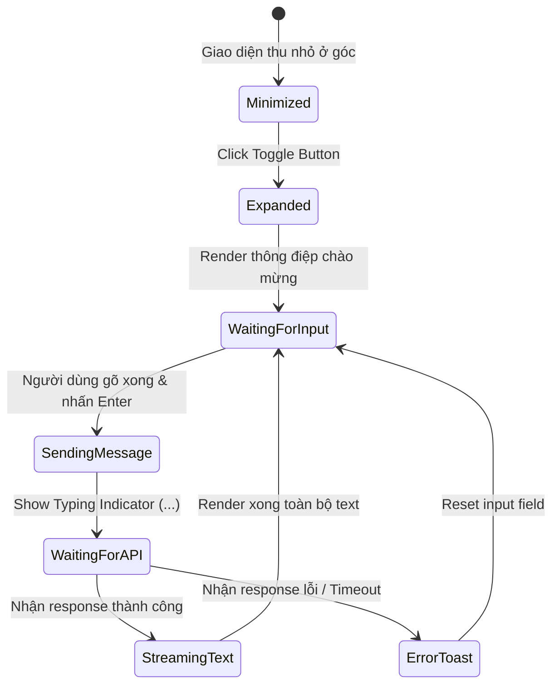

# 🎭 Behavioral Specification - Gemini AI Chatbot Advisor

## 1. Biểu đồ Trạng thái Vue Component Chat Widget

---

## 2. Quy tắc Ứng xử và Chặn Từ khóa Nhạy cảm (Keyword Filter & Guardrails)
- **Tự động gắn thẻ cảnh báo nguy hiểm:** AI được lập trình hệ thống nhận dạng các từ khóa cực kỳ nguy hiểm như: *"co giật", "sùi bọt mép", "bị đâm", "ra máu nhiều", "không thở được"*.
- Khi phát hiện các từ khóa này, AI ngay lập tức chèn đoạn văn bản in đậm màu đỏ ở đầu câu trả lời: **"CẢNH BÁO KHẨN CẤP: Thú cưng của bạn đang có biểu hiện nguy kịch! Vui lòng liên hệ hotline hoặc mang bé tới trạm y tế gần nhất ngay lập tức!"**.
