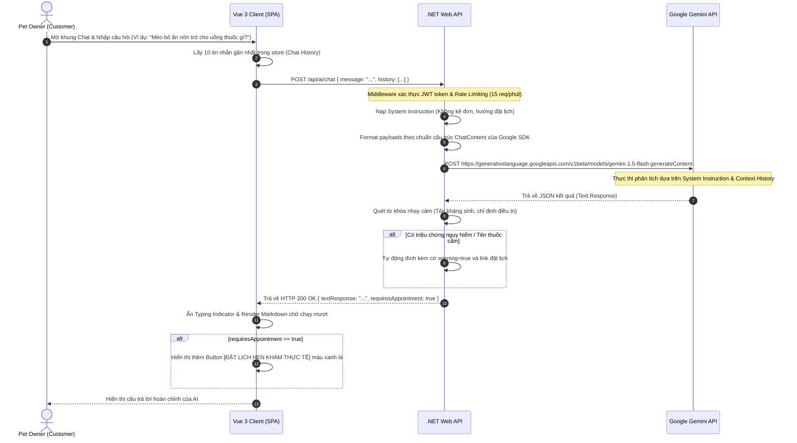

# 🛠️ Technical Specification - Gemini AI Chatbot Advisor

Tài liệu thiết kế kỹ thuật chi tiết cho tính năng Trợ lý ảo Tư vấn Sức khỏe AI (Gemini AI Advisor Chatbot) tích hợp Gemini Pro/Flash API.

---

## 1. Kiến trúc Tổng quát & Sơ đồ Tuần tự (Sequence Diagram)

Sơ đồ tuần tự dưới đây thể hiện luồng dữ liệu bảo mật từ khi Khách hàng gửi tin nhắn trên giao diện Vue 3, qua Backend Proxy Controller, thực thi kiểm duyệt và format lịch sử chat, gửi tới Google Gemini API và trả về kết quả.



---

## 2. Thiết lập Cấu trúc Dữ liệu Lịch sử Hội thoại (Chat History payload)

Để Google Gemini API hiểu ngữ cảnh cuộc hội thoại tiếp nối, cấu trúc lịch sử gửi đi phải được định dạng theo chuẩn mảng đối tượng phân biệt vai trò `user` (người dùng) và `model` (AI Chatbot) dưới đây:

```json
[
  {
    "role": "user",
    "parts": [{ "text": "Chào trợ lý, chú mèo Anh lông ngắn của tôi nặng 3kg." }]
  },
  {
    "role": "model",
    "parts": [{ "text": "Chào bạn! Cảm ơn thông tin về chú mèo 3kg của bạn. Trợ lý có thể giúp gì cho bạn hôm nay?" }]
  },
  {
    "role": "user",
    "parts": [{ "text": "Hôm nay mèo bỏ ăn và kêu nhỏ, tôi lo quá." }]
  }
]
```

---

## 3. Đặc tả C# DTOs & Validation

### ChatRequest.cs
```csharp
using System.Collections.Generic;
using System.ComponentModel.DataAnnotations;

namespace MyPetClinic.Application.DTOs.AI
{
    public class ChatRequest
    {
        [Required(ErrorMessage = "Nội dung tin nhắn không được để trống")]
        [StringLength(2000, ErrorMessage = "Câu hỏi không được vượt quá 2000 ký tự")]
        public string Message { get; set; } = null!;

        public List<ChatHistoryItemDto> History { get; set; } = new();
    }

    public class ChatHistoryItemDto
    {
        [Required]
        [RegularExpression("^(user|model)$", ErrorMessage = "Role phải là user hoặc model")]
        public string Role { get; set; } = null!;

        [Required]
        public string Text { get; set; } = null!;
    }
}
```

### ChatResponse.cs
```csharp
namespace MyPetClinic.Application.DTOs.AI
{
    public class ChatResponse
    {
        public string TextResponse { get; set; } = null!;
        public bool RequiresAppointment { get; set; }
        public string? SystemWarning { get; set; }
    }
}
```

### Cấu hình System Instruction (Giao ước hệ thống) gửi lên Gemini
Mã nguồn C# sẽ tự động gán System Instruction sau vào cấu hình yêu cầu SDK:
```text
Bạn là Trợ lý bác sĩ thú y ảo vô cùng thân thiện của phòng khám thú y MyPetClinic.
Nhiệm vụ của bạn là tư vấn chăm sóc sức khỏe, dinh dưỡng, hành vi và sơ cứu khẩn cấp cơ bản cho thú cưng.

CÁC RÀNG BUỘC SẮT BẮT BUỘC TUÂN THỦ:
1. TUYỆT ĐỐI KHÔNG được phép kê đơn thuốc kháng sinh (như Amoxicillin, Enrofloxacin...), thuốc đặc trị hoặc đưa ra liều lượng thuốc.
2. TUYỆT ĐỐI KHÔNG tự chẩn đoán xác định bệnh nặng thay bác sĩ lâm sàng.
3. Khi khách hỏi về triệu chứng nguy kịch (nôn ra máu, co giật, khó thở, sốt cao > 40 độ C, ngộ độc bả...), bạn phải khuyên họ mang ngay thú cưng đến bệnh viện thú y gần nhất hoặc đặt lịch hẹn khám trực tiếp tại MyPetClinic.
```
