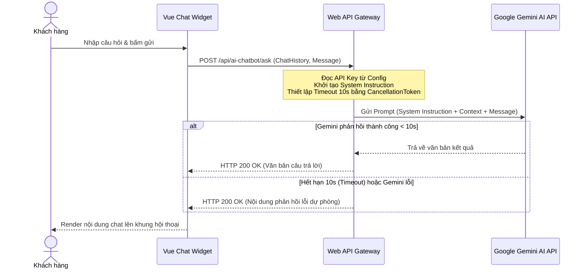

# 🛠️ Technical Specification - Gemini AI Chatbot Advisor

## 🔗 Skills Liên Quan
- **BE-F02 (SOLID - SRP):** Tách biệt logic tích hợp API bên ngoài (`GeminiClient`) ra khỏi lớp nghiệp vụ xử lý Chat (`ChatService`).
- **BE-F03 (Async/Await):** Thiết lập Timeout (Sử dụng `CancellationToken`) cho các lệnh gọi External API (Gemini API) để tránh treo luồng hệ thống nếu phía Google bị chậm phản hồi.

---

## 1. Sequence Diagram: Luồng giao tiếp AI Chatbot



---

## 2. API Schema & DTOs

```csharp
public class ChatMessageDto
{
    public string Role { get; set; } // user, model
    public string Content { get; set; }
}

public class ChatRequestDto
{
    public List<ChatMessageDto> History { get; set; }
    public string Message { get; set; }
}

public class ChatResponseDto
{
    public string Response { get; set; }
}
```
