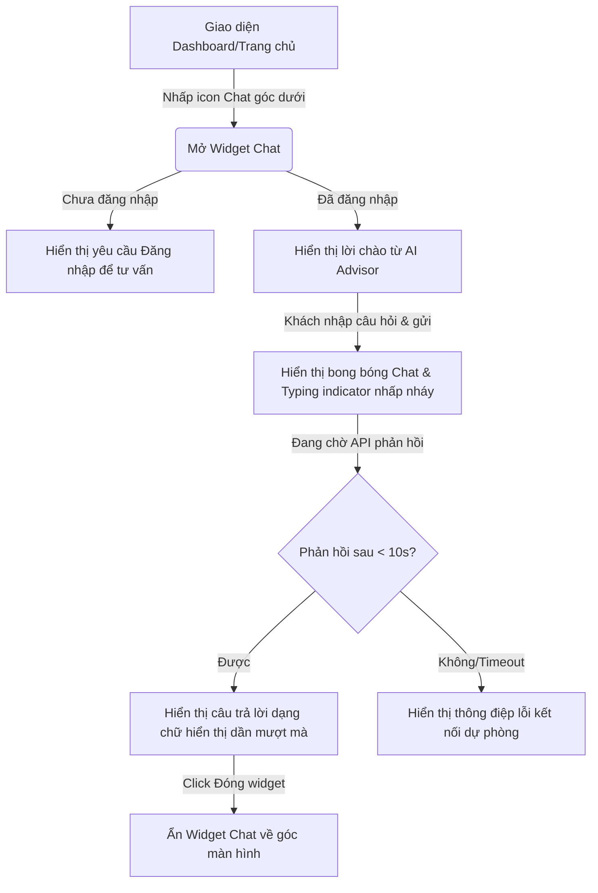
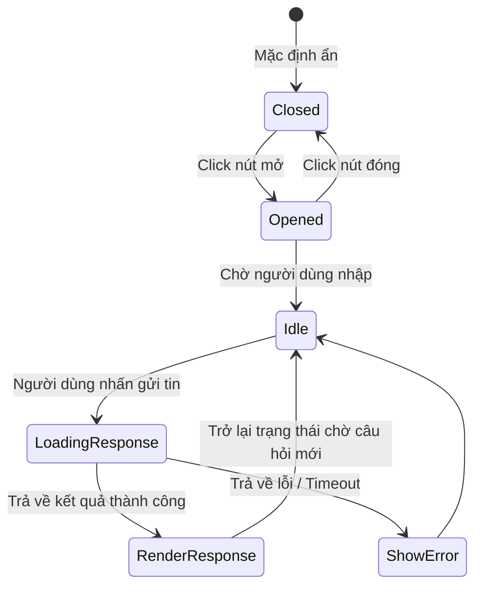

# 📐 UX Flow & State Transitions - Gemini AI Chatbot Advisor

## 1. Luồng Trải nghiệm Người dùng (UX Flow)

```mermaid
graph TD
    A[Giao diện Dashboard/Trang chủ] -->|Nhấp icon Chat góc dưới| B(Mở Widget Chat)
    B -->|Chưa đăng nhập| C[Hiển thị yêu cầu Đăng nhập để tư vấn]
    B -->|Đã đăng nhập| D[Hiển thị lời chào từ AI Advisor]
    D -->|Khách nhập câu hỏi & gửi| E[Hiển thị bong bóng Chat & Typing indicator nhấp nháy]
    E -->|Đang chờ API phản hồi| F{Phản hồi sau < 10s?}
    F -->|Được| G[Hiển thị câu trả lời dạng chữ hiển thị dần mượt mà]
    F -->|Không/Timeout| H[Hiển thị thông điệp lỗi kết nối dự phòng]
    G -->|Click Đóng widget| I[Ẩn Widget Chat về góc màn hình]
```

---

## 2. Bản đồ Chuyển dịch Trạng thái Chat (Widget State Transitions)

```mermaid
stateDiagram-v2
    [*] --> Closed : Mặc định ẩn
    Closed --> Opened : Click nút mở
    Opened --> Idle : Chờ người dùng nhập
    Idle --> LoadingResponse : Người dùng nhấn gửi tin
    LoadingResponse --> RenderResponse : Trả về kết quả thành công
    LoadingResponse --> ShowError : Trả về lỗi / Timeout
    RenderResponse --> Idle : Trở lại trạng thái chờ câu hỏi mới
    ShowError --> Idle
    Opened --> Closed : Click nút đóng
```
