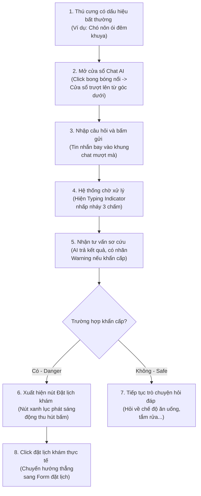

# 🗺️ UX Flow & Interactions - Gemini AI Chatbot

Tài liệu đặc tả luồng trải nghiệm người dùng (UX Journey Map), các điểm chạm tương tác và hiệu ứng chuyển động giao diện dành cho Khách hàng khi trò chuyện với Trợ lý AI.

---

## 1. Bản đồ Hành trình Trải nghiệm của Khách hàng (User Journey Map)



---

## 2. Chi tiết các Bước Tương tác & Điểm chạm (Touchpoints)

### Bước 1: Mở cửa sổ chat nổi
- **Tương tác:** Khách hàng click vào icon bong bóng chat nổi màu xanh dương phát sáng nhè nhẹ ở góc màn hình.
- **Hiệu ứng:** Cửa sổ chat mini thực hiện hoạt ảnh trượt lên (Slide-up) từ cạnh dưới và phóng to nhẹ trong 250ms cùng hiệu ứng Backdrop Blur mờ kính tối sang trọng. Icon bong bóng chat chuyển đổi thành nút đóng [x] để biểu thị hành động thu nhỏ.

### Bước 2: Gửi câu hỏi và Bong bóng bay vào khung
- **Tương tác:** Khách hàng nhập câu hỏi và click nút "Gửi".
- **Hiệu ứng:** Tin nhắn của khách hàng bay vào khung chat bằng một chuyển động trượt nhẹ (Fade-in-slide) từ dưới lên trong 150ms. Ô nhập liệu lập tức trống và tự động khóa (Disabled) để tránh gửi trùng lặp.
- **Trạng thái chờ:** Bong bóng chat của AI lập tức xuất hiện ba dấu chấm nhấp nháy tuần tự (Typing Indicator) tạo cảm giác AI đang suy nghĩ thực sự.

### Bước 3: Đọc câu trả lời và hành động tiếp theo
- **Tương tác:** AI trả về câu trả lời.
- **Hiệu ứng:**
  - Hoạt ảnh chữ chạy (Text Stream) mô phỏng tốc độ gõ của trợ lý giúp người đọc dễ tiếp thu thông tin.
  - Nếu câu trả lời chứa cảnh báo y tế nhạy cảm ( requiresAppointment = true): Một dải viền cảnh báo màu cam hổ phách xuất hiện dọc bên trái bong bóng AI. Dưới bong bóng xuất hiện một nút bấm lớn màu xanh ngọc phát sáng nhấp nháy nhẹ (Pulse green effect) với nội dung: **"Đặt lịch khám trực tiếp với Bác sĩ ngay"**.
  - Khi click vào nút này, cửa sổ chat tự động thu nhỏ lại và trình duyệt tự động mở trang đặt lịch khám, tự động điền các thông tin triệu chứng mà người dùng vừa mô tả với AI vào Form đặt lịch (Auto-fill symptoms).

---

## 3. Đặc tả Các hiệu ứng Chuyển động CSS (Micro-animations)

Các hiệu ứng CSS tinh tế cho giao diện chat:

```css
/* Hiệu ứng trượt lên khi mở khung chat */
.chat-window-enter {
  transform: translateY(100px) scale(0.95);
  opacity: 0;
  animation: slideUpChat 0.3s cubic-bezier(0.16, 1, 0.3, 1) forwards;
}

@keyframes slideUpChat {
  to {
    transform: translateY(0) scale(1);
    opacity: 1;
  }
}

/* Hiệu ứng bay vào của tin nhắn mới */
.message-bubble-enter {
  opacity: 0;
  transform: translateY(15px);
  animation: bubbleEnter 0.2s ease-out forwards;
}

@keyframes bubbleEnter {
  to {
    opacity: 1;
    transform: translateY(0);
  }
}

/* Hiệu ứng phát sáng nhấp nháy cho nút Đặt lịch */
@keyframes pulse-green {
  0% {
    box-shadow: 0 0 0 0 rgba(16, 185, 129, 0.4);
  }
  70% {
    box-shadow: 0 0 0 10px rgba(16, 185, 129, 0);
  }
  100% {
    box-shadow: 0 0 0 0 rgba(16, 185, 129, 0);
  }
}

.btn-pulse-appointment {
  background-color: var(--btn-action-green);
  color: white;
  animation: pulse-green 2s infinite;
}
```
