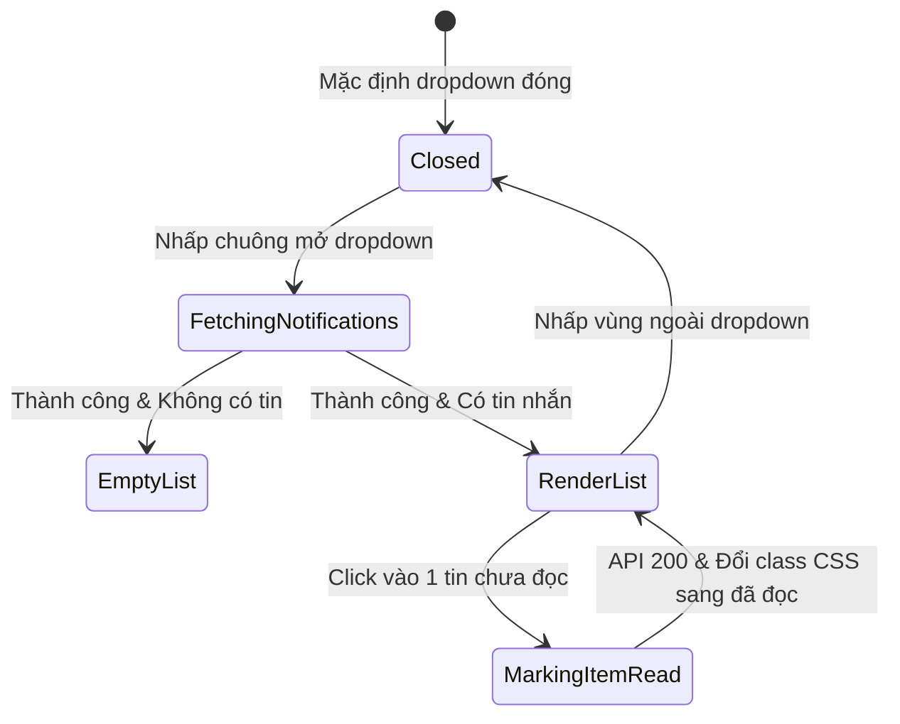

# 🎭 Behavioral Specification - Automatic Notification Service

## 1. Biểu đồ Trạng thái Vue Notification Component

---

## 2. Ràng buộc Hành vi & Quy tắc Giao tiếp thời gian thực
- **SignalR Real-time Push:** Khi SignalR Hub phát đi tin nhắn `ReceiveNotification`, client ngay lập tức đẩy thông báo mới vào đầu mảng `list` trong Store, tăng số lượng badge chuông lên 1 và phát tiếng chuông thông báo (sound alert) tùy chọn.
- **Empty State UI:** Nếu danh sách trống, hiển thị hình vẽ minh họa (illustration) tinh tế kèm dòng chữ *"Bạn hiện không có thông báo nào mới."*.
