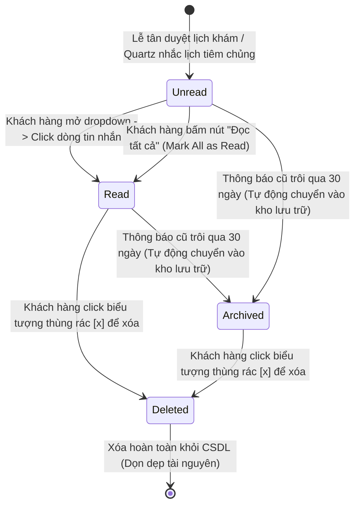

# 📊 Behavioral Specification - Automatic Notification Service

Tài liệu đặc tả hành vi hệ thống, mô hình máy trạng thái hữu hạn (FSM) và các điều kiện ràng buộc chuyển đổi trạng thái của thông báo hệ thống.

---

## 1. Biểu đồ Máy Trạng thái Thông báo (Notification Lifecycle FSM)

Vòng đời của một tin thông báo in-app (`Notification.IsRead`) được quản lý chặt chẽ theo mô hình máy trạng thái dưới đây:

---

## 2. Diễn giải chi tiết các chuyển dịch trạng thái (Transitions)

### 1. Khởi tạo (`Unread`) sang Đã đọc (`Read`)
- **Tác nhân:** Khách hàng (Người sở hữu thông báo).
- **Điều kiện kích hoạt:**
  - Khách hàng nhấp vào từng dòng thông báo cụ thể trên danh sách UI dropdown.
  - Khách hàng bấm nút "Đọc tất cả".
- **Hành vi hệ thống:**
  - Chuyển `IsRead = true` trong database.
  - Đốm chuông màu đỏ đếm số lượng thông báo giảm tương ứng.
  - UI đổi màu background từ xanh nhạt về trong suốt.

### 2. Đọc/Chưa đọc sang Lưu trữ (`Archived`)
- **Tác nhân:** Hệ thống chạy ngầm tự động (Cron job dọn dẹp hàng tuần).
- **Điều kiện kích hoạt:** Thông báo có thời gian tạo `CreatedAt` lớn hơn **30 ngày** so với hiện tại.
- **Hành vi hệ thống:**
  - Tự động di chuyển thông báo khỏi bảng hiển thị hoạt động sang bảng lưu trữ lịch sử hoặc lọc ẩn. Điều này giúp tối ưu hóa kích thước bảng `Notifications` hoạt động, bảo toàn tốc độ truy vấn SELECT.

### 3. Đã đọc sang Xóa (`Deleted`)
- **Tác nhân:** Khách hàng.
- **Điều kiện kích hoạt:** Người nuôi nhấp chọn nút xóa (icon Thùng rác) tại hàng thông báo.
- **Hành vi hệ thống:**
  - Thực thi lệnh SQL DELETE xóa bản ghi khỏi Database.
  - Cập nhật lại giao diện người dùng tức thời (Optimistic UI remove).

---

## 3. Các quy tắc ràng buộc bảo mật và nghiệp vụ (Business Rules Constraints)

- **Nguyên tắc Đối soát Quyền sở hữu (Ownership Constraint):**
  - Chặn đứng 100% mọi request cập nhật trạng thái `IsRead` nếu `UserId` trong bản ghi khác với `currentUserId` giải mã từ Claims JWT. Hệ thống trả về `403 Forbidden` ngay lập tức để chống IDOR.
- **Giới hạn Lưu trữ Hộp thư (Box Size Constraint):**
  - Mỗi tài khoản người dùng chỉ được lưu tối đa **50 thông báo** gần nhất. Khi thông báo thứ 51 được sinh ra, hệ thống tự động xóa bản ghi thông báo thứ 1 (cũ nhất) của người dùng đó để bảo vệ dung lượng lưu trữ CSDL.
- **Tính Nhất Quán Trạng Thái Lịch Hẹn:**
  - Thông báo về lịch hẹn phải phản ánh chính xác trạng thái thực tế. Ví dụ, nếu lịch hẹn đã bị hủy ở database trước đó, thông báo nhắc lịch tương ứng sẽ tự động ẩn đi hoặc chuyển trạng thái không cho phép đặt lịch nhanh từ thông báo nữa.
