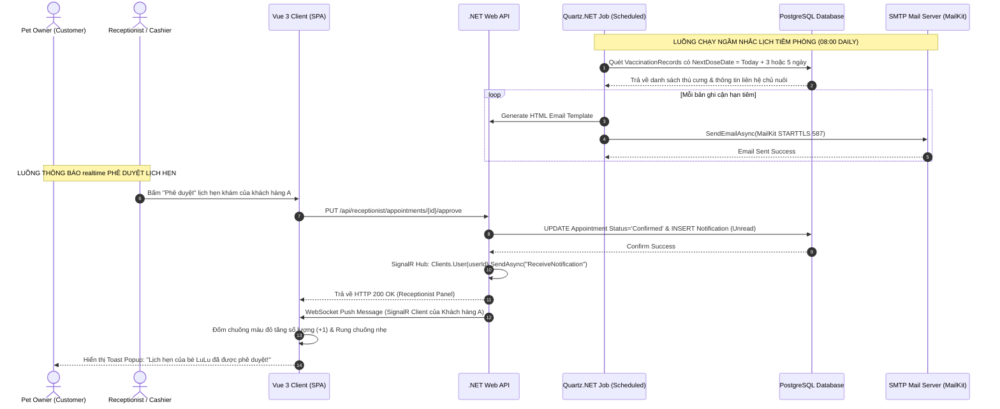

# 🛠️ Technical Specification - Automatic Notification Service

Tài liệu thiết kế kỹ thuật chi tiết cho phân hệ Nhắc lịch tiêm phòng & Thông báo tự động tích hợp Quartz.NET và SignalR.

---

## 1. Kiến trúc Tổng quát & Sơ đồ Tuần tự (Sequence Diagram)

Sơ đồ dưới đây mô tả luồng hoạt động chạy ngầm của Quartz.NET gửi mail tái chủng hàng ngày và luồng đẩy tin thời gian thực bằng SignalR WebSocket khi Lễ tân duyệt lịch hẹn khám.



---

## 2. Đặc tả Cơ sở Dữ liệu (Database Schema)

### Thực thể `Notifications` (Thông báo hệ thống)
Bảng lưu trữ danh sách các thông báo hiển thị in-app dành cho người dùng.

| Tên cột | Kiểu dữ liệu | Ràng buộc | Mô tả |
| :--- | :--- | :--- | :--- |
| **Id** | UUID / uniqueidentifier | Primary Key | Khóa chính thông báo |
| **UserId** | UUID / uniqueidentifier | Foreign Key | ID người dùng nhận thông báo |
| **Title** | VARCHAR(200) | Not Null | Tiêu đề thông báo ngắn gọn |
| **Content** | TEXT | Not Null | Nội dung thông báo chi tiết |
| **IsRead** | BOOLEAN | Not Null, Default FALSE | Trạng thái: `true` (Đã đọc), `false` (Chưa đọc) |
| **Type** | VARCHAR(50) | Not Null | Loại: `AppointmentUpdate`, `VaccineReminder`, `SystemAlert` |
| **CreatedAt** | TIMESTAMP WITH TIME ZONE | Not Null | Thời điểm tạo thông báo |

### Script SQL Khởi Tạo PostgreSQL
```sql
-- Tạo bảng Notifications
CREATE TABLE Notifications (
    Id UUID PRIMARY KEY DEFAULT gen_random_uuid(),
    UserId UUID NOT NULL,
    Title VARCHAR(200) NOT NULL,
    Content TEXT NOT NULL,
    IsRead BOOLEAN NOT NULL DEFAULT FALSE,
    Type VARCHAR(50) NOT NULL,
    CreatedAt TIMESTAMP WITH TIME ZONE NOT NULL DEFAULT CURRENT_TIMESTAMP,
    CONSTRAINT fk_notification_user FOREIGN KEY (UserId) REFERENCES Users(Id) ON DELETE CASCADE
);

-- Tạo Index tối ưu
CREATE INDEX idx_notifications_user_unread ON Notifications(UserId, IsRead) WHERE IsRead = FALSE;
CREATE INDEX idx_notifications_created_at ON Notifications(CreatedAt DESC);
```
*Index `idx_notifications_user_unread` giúp tối ưu hóa cực hạn tốc độ đếm số lượng tin nhắn chưa đọc của người dùng lúc vừa tải trang.*

---

## 3. Đặc tả C# DTOs & Validation

### UpdateNotificationStatusRequest.cs
```csharp
using System;
using System.ComponentModel.DataAnnotations;

namespace MyPetClinic.Application.DTOs.Notification
{
    public class UpdateNotificationStatusRequest
    {
        [Required(ErrorMessage = "Mã thông báo không được để trống")]
        public Guid NotificationId { get; set; }

        [Required(ErrorMessage = "Trạng thái đã đọc bắt buộc truyền")]
        public bool IsRead { get; set; }
    }
}
```

### NotificationDto.cs
```csharp
using System;

namespace MyPetClinic.Application.DTOs.Notification
{
    public class NotificationDto
    {
        public Guid Id { get; set; }
        public string Title { get; set; } = null!;
        public string Content { get; set; } = null!;
        public bool IsRead { get; set; }
        public string Type { get; set; } = null!;
        public DateTime CreatedAt { get; set; }
    }
}
```
Cấu trúc JSON phản hồi tương ứng:
```json
{
  "id": "c883e54b-d72b-42fa-97ab-713217b1897d",
  "title": "Lịch hẹn phê duyệt thành công",
  "content": "Lịch hẹn khám bệnh cho bé mèo LuLu của bạn vào 14:00 ngày 12/06/2026 đã được phê duyệt bởi lễ tân.",
  "isRead": false,
  "type": "AppointmentUpdate",
  "createdAt": "2026-06-11T10:50:00.000Z"
}
```
