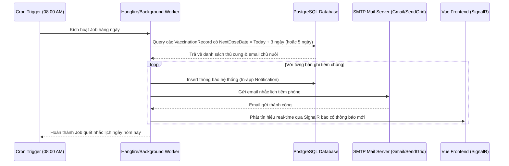

# 🛠️ Technical Specification - Automatic Notification Service

## 🔗 Skills Liên Quan
- **BE-F02 (SOLID - SRP):** Tách biệt logic gửi mail (`EmailSender`) ra khỏi logic quét hàng chờ nhắc lịch (`VaccinationReminderJob`).
- **BE-F03 (Async/Await):** Thực thi các cuộc gọi SMTP gửi email bất đồng bộ bằng `SendEmailAsync`.

---

## 1. Sequence Diagram: Luồng gửi thông báo tự động (Background Job Workflow)



---

## 2. API Schema & DTOs

```csharp
public class NotificationDto
{
    public Guid Id { get; set; }
    public string Title { get; set; }
    public string Message { get; set; }
    public bool IsRead { get; set; }
    public DateTime CreatedAt { get; set; }
}

public class MarkAsReadRequest
{
    public Guid NotificationId { get; set; }
}
```
