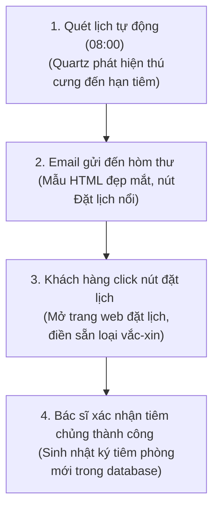
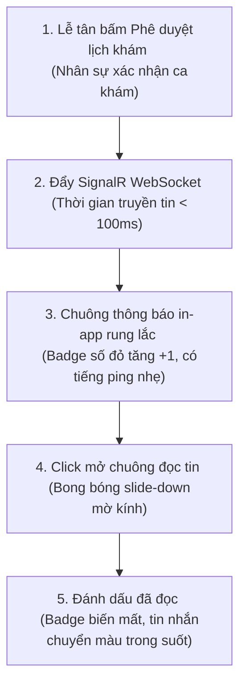

# 🗺️ UX Flow & Interactions - Automatic Notification Service

Tài liệu đặc tả luồng trải nghiệm người dùng (UX Journey Map), các điểm chạm tương tác và hiệu ứng chuyển động giao diện dành cho Khách hàng khi nhận thông báo và nhắc lịch tiêm phòng.

---

## 1. Bản đồ Hành trình Trải nghiệm của Khách hàng (User Journey Map)

### Luồng 1: Nhận Email nhắc tiêm phòng -> Đặt lịch nhanh


### Luồng 2: Lễ tân phê duyệt lịch khám -> Nhận thông báo realtime


---

## 2. Chi tiết các Bước Tương tác & Điểm chạm (Touchpoints)

### Bước 1: Hoạt ảnh Chuông thông báo rung lắc (Bell Shake Interaction)
- **Tương tác:** Lễ tân duyệt lịch hẹn khám y khoa của khách.
- **Hiệu ứng:** 
  - Icon hình chuông (Bell) trên thanh điều hướng đầu trang của khách hàng lập tức thực hiện hoạt ảnh rung lắc xoay nhẹ trái phải (Rung chuông) 4 lần trong 800ms.
  - Badge đếm số thông báo màu đỏ nhảy từ số cũ lên số mới kèm hiệu ứng phình to nhẹ (Pulse zoom).
  - Toast thông báo nhỏ trượt ra từ góc màn hình hiển thị tiêu đề và nội dung rút gọn: *"Lịch hẹn khám bé LuLu đã được xác nhận vào 14:00 ngày 12/06!"*.

### Bước 2: Mở Dropdown xem chi tiết thông báo
- **Tương tác:** Khách hàng click vào Icon Chuông.
- **Hiệu ứng:** Khung Dropdown danh sách thông báo thả trượt nhẹ từ trên xuống (Slide-down) trong 200ms với hiệu ứng mờ kính tối (Glassmorphism), phủ lớp Backdrop Blur lên vùng nội dung phía sau.
- **Tương tác Đọc:** Các thông báo chưa đọc hiển thị ở đầu, nền màu xanh lam nhạt và viền phát sáng nhẹ. Khi khách hàng di chuột qua dòng tin trong 1.5 giây, nền tự động chuyển sang trong suốt biểu thị đã đọc.

### Bước 3: Email nhắc lịch tiêm và link đặt lịch nhanh
- **Tương tác:** Khách hàng mở ứng dụng Gmail trên điện thoại, nhận thư từ phòng khám.
- **Trải nghiệm:** Thư được định dạng HTML tối giản sang trọng, có logo phòng khám nổi bật, nút **[ĐẶT LỊCH HẸN TÁI CHỦNG NHANH]** lớn màu xanh lá.
- **Chuyển hướng:** Khi click vào nút này, trình duyệt mở trang đặt lịch khám của phòng khám và tự động điền sẵn tên bé mèo/bé cún của khách hàng cùng loại vắc-xin cần tiêm nhắc lại, người nuôi chỉ cần chọn khung giờ và bấm Xác nhận là hoàn tất trong 3 click.

---

## 3. Đặc tả Các hiệu ứng Chuyển động CSS (Micro-animations)

Các hiệu ứng CSS tinh tế cho giao diện chuông thông báo:

```css
/* Hiệu ứng trượt menu thả chuông từ trên xuống */
.dropdown-slide-down {
  transform: translateY(-10px);
  opacity: 0;
  animation: dropSlide 0.25s cubic-bezier(0.16, 1, 0.3, 1) forwards;
}

@keyframes dropSlide {
  to {
    transform: translateY(0);
    opacity: 1;
  }
}

/* Hiệu ứng mờ nền của dòng thông báo khi chuyển từ chưa đọc sang đã đọc */
.notif-transition-read {
  transition: background-color 0.4s ease, border-color 0.4s ease;
}
```
