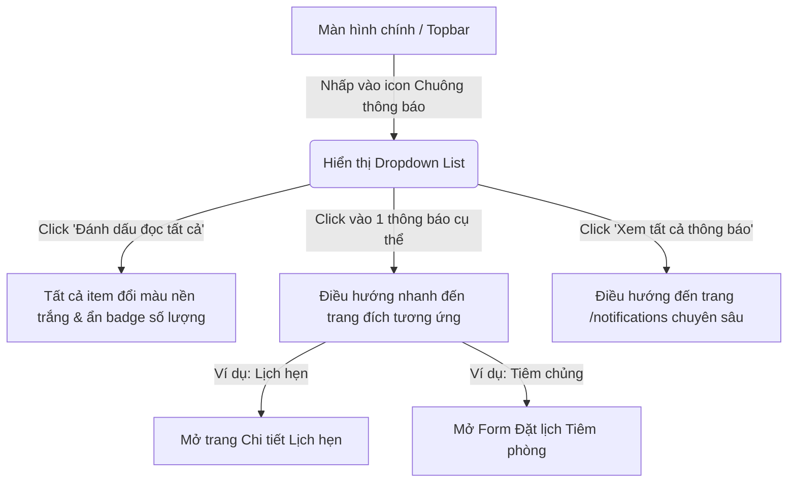
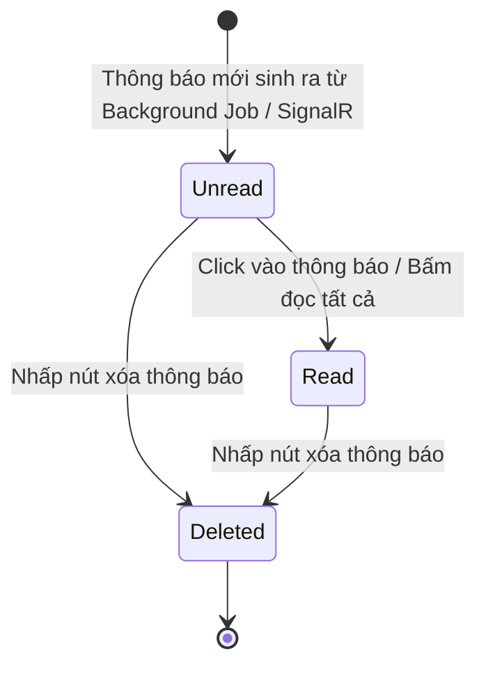

# 📐 UX Flow & State Transitions - Automatic Notification Service

## 1. Luồng Giao diện Thông báo (UX Flow)

```mermaid
graph TD
    A[Màn hình chính / Topbar] -->|Nhấp vào icon Chuông thông báo| B(Hiển thị Dropdown List)
    B -->|Click 'Đánh dấu đọc tất cả'| C[Tất cả item đổi màu nền trắng & ẩn badge số lượng]
    B -->|Click vào 1 thông báo cụ thể| D[Điều hướng nhanh đến trang đích tương ứng]
    D -->|Ví dụ: Lịch hẹn| E[Mở trang Chi tiết Lịch hẹn]
    D -->|Ví dụ: Tiêm chủng| F[Mở Form Đặt lịch Tiêm phòng]
    B -->|Click 'Xem tất cả thông báo'| G[Điều hướng đến trang /notifications chuyên sâu]
```

---

## 2. Bản đồ Trạng thái Đọc tin nhắn (Message State Transitions)

```mermaid
stateDiagram-v2
    [*] --> Unread : Thông báo mới sinh ra từ Background Job / SignalR
    Unread --> Read : Click vào thông báo / Bấm đọc tất cả
    Unread --> Deleted : Nhấp nút xóa thông báo
    Read --> Deleted : Nhấp nút xóa thông báo
    Deleted --> [*]
```
