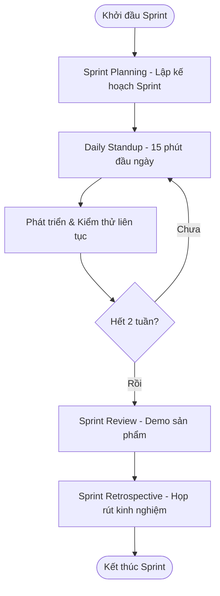

# 📋 Kế Hoạch Thực Thi Sprint - Sprint Execution Plan

Tài liệu này đặc tả quy trình vận hành, phối hợp nhóm, quản trị rủi ro và các mốc thời gian thực thi đầy đủ **17 Sprints** phát triển của dự án **MyPetClinic**.

---

## 1. Quy Trình Vận Hành Agile/Scrum Hàng Ngày

Để đảm bảo tiến độ 2 tuần/sprint được tuân thủ nghiêm ngặt, đội ngũ phát triển áp dụng khung làm việc Agile/Scrum rút gọn như sau:

### 1.1. Các sự kiện trong Sprint (Sprint Events)
*   **Sprint Planning (Đầu Sprint - 2 giờ):** 
    *   Thống nhất mục tiêu Sprint (Sprint Goal).
    *   Lựa chọn các User Story từ Product Backlog vào Sprint Backlog dựa trên vận tốc làm việc (Velocity) của nhóm.
    *   Phân rã User Story thành các task kỹ thuật cụ thể và gán người thực hiện.
*   **Daily Stand-up (Hàng ngày - 15 phút đầu giờ):**
    *   Trả lời 3 câu hỏi: Hôm qua đã làm gì? Hôm nay sẽ làm gì? Có gặp khó khăn/nút thắt (impediment) nào không?
*   **Sprint Review & Demo (Cuối Sprint - 1 giờ):**
    *   Demo các tính năng đã hoàn thành (đạt chuẩn Definition of Done) cho Product Owner/Giảng viên.
    *   Ghi nhận phản hồi để điều chỉnh backlog nếu cần thiết.
*   **Sprint Retrospective (Cuối Sprint - 1 giờ):**
    *   Nhìn nhận lại quá trình làm việc: Cái gì tốt (Start/Keep)? Cái gì chưa tốt (Stop)? Hành động cải tiến trong Sprint tới (Action items)?

---

## 2. Phân Vai & Phối Hợp Thành Viên (Team Roles & Collaboration)

### 2.1. Phân chia vai trò chính
*   **Nam (Backend Lead / DevOps):** Thiết kế kiến trúc, xây dựng database, quản lý API lõi (Authentication, Booking, Clinical, Payment) và pipeline CI/CD.
*   **Phương (Frontend Lead):** Xây dựng khung giao diện Vue 3 + TS, thiết kế UI/UX đồng bộ, tối ưu hóa responsive và tích hợp API.
*   **Lâm (Frontend Developer / QA):** Phát triển giao diện cổng thông tin khách hàng, cổng lễ tân, viết tài liệu hướng dẫn và thực hiện kiểm thử tích hợp (Integration Test).
*   **Hạnh (Backend Developer / AI Specialist):** Phát triển các API tiện ích (Services, Doctor schedules, queue management), tích hợp Gemini AI và xây dựng Background Jobs (nhắc lịch tiêm chủng).

### 2.2. Quy trình làm việc trên Git (Git Workflow)
*   **Nhánh chính:**
    *   `main`: Chứa code stable đã release qua các mốc quan trọng.
    *   `develop`: Nhánh tích hợp chính. Mọi tính năng mới đều được merge vào đây.
*   **Nhánh tính năng (Feature branches):** `feature/sprint-[id]-[feature-name]` (Ví dụ: `feature/sprint-1-login-backend`).
*   **Quy chuẩn Pull Request (PR):**
    *   Tối thiểu phải có **1 reviewer** chấp thuận trước khi merge vào `develop`.
    *   Code phải pass qua pipeline kiểm tra tự động (GitHub Actions - Build & Unit Test).

---

## 3. Mốc Thời Gian & Kế Hoạch Bàn Giao (Milestones & Deliverables)

| Sprint | Thời gian dự kiến | Mục tiêu bàn giao chính | Môi trường triển khai |
| :--- | :--- | :--- | :--- |
| **Sprint 1** | Tuần 1 - Tuần 2 | Bộ khung Clean Architecture Backend, Vue 3 SPA Frontend và Pipeline CI/CD. | Local Staging (Dockerized PostgreSQL) |
| **Sprint 2** | Tuần 3 - Tuần 4 | API & UI Đăng ký tài khoản (PB01) và Đăng nhập hệ thống (PB02). | Local Staging |
| **Sprint 3** | Tuần 5 - Tuần 6 | Quên mật khẩu xác thực OTP (PB03) và Quản lý thông tin cá nhân (PB07). | Local Staging |
| **Sprint 4** | Tuần 7 - Tuần 8 | Tra cứu danh mục dịch vụ công khai (PB04) và Đội ngũ bác sĩ thú y (PB05). | Local Staging |
| **Sprint 5** | Tuần 9 - Tuần 10 | CRUD Hồ sơ thú cưng (PB08) tích hợp bảo mật chống tấn công IDOR bằng cách check OwnerId. | Local Staging |
| **Sprint 6** | Tuần 11 - Tuần 12 | Logic thiết kế ca làm việc & tính toán khung giờ trống khả dụng của Bác sĩ. | Local Staging |
| **Sprint 7** | Tuần 13 - Tuần 14 | Đặt lịch khám (PB09) & tiêm chủng (PB10) trực tuyến (Serializable Transaction chống trùng lịch, check kho). | Staging / Development |
| **Sprint 8** | Tuần 15 - Tuần 16 | Timeline theo dõi trạng thái lịch hẹn khách hàng (PB11) và Cổng xem lịch sử y tế (PB12). | Staging / Development |
| **Sprint 9** | Tuần 17 - Tuần 18 | Cổng Lễ tân tiếp nhận check-in/walk-in (PB15) và Duyệt/Hủy lịch hẹn gửi email tự động (PB17). | Staging / Development |
| **Sprint 10** | Tuần 19 - Tuần 20 | Logic tự động cấp số thứ tự Queue (PB18) và màn hình TV Queue Board ngoài phòng chờ sảnh chính. | Staging / Development |
| **Sprint 11** | Tuần 21 - Tuần 22 | Cổng Bác sĩ: Theo dõi hàng đợi khám của riêng mình (PB20) và Kích hoạt ca khám bệnh (PB22). | Staging / Development |
| **Sprint 12** | Tuần 23 - Tuần 24 | Khám lâm sàng: Xem lịch sử bệnh án (PB21) và Quản lý bệnh án kê đơn (PB23 - Trừ kho thuốc rollback). | Staging / Development |
| **Sprint 13** | Tuần 25 - Tuần 26 | Ghi nhận thực hiện tiêm chủng (PB24) và Thanh toán & In hóa đơn tổng hợp tại quầy (PB19). | Staging / Development |
| **Sprint 14** | Tuần 27 - Tuần 28 | Admin: Quản lý danh sách người dùng (PB28), dịch vụ khám (PB26) và danh mục (PB27). | Demo Environment |
| **Sprint 15** | Tuần 29 - Tuần 30 | Admin: Quản lý kho dược phẩm/vật tư y tế (PB29) và Lịch làm việc phân ca bác sĩ (PB30). | Demo Environment |
| **Sprint 16** | Tuần 31 - Tuần 32 | Thống kê biểu đồ doanh số/KPIs (PB33), Cổng Blog cẩm nang (PB06, 32) và Khách hàng đánh giá (PB13). | Demo Environment |
| **Sprint 17** | Tuần 33 - Tuần 34 | Trợ lý Gemini AI Chatbot (PB14), Gửi mail nhắc lịch tự động (PB34) và Chạy bộ test tích hợp E2E. | Production Release (UAT) |

---

## 4. Quản Trị Rủi Ro & Giải Pháp Khắc Phục (Risk Management)

| Loại rủi ro | Khả năng | Ảnh hưởng | Giải pháp phòng ngừa / Khắc phục |
| :--- | :--- | :---: | :--- |
| **Trễ hạn task quan trọng (Đặc biệt là Booking ở Sprint 7)** | Trung bình | Rất cao | Chia nhỏ task, hỗ trợ chéo giữa Nam và Hạnh ở backend. Thiết lập mốc cảnh báo trước 3 ngày khi kết thúc Sprint. |
| **Xung đột API giữa FE và BE** | Cao | Trung bình | Định nghĩa trước tài liệu giao ước API ([api-spec.md](file:///e:/DATN/MyPetClinic/plan/api-spec.md)) trước khi code. Sử dụng công cụ mock API nếu BE chưa hoàn thành kịp. |
| **Lỗi tồn kho thuốc bất đồng bộ (Race Condition)** | Thấp | Cao | Sử dụng Database Transactions và Lock ở tầng Database khi thực hiện trừ số lượng thuốc tồn kho trong [Medical_records](file:///e:/DATN/MyPetClinic/plan/database.md#L160). |
| **Quá tải API Gemini AI khi chat** | Trung bình | Trung bình | Triển khai cơ chế lưu cache kết quả trả về cho các câu hỏi phổ biến, giới hạn tần suất yêu cầu (Rate Limiting) trên mỗi tài khoản. |

---

## 5. Tiêu Chí Nghiệm Thu & Kiểm Thử (Definition of Done & Testing)
*   **Unit Test:** 100% các Service xử lý nghiệp vụ đặt lịch khám, kiểm tra trùng lặp thời gian bác sĩ phải được viết Unit Test và pass thành công (ví dụ: [tests/MyPetClinic.Tests/](file:///e:/DATN/MyPetClinic/backend/tests/MyPetClinic.Tests/)).
*   **UI/UX:** Giao diện đáp ứng tốt trên các kích thước màn hình phổ biến (Responsive Design), không vỡ layout, tuân thủ bảng mã màu CSS chuẩn.
*   **Báo cáo tiến độ:** Mọi thay đổi về tiến độ thực thi phải được ghi nhận vào nhật ký [progress.md](file:///e:/DATN/MyPetClinic/plan/tracking/progress.md) vào ngày cuối của mỗi Sprint.
