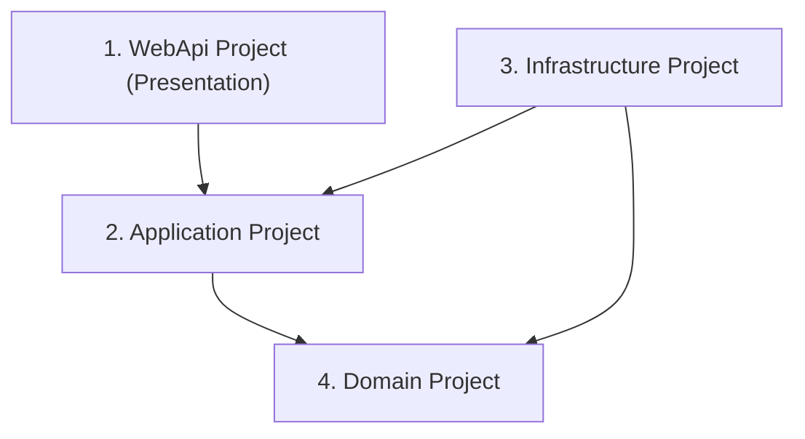

# ⚙️ Đặc Tả Kỹ Thuật Chi Tiết - Core Architecture & CI/CD Setup (Sprint 1)

Tài liệu này đặc tả chi tiết mã nguồn thiết lập cấu trúc giải pháp Backend, Frontend và cấu hình tự động hóa CI/CD trong **Sprint 1** của dự án **MyPetClinic**.

---

## 1. Kiến Trúc Backend (.NET 8 Clean Architecture)

Hệ thống Backend được thiết lập theo cấu trúc Clean Architecture 4 lớp giúp tách biệt độc lập giữa logic nghiệp vụ và các chi tiết công nghệ (Database, Web API, External Services).

### 1.1. Sơ Đồ Cấu Trúc Solution & Project References



### 1.2. Đặc Tả Thư Mục Chi Tiết Backend

```text
MyPetClinic/
├── MyPetClinic.sln (hoặc MyPetClinic.slnx)
└── src/
    ├── MyPetClinic.Domain/
    │   ├── Entities/          # Các thực thể nghiệp vụ (User, Pet, Appointment...)
    │   ├── Enums/             # Các kiểu liệt kê
    │   ├── Exceptions/        # Custom exceptions ở cấp độ domain
    │   └── ValueObjects/      # Các đối tượng giá trị không có ID định danh
    ├── MyPetClinic.Application/
    │   ├── Common/
    │   │   ├── Interfaces/    # Khai báo interfaces repository, email, token...
    │   │   └── Mappings/      # Các lớp cấu hình ánh xạ DTO
    │   ├── Services/          # Hiện thực các logic nghiệp vụ
    │   └── Dtos/              # Các đối tượng chuyển dữ liệu qua mạng
    ├── MyPetClinic.Infrastructure/
    │   ├── Data/
    │   │   ├── AppDbContext.cs# Lớp kết nối Database chính của Entity Framework
    │   │   └── Configurations/# Fluent API configurations cho từng bảng dữ liệu
    │   ├── Repositories/      # Hiện thực các interfaces repository ở tầng Application
    │   └── Services/          # Triển khai các dịch vụ hạ tầng (SMTP, JWT Generator)
    └── WebApi/
        ├── Controllers/       # API Controllers điều hướng HTTP request
        ├── Middleware/        # Lớp bắt ngoại lệ tập trung (Global Exception Middleware)
        ├── Program.cs         # Đăng ký Dependency Injection và Middleware Pipeline
        └── appsettings.json   # Tệp cấu hình tham số môi trường
```

---

## 2. Thiết Lập Khung Ứng Dụng Frontend (Vue 3, Vite & TypeScript)

Dự án Frontend được thiết lập dưới dạng SPA (Single Page Application) sử dụng Vite làm công cụ build và TypeScript để quản lý mã nguồn chặt chẽ.

### 2.1. Danh Sách Thư Viện Cốt Lõi Ban Đầu (package.json)

```json
{
  "dependencies": {
    "vue": "^3.4.0",
    "vue-router": "^4.2.0",
    "pinia": "^2.1.0",
    "axios": "^1.6.0",
    "jwt-decode": "^4.0.0"
  },
  "devDependencies": {
    "vite": "^5.0.0",
    "typescript": "^5.2.0",
    "vue-tsc": "^1.8.0"
  }
}
```

### 2.2. Đặc Tả Thư Mục Chi Tiết Frontend

```text
frontend/
├── index.html
├── package.json
├── tsconfig.json
├── vite.config.ts
└── src/
    ├── main.ts                # Điểm khởi đầu ứng dụng Vue
    ├── App.vue                # Component gốc của ứng dụng
    ├── assets/                # Chứa hình ảnh, CSS chung
    │   └── styles/
    │       └── index.css      # Cấu hình biến CSS HSL và Glassmorphism
    ├── components/            # Các UI components dùng chung (Button, Input, Modal)
    ├── layouts/               # Layout dùng chung cho các phân hệ
    │   ├── DefaultLayout.vue  # Layout trang chính có Header/Footer
    │   └── AuthLayout.vue     # Layout trang đăng nhập/đăng ký gọn gàng
    ├── router/
    │   └── index.ts           # Cấu hình định tuyến Route
    ├── stores/
    │   └── auth.ts            # Quản lý Pinia state cho Authentication
    ├── utils/
    │   └── api.ts             # Cấu hình Axios instance và Interceptors
    └── views/                 # Các view chính cho từng trang
```

---

## 3. Quy Trình Tích Hợp Liên Tục (CI/CD Pipeline GitHub Actions)

Tự động hóa build và test backend khi lập trình viên tạo Pull Request vào nhánh phát triển (`develop`).

### 3.1. Cấu Hình Workflow .NET Core (dotnet-build-test.yml)

```yaml
# Location: .github/workflows/dotnet-build-test.yml
name: .NET Core Build and Test Validation

on:
  push:
    branches: [ "develop", "main" ]
  pull_request:
    branches: [ "develop" ]

jobs:
  build-and-test:
    runs-on: ubuntu-latest

    steps:
    - name: Checkout repository
      uses: actions/checkout@v3

    - name: Setup .NET SDK
      uses: actions/setup-dotnet@v3
      with:
        dotnet-version: 8.0.x

    - name: Restore dependencies
      run: dotnet restore MyPetClinic.sln

    - name: Build Solution
      run: dotnet build MyPetClinic.sln --no-restore --configuration Release

    - name: Run Unit Tests
      run: dotnet test MyPetClinic.sln --no-build --verbosity normal
```
