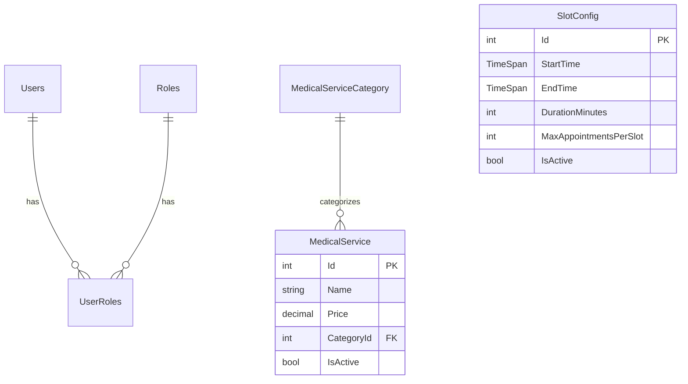

# 🛠️ Đặc Tả Kỹ Thuật: Quản Trị Hệ Thống & Cấu Hình Dịch Vụ
## Thiết kế CRUD Nhân sự, Phân Quyền RBAC, Quản Lý Dịch Vụ và Cấu Hình Khung Giờ

Tài liệu này đặc tả chi tiết kiến trúc dữ liệu, các ràng buộc nghiệp vụ an ninh và giao diện quản trị hệ thống thuộc **Sprint 14: Quản Trị Hệ Thống & Cấu Hình Dịch Vụ**.

---

## 💾 1. Thiết Kế Cơ Sở Dữ Liệu & Fluent API

Hệ thống quản trị sử dụng các bảng hiện có `Users`, `Roles` (từ hệ thống Identity) và bổ sung thực thể dịch vụ `MedicalService`, cùng cấu hình slot toàn cục `SlotConfig`.



### 1.1. Thực thể C# `MedicalService.cs` và `SlotConfig.cs`

```csharp
namespace MyPetClinic.Domain.Entities;

public class MedicalService
{
    public int Id { get; set; }
    public string Name { get; set; } = string.Empty;
    public decimal Price { get; set; }
    public int CategoryId { get; set; }
    public bool IsActive { get; set; } = true;
    
    // Navigation Property
    public MedicalServiceCategory? Category { get; set; }
}

public class SlotConfig
{
    public int Id { get; set; }
    public TimeSpan StartTime { get; set; }
    public TimeSpan EndTime { get; set; }
    public int DurationMinutes { get; set; }
    public int MaxAppointmentsPerSlot { get; set; }
    public bool IsActive { get; set; } = true;
}
```

### 1.2. Cấu hình Fluent API trong `ApplicationDbContext.cs`

```csharp
protected override void OnModelCreating(ModelBuilder modelBuilder)
{
    base.OnModelCreating(modelBuilder);

    modelBuilder.Entity<MedicalService>(entity =>
    {
        entity.ToTable("MedicalServices");
        entity.HasKey(e => e.Id);
        entity.Property(e => e.Name).IsRequired().HasMaxLength(150);
        entity.Property(e => e.Price).HasPrecision(18, 2);
        
        entity.HasOne(d => d.Category)
              .WithMany(p => p.Services)
              .HasForeignKey(d => d.CategoryId)
              .OnDelete(DeleteBehavior.Restrict);
    });

    modelBuilder.Entity<SlotConfig>(entity =>
    {
        entity.ToTable("SlotConfigs");
        entity.HasKey(e => e.Id);
        entity.Property(e => e.StartTime).IsRequired();
        entity.Property(e => e.EndTime).IsRequired();
        entity.Property(e => e.DurationMinutes).IsRequired();
        entity.Property(e => e.MaxAppointmentsPerSlot).HasDefaultValue(3);
    });
}
```

---

## 🔒 2. Logic Backend & Phân Quyền Bảo Mật (RBAC Filter)

Các API quản trị được bảo vệ nghiêm ngặt bằng phân quyền vai trò `admin`. Đồng thời, hệ thống ngăn chặn việc Admin tự hạ quyền hoặc tự khóa tài khoản của chính mình.

### 2.1. API Controller `AdminController.cs`

```csharp
using Microsoft.AspNetCore.Authorization;
using Microsoft.AspNetCore.Mvc;
using MyPetClinic.Application.Interfaces;
using MyPetClinic.Application.DTOs;
using System.Security.Claims;

namespace MyPetClinic.WebApi.Controllers;

[ApiController]
[Route("api/admin")]
[Authorize(Roles = "admin")] // Chỉ duy nhất vai trò admin được truy cập
public class AdminController : ControllerBase
{
    private readonly IUserService _userService;
    private readonly IAuditLogService _auditLogService;

    public AdminController(IUserService userService, IAuditLogService auditLogService)
    {
        _userService = userService;
        _auditLogService = auditLogService;
    }

    [HttpPut("users/{userId}/role")]
    public async Task<IActionResult> UpdateUserRole(string userId, [FromBody] UpdateRoleDto dto)
    {
        var currentUserId = User.FindFirstValue(ClaimTypes.NameIdentifier);
        
        // Nghiệp vụ biên: Không cho phép Admin tự đổi vai trò của mình
        if (currentUserId == userId)
        {
            return BadRequest(new { Message = "Bạn không thể tự thay đổi vai trò của chính mình." });
        }

        var result = await _userService.UpdateUserRoleAsync(userId, dto.NewRole);
        if (!result.Succeeded)
        {
            return BadRequest(new { Errors = result.Errors });
        }

        // Ghi nhận Audit Log hành động nhạy cảm
        await _auditLogService.LogActionAsync(currentUserId!, "ChangeRole", $"Đổi vai trò user {userId} thành {dto.NewRole}");

        return Ok(new { Message = "Cập nhật vai trò thành công." });
    }

    [HttpPut("users/{userId}/status")]
    public async Task<IActionResult> ToggleUserStatus(string userId, [FromBody] ToggleStatusDto dto)
    {
        var currentUserId = User.FindFirstValue(ClaimTypes.NameIdentifier);

        // Nghiệp vụ biên: Không cho phép Admin tự khóa tài khoản của chính mình
        if (currentUserId == userId)
        {
            return BadRequest(new { Message = "Bạn không thể tự khóa tài khoản của chính mình." });
        }

        var result = await _userService.SetUserStatusAsync(userId, dto.IsActive);
        if (!result)
        {
            return NotFound(new { Message = "Không tìm thấy người dùng." });
        }

        await _auditLogService.LogActionAsync(currentUserId!, dto.IsActive ? "ActivateUser" : "SuspendUser", $"Trạng thái hoạt động user {userId} đặt thành {dto.IsActive}");

        return Ok(new { Message = "Cập nhật trạng thái người dùng thành công." });
    }
}
```

---

## 🗄️ 3. Quản Lý Trạng Thái Giao Diện (Vue 3 Pinia Store)

Pinia Store `useAdminStore` quản lý danh sách nhân sự, danh sách dịch vụ và cấu hình khung giờ slots đặt lịch trực tuyến.

### 3.1. `useAdminStore.ts`

```typescript
import { defineStore } from 'pinia';
import axios from 'axios';

interface UserInfo {
  id: string;
  fullName: string;
  email: string;
  role: string;
  isActive: boolean;
}

interface ServiceInfo {
  id: number;
  name: string;
  price: number;
  categoryId: number;
  isActive: boolean;
}

export const useAdminStore = defineStore('admin', {
  state: () => ({
    users: [] as UserInfo[],
    services: [] as ServiceInfo[],
    isLoading: false,
    errorMessage: ''
  }),
  
  getters: {
    activeVetsCount: (state) => {
      return state.users.filter(u => u.role === 'doctor' && state.users).length;
    },
    formattedServices: (state) => {
      return state.services.map(s => ({
        ...s,
        formattedPrice: new Intl.NumberFormat('vi-VN', { style: 'currency', currency: 'VND' }).format(s.price)
      }));
    }
  },

  actions: {
    async fetchUsers() {
      this.isLoading = true;
      try {
        const response = await axios.get('/api/admin/users');
        this.users = response.data;
      } catch (err: any) {
        this.errorMessage = err.response?.data?.message || 'Không thể tải danh sách người dùng';
      } finally {
        this.isLoading = false;
      }
    },

    async changeUserRole(userId: string, newRole: string) {
      try {
        await axios.put(`/api/admin/users/${userId}/role`, { newRole });
        const user = this.users.find(u => u.id === userId);
        if (user) user.role = newRole;
      } catch (err: any) {
        throw new Error(err.response?.data?.message || 'Không thể đổi vai trò');
      }
    },

    async toggleUserStatus(userId: string, isActive: boolean) {
      try {
        await axios.put(`/api/admin/users/${userId}/status`, { isActive });
        const user = this.users.find(u => u.id === userId);
        if (user) user.isActive = isActive;
      } catch (err: any) {
        throw new Error(err.response?.data?.message || 'Không thể cập nhật trạng thái');
      }
    }
  }
});
```

---

## 🧪 4. Kịch Bản Kiểm Thử Unit Test (xUnit & FluentAssertions)

Mục tiêu kiểm thử: Đảm bảo phân quyền RBAC hoạt động chính xác và các nghiệp vụ bảo mật biên (không tự khóa/hạ quyền) được thực thi.

```csharp
using FluentAssertions;
using Microsoft.AspNetCore.Mvc;
using Moq;
using MyPetClinic.Application.DTOs;
using MyPetClinic.Application.Interfaces;
using MyPetClinic.WebApi.Controllers;
using System.Security.Claims;
using Xunit;
using Microsoft.AspNetCore.Http;

namespace MyPetClinic.Tests;

public class AdminControllerTests
{
    private readonly Mock<IUserService> _mockUserService;
    private readonly Mock<IAuditLogService> _mockAuditLogService;
    private readonly AdminController _controller;

    public AdminControllerTests()
    {
        _mockUserService = new Mock<IUserService>();
        _mockAuditLogService = new Mock<IAuditLogService>();
        _controller = new AdminController(_mockUserService.Object, _mockAuditLogService.Object);
    }

    private void SetupUserContext(string currentUserId)
    {
        var user = new ClaimsPrincipal(new ClaimsIdentity(new[]
        {
            new Claim(ClaimTypes.NameIdentifier, currentUserId),
            new Claim(ClaimTypes.Role, "admin")
        }, "mock"));

        _controller.ControllerContext = new ControllerContext
        {
            HttpContext = new DefaultHttpContext { User = user }
        };
    }

    [Fact]
    public async Task UpdateUserRole_SelfDemote_ShouldReturnBadRequest()
    {
        // Arrange
        SetupUserContext("admin-id-123");
        var dto = new UpdateRoleDto { NewRole = "doctor" };

        // Act
        var result = await _controller.UpdateUserRole("admin-id-123", dto);

        // Assert
        result.Should().BeOfType<BadRequestObjectResult>();
    }

    [Fact]
    public async Task ToggleUserStatus_SelfSuspend_ShouldReturnBadRequest()
    {
        // Arrange
        SetupUserContext("admin-id-123");
        var dto = new ToggleStatusDto { IsActive = false };

        // Act
        var result = await _controller.ToggleUserStatus("admin-id-123", dto);

        // Assert
        result.Should().BeOfType<BadRequestObjectResult>();
    }
}
```
