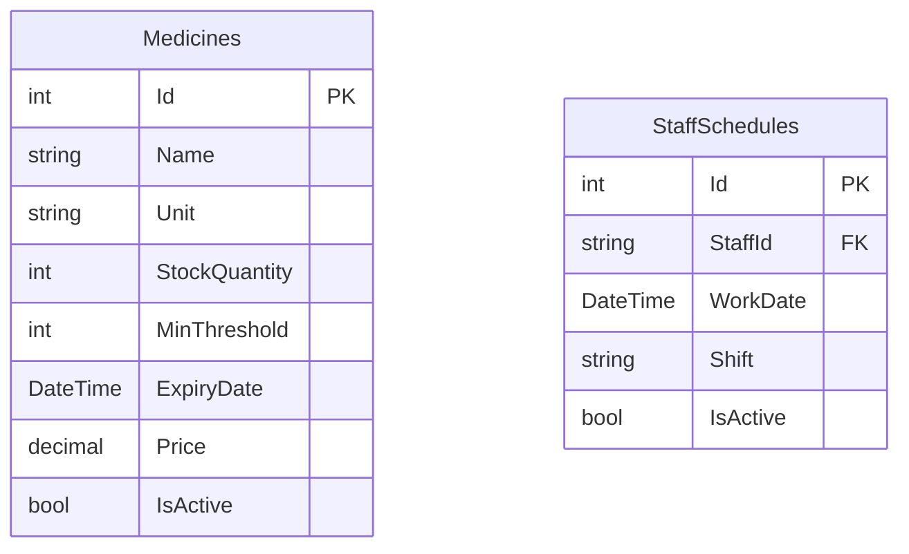

# 🛠️ Đặc Tả Kỹ Thuật: Quản Lý Kho Thuốc & Lịch Trực Nhân Sự
## Thiết kế CRUD Thuốc, Cảnh Báo Hết Hạn/Hàng Tồn, Phân Lịch Trực và Kiểm Tra Xung Đột Lịch Trực

Tài liệu này đặc tả chi tiết kiến trúc dữ liệu, thuật toán kiểm tra trùng lịch trực và cảnh báo tồn kho thuộc **Sprint 15: Quản Lý Kho Thuốc & Lịch Trực Nhân Sự**.

---

## 💾 1. Thiết Kế Cơ Sở Dữ Liệu & Fluent API

Hệ thống quản lý kho và lịch trực sử dụng các bảng `Medicines` (Thông tin thuốc & tồn kho) và `StaffSchedules` (Lịch trực nhân viên).



### 1.1. Thực thể C# `Medicine.cs` và `StaffSchedule.cs`

```csharp
namespace MyPetClinic.Domain.Entities;

public class Medicine
{
    public int Id { get; set; }
    public string Name { get; set; } = string.Empty;
    public string Unit { get; set; } = "Hộp";
    public int StockQuantity { get; set; }
    public int MinThreshold { get; set; } = 10; // Ngưỡng tồn kho tối thiểu để cảnh báo
    public DateTime ExpiryDate { get; set; }
    public decimal Price { get; set; }
    public bool IsActive { get; set; } = true;
}

public class StaffSchedule
{
    public int Id { get; set; }
    public string StaffId { get; set; } = string.Empty;
    public DateTime WorkDate { get; set; }
    public string Shift { get; set; } = string.Empty; // "Morning" (Sáng), "Afternoon" (Chiều)
    public bool IsActive { get; set; } = true;
}
```

### 1.2. Cấu hình Fluent API trong `ApplicationDbContext.cs`

```csharp
protected override void OnModelCreating(ModelBuilder modelBuilder)
{
    base.OnModelCreating(modelBuilder);

    modelBuilder.Entity<Medicine>(entity =>
    {
        entity.ToTable("Medicines");
        entity.HasKey(e => e.Id);
        entity.Property(e => e.Name).IsRequired().HasMaxLength(150);
        entity.Property(e => e.Unit).IsRequired().HasMaxLength(30);
        entity.Property(e => e.Price).HasPrecision(18, 2);
    });

    modelBuilder.Entity<StaffSchedule>(entity =>
    {
        entity.ToTable("StaffSchedules");
        entity.HasKey(e => e.Id);
        entity.Property(e => e.StaffId).IsRequired();
        entity.Property(e => e.WorkDate).IsRequired();
        entity.Property(e => e.Shift).IsRequired().HasMaxLength(20);
        
        // Tạo unique index để tối ưu và ngăn ngừa ghi trùng lịch trực ở mức DB
        entity.HasIndex(e => new { e.StaffId, e.WorkDate, e.Shift }).IsUnique();
    });
}
```

---

## 🔒 2. Logic Backend & Nghiệp Vụ Biên

### 2.1. Logic Kiểm Tra Trùng Lịch Trực (`ScheduleService.cs`)

```csharp
using MyPetClinic.Domain.Entities;
using MyPetClinic.Application.Interfaces;
using Microsoft.EntityFrameworkCore;

namespace MyPetClinic.Infrastructure.Services;

public class ScheduleService : IScheduleService
{
    private readonly IApplicationDbContext _context;

    public ScheduleService(IApplicationDbContext context)
    {
        _context = context;
    }

    public async Task<bool> AssignScheduleAsync(StaffSchedule schedule)
    {
        // Kiểm tra xem nhân viên đã có lịch trực trong ngày và ca trực đó chưa
        var isConflict = await _context.StaffSchedules
            .AnyAsync(s => s.StaffId == schedule.StaffId 
                        && s.WorkDate.Date == schedule.WorkDate.Date 
                        && s.Shift == schedule.Shift 
                        && s.IsActive);

        if (isConflict)
        {
            return false; // Phát hiện xung đột lịch trực
        }

        _context.StaffSchedules.Add(schedule);
        await _context.SaveChangesAsync();
        return true;
    }
}
```

### 2.2. Logic Lọc Thuốc Sắp Hết Hạn & Tồn Kho Thấp (`MedicineService.cs`)

```csharp
public class MedicineService : IMedicineService
{
    private readonly IApplicationDbContext _context;

    public MedicineService(IApplicationDbContext context)
    {
        _context = context;
    }

    public async Task<List<Medicine>> GetLowStockMedicinesAsync()
    {
        // Lọc thuốc có lượng tồn kho nhỏ hơn hoặc bằng ngưỡng tối thiểu cấu hình
        return await _context.Medicines
            .Where(m => m.StockQuantity <= m.MinThreshold && m.IsActive)
            .ToListAsync();
    }

    public async Task<List<Medicine>> GetExpiringMedicinesAsync(int daysAhead = 30)
    {
        var targetDate = DateTime.UtcNow.AddDays(daysAhead);
        // Lọc thuốc sắp hết hạn (dưới 30 ngày)
        return await _context.Medicines
            .Where(m => m.ExpiryDate <= targetDate && m.ExpiryDate >= DateTime.UtcNow && m.IsActive)
            .ToListAsync();
    }
}
```

---

## 🗄️ 3. Quản Lý Trạng Thái Giao Diện (Vue 3 Pinia Store)

Pinia Stores xử lý hiển thị danh mục kho thuốc và phối hợp sắp xếp lịch trực nhân viên.

### 3.1. `useInventoryStore.ts`

```typescript
import { defineStore } from 'pinia';
import axios from 'axios';

interface Medicine {
  id: number;
  name: string;
  unit: string;
  stockQuantity: number;
  minThreshold: number;
  expiryDate: string;
  price: number;
}

export const useInventoryStore = defineStore('inventory', {
  state: () => ({
    medicines: [] as Medicine[],
    isLoading: false
  }),
  
  getters: {
    lowStockItems: (state) => {
      return state.medicines.filter(m => m.stockQuantity <= m.minThreshold);
    },
    expiringItems: (state) => {
      const thirtyDaysFromNow = new Date();
      thirtyDaysFromNow.setDate(thirtyDaysFromNow.getDate() + 30);
      return state.medicines.filter(m => new Date(m.expiryDate) <= thirtyDaysFromNow && new Date(m.expiryDate) >= new Date());
    }
  },

  actions: {
    async fetchMedicines() {
      this.isLoading = true;
      try {
        const response = await axios.get('/api/medicines');
        this.medicines = response.data;
      } catch (error) {
        console.error('Không thể lấy danh sách kho thuốc', error);
      } finally {
        this.isLoading = false;
      }
    }
  }
});
```

---

## 🧪 4. Kịch Bản Kiểm Thử Unit Test (xUnit & FluentAssertions)

```csharp
using FluentAssertions;
using Microsoft.EntityFrameworkCore;
using MyPetClinic.Domain.Entities;
using MyPetClinic.Infrastructure.Services;
using System;
using System.Threading.Tasks;
using Xunit;

namespace MyPetClinic.Tests;

public class ScheduleServiceTests
{
    private IApplicationDbContext GetInMemoryDbContext()
    {
        var options = new DbContextOptionsBuilder<ApplicationDbContext>()
            .UseInMemoryDatabase(databaseName: Guid.NewGuid().ToString())
            .Options;
        return new ApplicationDbContext(options);
    }

    [Fact]
    public async Task AssignSchedule_ShouldFail_WhenConflictExists()
    {
        // Arrange
        var context = GetInMemoryDbContext();
        var service = new ScheduleService(context);
        var workDate = DateTime.Today;

        var existingSchedule = new StaffSchedule
        {
            StaffId = "doctor-1",
            WorkDate = workDate,
            Shift = "Morning"
        };
        context.StaffSchedules.Add(existingSchedule);
        await context.SaveChangesAsync();

        var conflictingSchedule = new StaffSchedule
        {
            StaffId = "doctor-1",
            WorkDate = workDate,
            Shift = "Morning"
        };

        // Act
        var result = await service.AssignScheduleAsync(conflictingSchedule);

        // Assert
        result.Should().BeFalse(); // Phát hiện trùng lặp lịch trực
    }
}
```
