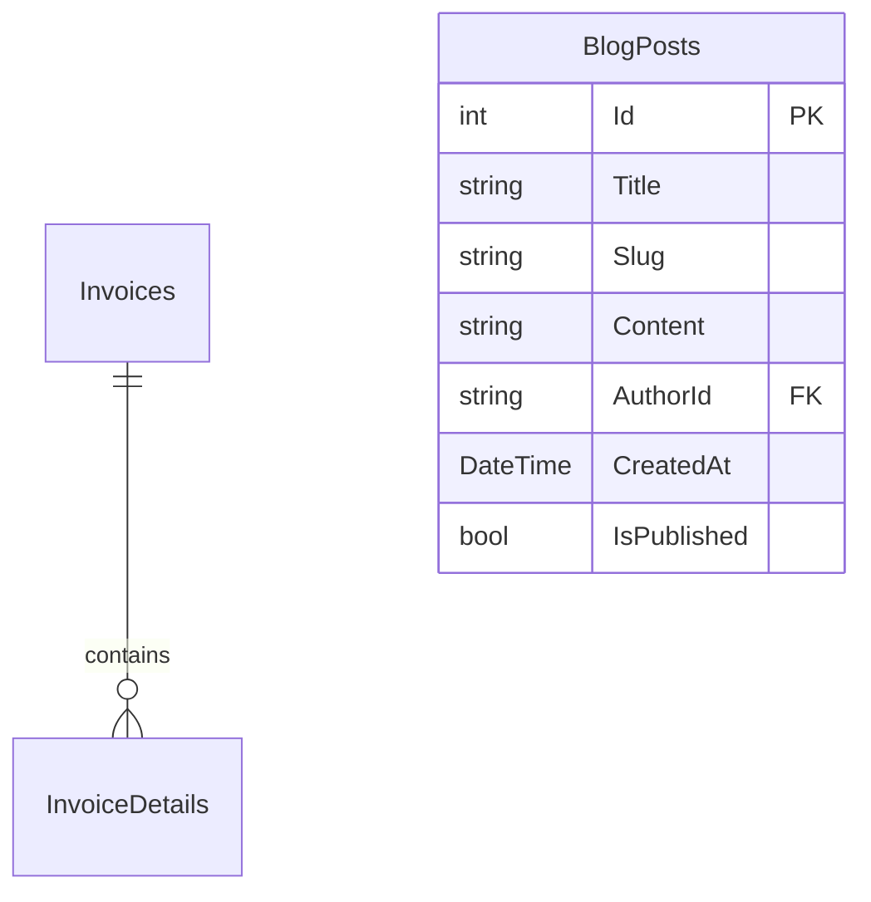

# 🛠️ Đặc Tả Kỹ Thuật: Báo Cáo Doanh Thu & Cổng Thông Tin (Blog)
## Thiết kế Truy Vấn Tổng Hợp Doanh Thu, Quản Lý Bài Viết Blog và Tích Hợp Biểu Đồ Thống Kê

Tài liệu này đặc tả chi tiết kiến trúc dữ liệu, các hàm gộp truy vấn SQL và giao diện hiển thị biểu đồ thuộc **Sprint 16: Báo Cáo Doanh Thu & Cổng Thông Tin (Blog)**.

---

## 💾 1. Thiết Kế Cơ Sở Dữ Liệu & Fluent API

Hệ thống sử dụng các bảng `Invoices` để tính toán doanh thu và bảng mới `BlogPosts` để lưu trữ bài viết.



### 1.1. Thực thể C# `BlogPost.cs`

```csharp
namespace MyPetClinic.Domain.Entities;

public class BlogPost
{
    public int Id { get; set; }
    public string Title { get; set; } = string.Empty;
    public string Slug { get; set; } = string.Empty; // URL thân thiện SEO (Ví dụ: cach-cham-soc-cho-con)
    public string Content { get; set; } = string.Empty;
    public string AuthorId { get; set; } = string.Empty;
    public DateTime CreatedAt { get; set; } = DateTime.UtcNow;
    public bool IsPublished { get; set; } = false;
}
```

### 1.2. Cấu hình Fluent API trong `ApplicationDbContext.cs`

```csharp
protected override void OnModelCreating(ModelBuilder modelBuilder)
{
    base.OnModelCreating(modelBuilder);

    modelBuilder.Entity<BlogPost>(entity =>
    {
        entity.ToTable("BlogPosts");
        entity.HasKey(e => e.Id);
        entity.Property(e => e.Title).IsRequired().HasMaxLength(200);
        entity.Property(e => e.Slug).IsRequired().HasMaxLength(250);
        entity.HasIndex(e => e.Slug).IsUnique(); // Đảm bảo slug là duy nhất phục vụ SEO
        entity.Property(e => e.Content).IsRequired();
    });
}
```

---

## 📊 2. Tối Ưu Hóa Truy Vấn Database (Aggregate LINQ)

Theo Kỷ luật Sắt, các phép tính tổng hợp (Sum, Count) phải được dịch trực tiếp xuống database. Không tải toàn bộ hóa đơn thô vào bộ nhớ Server rồi mới cộng.

### 2.1. Logic Thống Kê Doanh Thu (`ReportService.cs`)

```csharp
using Microsoft.EntityFrameworkCore;
using MyPetClinic.Application.DTOs;
using MyPetClinic.Application.Interfaces;

namespace MyPetClinic.Infrastructure.Services;

public class ReportService : IReportService
{
    private readonly IApplicationDbContext _context;

    public ReportService(IApplicationDbContext context)
    {
        _context = context;
    }

    public async Task<RevenueReportDto> GetRevenueReportAsync(DateTime startDate, DateTime endDate)
    {
        // Thực hiện tính toán SUM trực tiếp trên Database Server bằng LINQ IQueryable
        var query = _context.Invoices
            .Where(i => i.PaymentStatus == "Paid" && i.CreatedAt >= startDate && i.CreatedAt <= endDate);

        decimal totalRevenue = await query.SumAsync(i => i.TotalAmount);
        int paidInvoicesCount = await query.CountAsync();

        // Thống kê doanh thu theo ngày
        var dailyStats = await query
            .GroupBy(i => i.CreatedAt.Date)
            .Select(g => new DailyRevenueDto
            {
                Date = g.Key,
                Amount = g.Sum(i => i.TotalAmount),
                Count = g.Count()
            })
            .OrderBy(d => d.Date)
            .ToListAsync();

        return new RevenueReportDto
        {
            TotalRevenue = totalRevenue,
            InvoicesCount = paidInvoicesCount,
            DailyRevenue = dailyStats
        };
    }
}
```

---

## 🗄️ 3. Quản Lý Trạng Thái Giao Diện (Vue 3 Pinia Store)

Pinia Store `useReportStore` quản lý việc tải và lưu cache số liệu doanh thu của Dashboard Admin.

### 3.1. `useReportStore.ts`

```typescript
import { defineStore } from 'pinia';
import axios from 'axios';

interface DailyRevenue {
  date: string;
  amount: number;
  count: number;
}

interface RevenueReport {
  totalRevenue: number;
  invoicesCount: number;
  dailyRevenue: DailyRevenue[];
}

export const useReportStore = defineStore('report', {
  state: () => ({
    reportData: null as RevenueReport | null,
    isLoading: false,
    errorMessage: ''
  }),

  actions: {
    async fetchRevenueReport(startDate: string, endDate: string) {
      this.isLoading = true;
      this.errorMessage = '';
      try {
        const response = await axios.get('/api/admin/reports/revenue', {
          params: { startDate, endDate }
        });
        this.reportData = response.data;
      } catch (err: any) {
        this.errorMessage = err.response?.data?.message || 'Không thể tải báo cáo doanh thu';
      } finally {
        this.isLoading = false;
      }
    }
  }
});
```

### 3.2. Hiển thị Biểu đồ Doanh Thu với Chart.js (Vue Mockup)

```vue
<script setup lang="ts">
import { onMounted, ref, watch } from 'vue';
import { Chart, registerables } from 'chart.js';
import { useReportStore } from '@/stores/useReportStore';

Chart.register(...registerables);

const reportStore = useReportStore();
const canvasRef = ref<HTMLCanvasElement | null>(null);
let chartInstance: Chart | null = null;

const renderChart = () => {
  if (!canvasRef.value || !reportStore.reportData) return;

  if (chartInstance) {
    chartInstance.destroy();
  }

  const labels = reportStore.reportData.dailyRevenue.map(d => new Date(d.date).toLocaleDateString('vi-VN'));
  const data = reportStore.reportData.dailyRevenue.map(d => d.amount);

  chartInstance = new Chart(canvasRef.value, {
    type: 'line',
    data: {
      labels,
      datasets: [{
        label: 'Doanh Thu Hàng Ngày (VNĐ)',
        data,
        borderColor: '#10b981',
        backgroundColor: 'rgba(16, 185, 129, 0.1)',
        fill: true,
        tension: 0.4
      }]
    },
    options: {
      responsive: true,
      plugins: {
        legend: { display: false }
      }
    }
  });
};

onMounted(async () => {
  await reportStore.fetchRevenueReport('2026-06-01', '2026-06-11');
  renderChart();
});
</script>

<template>
  <div class="glass-panel p-6 rounded-2xl">
    <h3 class="text-xl font-bold mb-4">Biểu Đồ Doanh Thu Phòng Khám</h3>
    <canvas ref="canvasRef"></canvas>
  </div>
</template>
```

---

## 🧪 4. Kịch Bản Kiểm Thử Unit Test (xUnit & FluentAssertions)

```csharp
using FluentAssertions;
using Microsoft.EntityFrameworkCore;
using MyPetClinic.Domain.Entities;
using MyPetClinic.Infrastructure.Services;
using System;
using System.Collections.Generic;
using System.Threading.Tasks;
using Xunit;

namespace MyPetClinic.Tests;

public class ReportServiceTests
{
    private IApplicationDbContext GetInMemoryDbContext()
    {
        var options = new DbContextOptionsBuilder<ApplicationDbContext>()
            .UseInMemoryDatabase(databaseName: Guid.NewGuid().ToString())
            .Options;
        return new ApplicationDbContext(options);
    }

    [Fact]
    public async Task GetRevenueReport_ShouldSumOnlyPaidInvoices()
    {
        // Arrange
        var context = GetInMemoryDbContext();
        var service = new ReportService(context);

        context.Invoices.AddRange(new List<Invoice>
        {
            new Invoice { Id = 1, TotalAmount = 500000, PaymentStatus = "Paid", CreatedAt = DateTime.UtcNow },
            new Invoice { Id = 2, TotalAmount = 300000, PaymentStatus = "Pending", CreatedAt = DateTime.UtcNow },
            new Invoice { Id = 3, TotalAmount = 200000, PaymentStatus = "Paid", CreatedAt = DateTime.UtcNow }
        });
        await context.SaveChangesAsync();

        // Act
        var report = await service.GetRevenueReportAsync(DateTime.UtcNow.AddDays(-1), DateTime.UtcNow.AddDays(1));

        // Assert
        report.TotalRevenue.Should().Be(700000); // 500k + 200k (bỏ qua hóa đơn Pending)
        report.InvoicesCount.Should().Be(2);
    }
}
```
