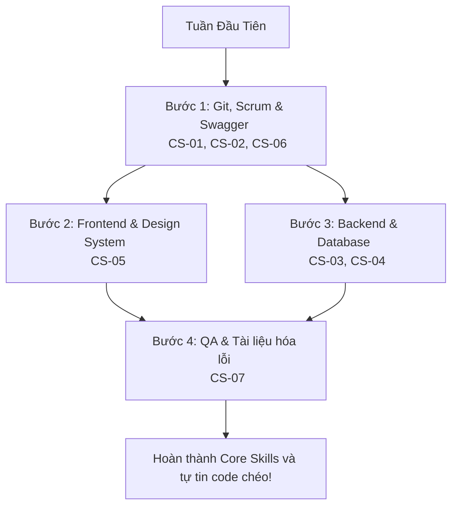

# 🐾 MyPetClinic - Core Skills Framework (Khung Năng Lực Cốt Lõi)

Chào mừng bạn đến với tài liệu hướng dẫn **Core Skills Framework** của dự án **MyPetClinic**. Đây là bộ kỹ năng **bắt buộc** mà mọi thành viên trong nhóm (**Nam, Phương, Lâm, Hạnh**) phải nắm vững để đảm bảo sự phối hợp trơn tru, đồng bộ phong cách lập trình và tối ưu hóa quy trình kiểm thử chất lượng sản phẩm.

---

## 📋 Bản đồ Kỹ năng & Mục lục Chi tiết

Để dễ dàng học tập và thực hành, Khung năng lực được chia nhỏ thành các phần chi tiết dưới đây:

### 🛠️ Kỹ năng Cộng tác & Quy trình Phát triển
* [**CS-01: Git & GitHub Collaboration**](file:///e:/DATN/MyPetClinic/skills/core/cs-01-git.md)
  * Quy trình tạo nhánh, commit chuẩn hóa, gộp code bằng Rebase và cách xử lý khi gặp conflict code dưới local.
* [**CS-02: Agile & Scrum Mindset**](file:///e:/DATN/MyPetClinic/skills/core/cs-02-scrum.md)
  * Quy tắc làm việc trong Sprint 2 tuần, cách chuẩn bị báo cáo Daily Standup lúc 8:30 AM và tiêu chuẩn bàn giao tính năng (Definition of Done).

### 🖥️ Kỹ năng Backend & Quản trị Cơ sở dữ liệu
* [**CS-03: C# & .NET Clean Architecture Basics**](file:///e:/DATN/MyPetClinic/skills/core/cs-03-dotnet.md)
  * Tổng quan cấu trúc Clean Architecture 4 lớp trong dự án Backend, cách khởi chạy Backend và quy trình đọc Stack Trace debug lỗi API 500.
* [**CS-04: PostgreSQL & EF Core Basics**](file:///e:/DATN/MyPetClinic/skills/core/cs-04-database.md)
  * Kết nối cơ sở dữ liệu Supabase Cloud bằng DBeaver/pgAdmin, cách viết truy vấn kiểm tra dữ liệu và chạy Entity Framework Migrations.

### 🎨 Kỹ năng Frontend & Giao diện
* [**CS-05: Vue 3, TS & Premium CSS Basics**](file:///e:/DATN/MyPetClinic/skills/core/cs-05-frontend.md)
  * Cách viết component Vue 3 Single File Component (SFC) bằng TypeScript và hướng dẫn áp dụng hệ thống thiết kế Premium Gold CSS Variables.

### 🧪 Kỹ năng Kiểm thử & Tài liệu Kỹ thuật
* [**CS-06: API Testing with Postman & Swagger**](file:///e:/DATN/MyPetClinic/skills/core/cs-06-api.md)
  * Sử dụng Swagger UI để chạy thử API và hướng dẫn import/sử dụng Postman Collection có đính kèm Bearer Token xác thực.
* [**CS-07: Documentation & QA Mindset**](file:///e:/DATN/MyPetClinic/skills/core/cs-07-documentation.md)
  * Tiêu chuẩn định dạng tài liệu kỹ thuật bằng Markdown và quy chuẩn viết Bug Report mô tả lỗi tối thiểu 5 bước.

---

## 🚀 Lộ Trình Học Tập Cho Thành Viên Mới

---

## 🤝 Peer Review Checklist trước khi gộp code

Trước khi nhấn nút **Approve** cho bất kỳ Pull Request nào trên GitHub, người review (ví dụ: Nam review cho Phương, Hạnh review cho Lâm) phải tích đủ các đầu mục:

- [ ] 1. Ứng dụng build thành công dưới local, không sinh ra lỗi cảnh báo TypeScript hay dotnet format.
- [ ] 2. Giao diện sử dụng các biến màu CSS từ file `style.css` (Gold Design System), không sử dụng mã màu cứng (như `#ff0000`).
- [ ] 3. Dữ liệu API được truyền nhận an toàn qua DTO, không trả thẳng Entity Database ra ngoài.
- [ ] 4. Đã thực hiện kiểm thử thủ công trên trình duyệt ít nhất 2 kích cỡ màn hình (Mobile và Desktop).
