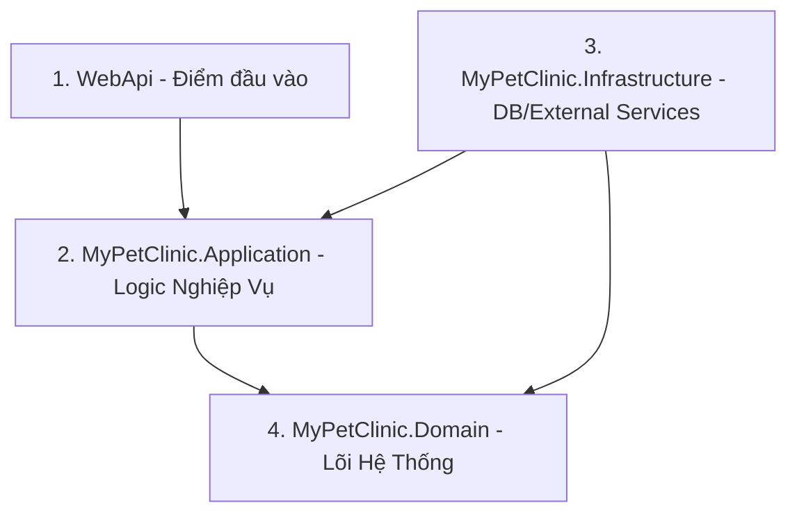

# 🐾 CS-03: C# & .NET Clean Architecture Basics

Tài liệu này cung cấp kiến thức nền tảng về C# và kiến trúc Clean Architecture được áp dụng trong phần Backend của **MyPetClinic**. Tất cả các thành viên (kể cả Frontend và QA) đều cần đọc hiểu tài liệu này để có thể tự chạy dự án, đọc log lỗi và hiểu luồng dữ liệu của hệ thống.

---

## 1. Cấu trúc Clean Architecture trong Backend

Mã nguồn Backend nằm ở thư mục [backend/src](file:///e:/DATN/MyPetClinic/backend/src). Hệ thống được chia tách thành 4 lớp dự án con để đảm bảo tính độc lập và dễ kiểm thử:



### 1. MyPetClinic.Domain (Lớp Lõi - Domain Layer)
- **Nhiệm vụ:** Định nghĩa thực thể (Entities), Enum, Exceptions của nghiệp vụ phòng khám thú y.
- **Ví dụ:** Thực thể `Pet` (Thú cưng), `Booking` (Lịch khám), `Invoice` (Hóa đơn).
- **Đặc trưng:** Lớp này hoàn toàn sạch, không phụ thuộc vào bất kỳ thư viện ngoài nào (kể cả Entity Framework).

### 2. MyPetClinic.Application (Lớp Ứng Dụng - Application Layer)
- **Nhiệm vụ:** Chứa logic nghiệp vụ chính (Business Logic), định nghĩa cấu trúc dữ liệu truyền nhận (DTOs), Interfaces của Repository và Services.
- **Ví dụ:** `BookingService` chịu trách nhiệm kiểm tra xem bác sĩ có rảnh giờ đó không rồi mới tạo lịch khám.

### 3. MyPetClinic.Infrastructure (Lớp Hạ Tầng - Infrastructure Layer)
- **Nhiệm vụ:** Thực thi giao tiếp dữ liệu vật lý như lưu trữ database (thông qua Entity Framework Core kết nối PostgreSQL/Supabase), gửi mail, tích hợp dịch vụ bên thứ ba.
- **Ví dụ:** `AppDbContext.cs` cấu hình cách ánh xạ các đối tượng C# thành các bảng trong PostgreSQL.

### 4. WebApi (Lớp Giao Diện API - Presentation Layer)
- **Nhiệm vụ:** Nơi nhận các HTTP Request từ Frontend, kiểm tra quyền truy cập (Authentication/Authorization) và trả về HTTP Response.
- **Ví dụ:** `BookingsController.cs` cung cấp endpoint `POST /api/v1/bookings` để đặt lịch.

---

## 2. Cách Chạy Backend và Đọc Log Debug Lỗi 500

### Cách khởi chạy Backend dưới local
1. Đảm bảo đã cài đặt [.NET SDK](https://dotnet.microsoft.com/download) phiên bản phù hợp.
2. Mở terminal tại thư mục [backend/src/WebApi](file:///e:/DATN/MyPetClinic/backend/src/WebApi) và chạy lệnh:
   ```bash
   dotnet run
   ```
3. API sẽ chạy mặc định tại cổng `http://localhost:5000` hoặc cổng được cấu hình trong `launchSettings.json`. Bạn truy cập `http://localhost:5000/swagger` để mở tài liệu API.

### Quy trình QA/Frontend tự phân tích lỗi 500
Khi Frontend gọi API và nhận về mã lỗi **500 Internal Server Error**:
1. Nhìn vào terminal đang chạy lệnh `dotnet run` của Backend.
2. Tìm dòng chữ bắt đầu bằng `fail:` hoặc màu đỏ báo lỗi Exception.
3. Đọc **Stack Trace** (Dấu vết thực thi) từ trên xuống dưới để tìm class của dự án:
   ```text
   fail: Microsoft.AspNetCore.Diagnostics.DeveloperExceptionPageMiddleware[1]
         An unhandled exception has occurred while executing the request.
         System.NullReferenceException: Object reference not set to an instance of an object.
            at MyPetClinic.Application.Services.BookingService.CreateBookingAsync(BookingDto dto) in E:\DATN\MyPetClinic\backend\src\MyPetClinic.Application\Services\BookingService.cs:line 42
   ```
   *Nhìn vào log trên, ta phát hiện ngay lỗi NullReferenceException xảy ra ở dòng 42 trong file BookingService.cs.*
4. Chụp lại lỗi này gửi cho Nam (Backend Lead) cùng với API Request Payload từ Postman/Chrome DevTools để xử lý nhanh nhất.

---

## 3. Cú pháp C# Cơ bản để Đọc hiểu (So sánh với JS/TS)

| Khái niệm | Ví dụ trong C# | Giải thích |
| :--- | :--- | :--- |
| **Khai báo biến** | `string petName = "Milo";`<br>`int age = 3;` | C# là ngôn ngữ định kiểu tĩnh, bắt buộc ghi rõ kiểu dữ liệu hoặc dùng từ khóa `var` khi trình biên dịch tự suy luận được. |
| **Phương thức Async** | `public async Task<Pet> GetPetAsync(Guid id)` | Tương đương với `async function` trả về một `Promise<Pet>` trong JavaScript/TypeScript. |
| **LINQ (Truy vấn mảng)** | `var dogs = pets.Where(p => p.Species == "Dog").ToList();` | Tương đương với phương thức `pets.filter(p => p.species === 'Dog')` trong JS. |
| **Dependency Injection** | Khai báo các interface thông qua Constructor | C# tự động truyền các dịch vụ (như DbContext) vào class khi khởi tạo. |

---

## 4. Bài tập Thực Hành Đạt Yêu Cầu CS-03

- [ ] Chạy thành công ứng dụng Backend dưới local và mở được giao diện Swagger.
- [ ] Xác định đúng lớp (Layer) chứa file logic khi nhận được một yêu cầu nghiệp vụ (ví dụ: Thay đổi logic tính tiền nằm ở lớp nào?).
- [ ] Tự phát hiện và đọc hiểu được nguyên nhân của ít nhất 1 lỗi Exception 500 phát sinh trong console log của WebApi.
